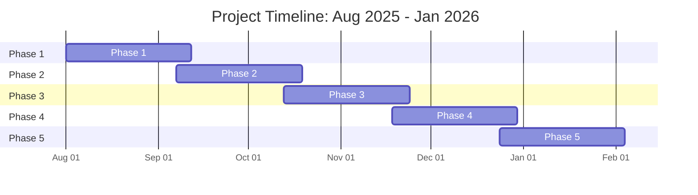

# build-apps-with-spark.md

---
title: Building and deploying AI-powered apps with GitHub Spark
shortTitle: Build apps with Spark
allowTitleToDifferFromFilename: true
intro: 'Learn how to build and deploy an intelligent web app with natural language using .'
versions:
  feature: spark
product: 'Anyone with a  license can use .'
topics:
  - Copilot
redirect_from:
  - /copilot/tutorials/building-ai-app-prototypes
contentType: tutorials
---

> [!NOTE]
> * 
> * The  setting that blocks suggestions matching public code may not work as intended when using . See [AUTOTITLE](/copilot/how-tos/manage-your-account/managing-copilot-policies-as-an-individual-subscriber#enabling-or-disabling-suggestions-matching-public-code).

## Introduction

With , you can describe what you want in natural language and get a fullstack web app with data storage, AI features, and  authentication built in. You can iterate using prompts, visual tools, or code, and then deploy with a click to a fully managed runtime.

 is seamlessly integrated with  so you can develop your spark via a synced  codespace with  for advanced editing. You can also create a repository for team collaboration, and leverage 's ecosystem of tools and integrations.

This tutorial will guide you through building and deploying an app with  and exploring its features.

### Prerequisites

* A  account with .

## Step 1: Create your web app

For this tutorial, we'll create a simple marketing tool app, where:
* The user enters a description of a product they want to market.
* The app generates marketing copy, and recommends a visual strategy and target audience.

1. Navigate to https://github.com/spark.
2. In the input field, enter a description of your app. For example:

   ```text copy
   Build an app called "AI-Powered Marketing Assistant."

   The app should allow users to input a brief description of a product or service. When the user submits their brief, send this information to a generative AI model with a prompt that asks the AI to return the following:
      - Persuasive and engaging marketing copy for the product or service.
      - A visual strategy for how to present the product/service (e.g., suggested imagery, colors, design motifs, or mood).
      - A recommendation for the ideal target audience.
   The app should display these three elements clearly and in an organized manner.  The app should look modern, fresh and engaging.
   ```

   > [!TIP]
   > * Be specific, and provide as many details as possible for the best results. You can [](https://github.com/copilot) to refine or suggest improvements to your initial prompt.
   > * Alternatively, drop a markdown document into the input field to provide  with more context on what you're hoping to build.

3. Optionally, upload an image to provide  with a visual reference for your app. Mocks, sketches, or screenshots all work to provide  with an idea of what you want to build.
4. Click **** to build your app.

   > [!NOTE]
   >  will always generate a Typescript and React app.

## Step 2: Refine and expand your app

Once  is done generating your app, you can test it out in the live preview window. From here, you can iterate on and expand your app using natural language, visual editing controls, or code.

1. To make changes to your app using **natural language**, under the "Iterate" tab in the left sidebar, enter your instructions in the main input field, then submit.
2. Optionally, click one of the "Suggestions" directly above the input field in the "Iterate" tab to develop your app.
3.  automatically alerts you to detected errors. To fix the errors, click **Fix All** above the input field in the "Iterate" tab.
4. Optionally, click ** Code** to view and edit the underlying code. The code editing panel has  code completion built in.
5. To make targeted changes to a specific element of your app click the **target icon** in the top right corner then hover over and select an element in the live preview pane.

## Step 3: Customize the styling of your app

Next, let's change the styling of your app using 's built-in tools. Alternatively, you can edit the code directly.

1. Change your app's overall appearance:
   * Click the **Theme** tab to adjust typography, colors, border radius, spacing, and other visual elements.
   * Choose from pre-generated themes to easily update the overall style your app.
1. To target visual edits at a specific component, click the **target icon**, then select an element of the app in the preview pane. Styling controls related to that specific element will show up in the left sidebar.
2. Optionally, edit styles in code:
   * Click **** to open the code editor.
   * Modify CSS, Tailwind CSS, or custom variables for fine-grained control (e.g., padding, spacing, fonts, colors).

     > [!TIP]
     > You can import custom fonts (like Google Fonts) or add advanced styles directly in the Spark code editor.
     > Ask [](https://github.com/copilot) for step-by-step guidance if you're not familiar with styling syntax.

1. Click the **Assets** tab to upload assets you want to surface in your app.
   * Add images, logos, videos, documents or other assets to personalize your app.
   * Once uploaded, instruct  on how you'd like to incorporate those assets into your app in the "Iterate" tab.

## Step 4: Store and manage data

If  detects the need to store data in your app, it will automatically set up data storage for you using a key-value store.

> [!NOTE]
> If you deploy your spark and make it visible to other users, the data in your app is **shared across all users** that can access your app. Make sure no sensitive data is included in your spark prior to updating visibility settings.

For our marketing app, let's add data storage so that users can save their favorite pieces of marketing copy and easily access them again later:

1. Use the following instruction in the "Iterate" tab to guide :

   ```text copy
   Add a "Favorites" page where users can save and view their favorite marketing copy results.
   ```

2. Interact with the app once it's done generating to test saving and retrieving favorites.
3. Check the "Data" tab to view and edit the stored values.
4. If you explicitly **don't** want  to save data, ask  to "store data locally" or "don't persist data".

## Step 5: Refine AI capabilities

Next, let's iterate on the AI capabilities included in our app, which are powered by .

 automatically detects when AI is needed for features in your app. It will auto-generate the prompts for each AI feature, integrate with the best-fit models, and manage API integration and LLM inference on your behalf.

1. Click the **Prompts** tab.
2. Review the prompts  generated to power each of the AI features used in your app.
   * In the case of our marketing app there are three separate prompts  has generated for us (marketing copy generation, visual strategy recommendation, and target audience recommendation).
1. Click on each prompt to view and edit without needing to go into the code. Make adjustments to better fit your use case.
2. Test the app to see updated results.

## Step 6: Edit and debug with code and 

You can view or edit your app’s code directly in  or via a synced  codespace.

> [!NOTE]
> *  uses an opinionated stack (**React**, **TypeScript**) for reliability.
> * For best results, you should **work within 's SDK** and core framework.
> * You can **add external libraries**, but compatibility isn’t guaranteed — you should test thoroughly.
> * Directly editing the React code **lets you add model context**, as long as you follow valid syntax and 's framework.

1. To edit code in :
   * Click ** Code**.
   * Navigate the file tree and make any edits, with access to Copilot code completions in the editor. Changes are reflected instantly in the live preview window.
1. To make more advanced edits:
   * In the top right corner, click ****, then click ** Open codespace** (a full-featured cloud IDE) to launch a codespace in a new browser tab.
   * Once inside the codespace, click **** to open  to make more advanced changes.
      * In the prompt box, select **Agent** mode to enable  to autonomously build, review, and troubleshoot your code.
      * Select **Edit** mode for  to review your app's code and suggest improvements and fixes.
      * Choose **Ask** mode for  to explain and help you understand the code or any errors you see in .
   * Changes you make in the codespace are automatically synced to .

## Step 7: Deploy and share your app

 comes with a fully integrated runtime environment that allows you to deploy your app in one click.

> [!NOTE]
> If you make your spark accessible to all  users, all users will be able to access and edit the data stored in your spark. Make sure to delete any private or sensitive data from your app prior to making it visible to other users.

1. In the top right corner, click **Publish**.
2. By default, your spark will be private and only accessible to you. Under "Visibility", choose whether you want your spark to remain private, or make it available to all  users.

   

3. Click **Visit site** to be taken to your live, deployed app. Copy your site's URL to share with others.
   > [!NOTE]
   > When you publish your app,  automatically includes cloud-based storage and LLM inference for your application to use as part of the integrated runtime.
   >
   > The URL for your spark is generated based on the name of your spark. You can edit the name of your app and  will automatically manage re-routing of old URLs to your latest URL.

## Step 8: Invite collaborators with a repository

Now that you have a functional, deployed app, you can continue to build and collaborate on your app in the same way you would with any other  project, by creating and linking a  repository to your spark.

1. In the top right corner, click ****, then click ** Create repository**.
2. In dialog box that opens, click **Create**.

A new, private repository is created under your personal account on , with the name of the repository based on the name of your spark.

Any changes made to your spark prior to repository creation will be added to your repository so you have a full record of all changes and commits made to your spark since its creation.

There's a two-way sync between your spark and the repository, so changes made in either  or the main branch of your repository are automatically reflected in both places.

You can also create issues in your repository and assign them to  so it can draft pull requests for fixes and improvements.

## Next steps

Explore more ideas you can build with :
* **Prototype new ideas quickly**: if you have a specific idea for a feature or app, upload a mockup, sketch, screenshot, or even paste a markdown documentation into  and ask  to build out your idea.
* **Build internal tools for yourself and your team**: If you have a common workflow or process that currently sits in a document or spreadsheet, explain your workflow or process to  and  can turn it into an interactive web app.

## Further reading

* [AUTOTITLE](/copilot/responsible-use-of-github-copilot-features/responsible-use-of-github-spark)
* [AUTOTITLE](/copilot/concepts/copilot-billing/about-billing-for-github-spark)
* [AUTOTITLE](/free-pro-team@latest/site-policy/github-terms/github-pre-release-license-terms)


# get-the-best-results.md

---
title: Best practices for using GitHub Copilot to work on tasks
shortTitle: Get the best results
allowTitleToDifferFromFilename: true
intro: 'Learn how to get the best results from .'
product: '<br><a href="https://github.com/features/copilot/plans?ref_cta=Copilot+plans+signup&ref_loc=best+practices+for+using+copilot+to+work+on+tasks&ref_page=docs" target="_blank" class="btn btn-primary mt-3 mr-3 no-underline"><span>Sign up for </span> </a>'
versions:
  feature: copilot
topics:
  - Copilot
redirect_from:
  - /copilot/using-github-copilot/using-copilot-coding-agent-to-work-on-tasks/best-practices-for-using-copilot-to-work-on-tasks
  - /copilot/using-github-copilot/using-copilot-coding-agent-to-work-on-issues/best-practices-for-using-copilot-to-work-on-issues
  - /copilot/using-github-copilot/using-copilot-coding-agent-to-work-on-issues/best-practices-for-using-copilot-to-work-on-tasks
  - /early-access/copilot/coding-agent/best-practices-for-using-copilot-coding-agent
  - /copilot/using-github-copilot/coding-agent/best-practices-for-using-copilot-to-work-on-tasks
  - /copilot/how-tos/agents/copilot-coding-agent/best-practices-for-using-copilot-to-work-on-tasks
  - /copilot/tutorials/coding-agent/best-practices
contentType: tutorials
---

> [!NOTE]
> 
>
> For an introduction to , see [AUTOTITLE](/copilot/concepts/about-copilot-coding-agent).

## Making sure your issues are well-scoped

 provides better results when assigned clear, well-scoped tasks. An ideal task includes:

* A clear description of the problem to be solved or the work required.
* Complete acceptance criteria on what a good solution looks like (for example, should there be unit tests?).
* Directions about which files need to be changed.

If you pass a task to  by assigning an issue, it's useful to think of the issue you assign to  as a prompt. Consider whether the issue description is likely to work as an AI prompt, and will enable  to make the required code changes.

## Choosing the right type of tasks to give to 

As you work with , you'll get a sense of the types of tasks it's best suited to work on. Initially, you might want to start by giving  simpler tasks, to see how it works as a coding agent. For example, you could start by asking  to fix bugs, alter user interface features, improve test coverage, update documentation, improve accessibility, or address technical debt.

Issues that you may choose to work on yourself, rather than assigning to , include:

* **Complex and broadly scoped tasks**
  * Broad-scoped, context-rich refactoring problems requiring cross-repository knowledge and testing
  * Complex issues requiring understanding dependencies and legacy code
  * Tasks that require deep domain knowledge
  * Tasks that involve substantial business logic
  * Large changes to a codebase requiring design consistency

* **Sensitive and critical tasks**
  * Production-critical issues
  * Tasks involving security, personally identifiable information, authentication repercussions
  * Incident response

* **Ambiguous tasks**
  * Tasks lacking clear definition: tasks with ambiguous requirements, open-ended tasks, tasks that require working through uncertainty to find a solution

* **Learning tasks**
  * Tasks where the developer wants to learn to achieve a deeper understanding

## Using comments to iterate on a pull request

Working with  on a pull request is just like working with a human developer: it's common for the pull request to need further work before it can be merged. The process for getting the pull request to a mergeable state is exactly the same when the pull request is created by  as when it's created by a human.

You can also mention `@copilot` in comments on the pull request—explaining what you think is incorrect, or could be improved—and leave  to make the required changes. Alternatively, you can work on the feature branch yourself and push changes to the pull request.

After a user with write access mentions `@copilot` in a comment,  will start to make any required changes, and will update the pull request when it's done. Because  starts looking at comments as soon as they are submitted, if you are likely to make multiple comments on a pull request it's best to batch them by clicking **Start a review**, rather than clicking **Add single comment**. You can then submit all of your comments at once, triggering  to work on your entire review, rather than working on individual comments separately.

> [!NOTE]
> 

As  makes changes to the pull request, it will keep the title and body up to date so they reflect the current changes.

## Adding custom instructions to your repository

By adding custom instructions to your repository, you can guide  on how to understand your project and how to build, test and validate its changes.

If  is able to build, test and validate its changes in its own development environment, it is more likely to produce good pull requests which can be merged quickly.

 supports a number of different types of custom instructions files:

* `/.github/copilot-instructions.md`
* `/.github/instructions/**/*.instructions.md`
* `**/AGENTS.md`
* `/CLAUDE.md`
* `/GEMINI.md`

For more information, see [AUTOTITLE](/copilot/customizing-copilot/adding-repository-custom-instructions-for-github-copilot?tool=webui).

### Repository-wide instructions

To add instructions that apply to all tasks assigned to  in your repository, create a `.github/copilot-instructions.md` file in the root of your repository. This file should contain information about your project, such as how to build and test it, and any coding standards or conventions you want  to follow. Note that the instructions will also apply to  and .

The first time you ask  to create a pull request in a given repository,  will leave a comment with a link to automatically generate custom instructions. You can also ask  to generate custom instructions for you at any time using our recommended prompt. See [AUTOTITLE](/copilot/how-tos/configure-custom-instructions/add-repository-instructions?tool=webui#asking-copilot-coding-agent-to-generate-a-copilot-instructionsmd-file).

You can also choose to write your own custom instructions at any time. Here is an example of an effective `copilot-instructions.md` file:

```markdown
This is a Go based repository with a Ruby client for certain API endpoints. It is primarily responsible for ingesting metered usage for GitHub and recording that usage. Please follow these guidelines when contributing:

## Code Standards

### Required Before Each Commit
- Run `make fmt` before committing any changes to ensure proper code formatting
- This will run gofmt on all Go files to maintain consistent style

### Development Flow
- Build: `make build`
- Test: `make test`
- Full CI check: `make ci` (includes build, fmt, lint, test)

## Repository Structure
- `cmd/`: Main service entry points and executables
- `internal/`: Logic related to interactions with other  services
- `lib/`: Core Go packages for billing logic
- `admin/`: Admin interface components
- `config/`: Configuration files and templates
- `docs/`: Documentation
- `proto/`: Protocol buffer definitions. Run `make proto` after making updates here.
- `ruby/`: Ruby implementation components. Updates to this folder should include incrementing this version file using semantic versioning: `ruby/lib/billing-platform/version.rb`
- `testing/`: Test helpers and fixtures

## Key Guidelines
1. Follow Go best practices and idiomatic patterns
2. Maintain existing code structure and organization
3. Use dependency injection patterns where appropriate
4. Write unit tests for new functionality. Use table-driven unit tests when possible.
5. Document public APIs and complex logic. Suggest changes to the `docs/` folder when appropriate
```

### Path-specific instructions

To add instructions that apply to specific types of files  will work on, like unit tests or React components, create one or more `.github/instructions/**/*.instructions.md` files in your repository.
In these files, include information about the file types, such as how to build and test them, and any coding standards or conventions you want  to follow.

Using the glob pattern in the front matter of the instructions file, you can specify the file types to which they should apply. For example, to create instructions for Playwright tests you could create an instructions file called `.github/instructions/playwright-tests.instructions.md` with the following content:

```markdown
---
applyTo: "**/tests/*.spec.ts"
---

## Playwright test requirements

When writing Playwright tests, please follow these guidelines to ensure consistency and maintainability:

1. **Use stable locators** - Prefer `getByRole()`, `getByText()`, and `getByTestId()` over CSS selectors or XPath
2. **Write isolated tests** - Each test should be independent and not rely on other tests' state
3. **Follow naming conventions** - Use descriptive test names and `*.spec.ts` file naming
4. **Implement proper assertions** - Use Playwright's `expect()` with specific matchers like `toHaveText()`, `toBeVisible()`
5. **Leverage auto-wait** - Avoid manual `setTimeout()` and rely on Playwright's built-in waiting mechanisms
6. **Configure cross-browser testing** - Test across Chromium, Firefox, and WebKit browsers
7. **Use Page Object Model** - Organize selectors and actions into reusable page classes for maintainability
8. **Handle dynamic content** - Properly wait for elements to load and handle loading states
9. **Set up proper test data** - Use beforeEach/afterEach hooks for test setup and cleanup
10. **Configure CI/CD integration** - Set up headless mode, screenshots on failure, and parallel execution
```

## Using the Model Context Protocol (MCP)

You can extend the capabilities of  by using MCP. This allows  to use tools provided by local and remote MCP servers. The  MCP server and [Playwright MCP server](https://github.com/microsoft/playwright-mcp) are enabled by default. For more information, see [AUTOTITLE](/copilot/using-github-copilot/coding-agent/extending-copilot-coding-agent-with-mcp).

## Pre-installing dependencies in 's environment

While working on a task,  has access to its own ephemeral development environment, powered by , where it can explore your code, make changes, execute automated tests and linters and more.

If  is able to build, test and validate its changes in its own development environment, it is more likely to produce good pull requests which can be merged quickly.

To do that, it will need your project's dependencies.  can discover and install these dependencies itself via a process of trial and error - but this can be slow and unreliable, given the non-deterministic nature of large language models (LLMs).

You can configure a `copilot-setup-steps.yml` file to pre-install these dependencies before the agent starts working so it can hit the ground running. For more information, see [AUTOTITLE](/copilot/customizing-copilot/customizing-the-development-environment-for-copilot-coding-agent#preinstalling-tools-or-dependencies-in-copilots-environment).


# pilot-coding-agent.md

---
title: 'Piloting GitHub Copilot coding agent in your organization'
shortTitle: 'Pilot '
intro: 'Follow best practices to enable  in your organization.'
allowTitleToDifferFromFilename: true
versions:
  feature: copilot
topics:
  - Copilot
product: ''
redirect_from:
  - /copilot/rolling-out-github-copilot-at-scale/enabling-developers/using-copilot-coding-agent-in-org
  - /copilot/tutorials/rolling-out-github-copilot-at-scale/enabling-developers/using-copilot-coding-agent-in-org
  - /copilot/tutorials/pilot-copilot-coding-agent
contentType: tutorials
---
<!--JTBD: When rolling out , I want to understand use cases and follow best practices, so I can ensure I'm using it as intended and get value from a pilot program.-->



 is an autonomous, AI-powered agent that completes software development tasks on . Adopting  in your organization frees your engineering teams to spend more time thinking strategically and less time making routine fixes and maintenance updates in a codebase.

:

* **Joins your team**: Developers can delegate work to  unlike IDE-based coding agents that require synchronous pairing sessions.  opens draft pull requests for team members to review and iterates based on feedback, as a developer would.
* **Reduces context switching**: Developers working in JetBrains IDEs, , , or  can ask  to create a pull request to complete small tasks without stopping what they are currently doing.
* **Executes tasks in parallel**:  can work on multiple issues simultaneously, handling tasks in the background while your team focuses on other priorities.

## 1. Evaluate

Before enabling  for members, understand how  will fit into your organization. This will help you evaluate whether  is suitable for your needs and plan communications and training sessions for developers.

1. Learn about , including the costs, built-in security features, and how it differs from other AI tools your developers may be used to. See [AUTOTITLE](/copilot/concepts/about-copilot-coding-agent).
2. Learn about the tasks that  is best suited for. These are generally well-defined and scoped issues, such as increasing test coverage, fixing bugs or flaky tests, or updating config files or documentation. See [AUTOTITLE](/copilot/tutorials/coding-agent/best-practices).
3. Consider how  fits alongside other tools in your organization's workflows. For an example scenario that walks through how to use  alongside other AI features on , see [AUTOTITLE](/copilot/rolling-out-github-copilot-at-scale/enabling-developers/integrating-agentic-ai).

## 2. Secure

All AI models are trained to meet a request, even if they don't have all the information needed to provide a good answer, and this can lead them to make mistakes. By following best practices, you can build on the default security features of .

1. Give  the information it needs to work successfully in a repository using a `copilot-instructions.md` file. See [AUTOTITLE](/copilot/customizing-copilot/adding-repository-custom-instructions-for-github-copilot).
2. Set up the  development environment for a repository with access to the tools and package repositories approved by the organization using a `copilot-setup-steps.yml` file and local MCP servers. See [AUTOTITLE](/copilot/customizing-copilot/customizing-the-development-environment-for-copilot-coding-agent) and [AUTOTITLE](/copilot/using-github-copilot/coding-agent/extending-copilot-coding-agent-with-mcp).
3. Follow best practices for storing secrets securely. See [AUTOTITLE](/actions/security-for-github-actions/security-guides/using-secrets-in-github-actions).
4. Enable code security features to further lower the risk of leaking secrets and introducing vulnerabilities into the code. See [AUTOTITLE](/code-security/securing-your-organization/enabling-security-features-in-your-organization/applying-the-github-recommended-security-configuration-in-your-organization).
5. Configure your branch rulesets to ensure that all pull requests raised by  are approved by a second user with write permissions (a sub-option of "Require a pull request before merging"). See [AUTOTITLE](/admin/enforcing-policies/enforcing-policies-for-your-enterprise/enforcing-policies-for-code-governance), [AUTOTITLE](/organizations/managing-organization-settings/creating-rulesets-for-repositories-in-your-organization) and [AUTOTITLE](/repositories/configuring-branches-and-merges-in-your-repository/managing-rulesets/available-rules-for-rulesets#require-a-pull-request-before-merging).

## 3. Pilot

<a href="https://github.com/github-copilot/purchase?ref_cta=Copilot+Enterprise+trial&ref_cta=Copilot+Business+trial&ref_loc=using-cca-effectively" target="_blank" class="btn btn-primary mt-3 mr-3 no-underline"><span>Sign up for </span> </a>

> [!TIP] You need , ,  or  to use .

As with any other change to working practices, it's important to run a trial to learn how to deploy  effectively in your organization or enterprise.

1. Gather a cross-functional team for the trial to bring different roles, backgrounds, and perspectives to the project. This will make it easier to ensure that you explore a broad range of ways to define issues, assign work to , and give clear review feedback.
2. Choose an isolated or low-risk repository, for example, one that contains documentation or internal tools. You could create a fresh repository to use as a playground, but  needs context to be successful, so you would need to add a lot of context, including team processes, development environment, and common dependencies.
3. Enable  in the repository and optionally enable third-party MCP servers for enhanced context sharing. See [AUTOTITLE](/copilot/managing-copilot/managing-github-copilot-in-your-organization/adding-copilot-coding-agent-to-organization).
4. Create repository instructions and pre-install any tools required in the development environment  uses. See [AUTOTITLE](/copilot/customizing-copilot/customizing-the-development-environment-for-copilot-coding-agent).
5. Identify a few compelling use cases for your organization, for example: test coverage or improving accessibility. See [Choose the right type of tasks to give to Copilot](/copilot/tutorials/coding-agent/best-practices#choosing-the-right-type-of-tasks-to-give-to-copilot) in the best practice guide.
6. Use best practice to create or refine issues for  in your pilot repository.
7. Assign issues to  and prepare team members to review its work.
8. Spend time looking at the codebase or documentation in  or , asking  to create a pull request to fix any bugs or small improvements that you identify.

Over the course of the trial, the team should iterate on the repository instructions, installed tools, access to MCP servers, and issue definition to identify how your organization can get the most from . This process will help you identify your organization's best practices for working with  and plan an effective rollout strategy.

In addition to giving you insight into how to set up  for success, you'll learn how  uses premium requests and actions minutes. This will be valuable when you come to set and manage your budget for a broader trial or full rollout. See [AUTOTITLE](/copilot/rolling-out-github-copilot-at-scale/assigning-licenses/managing-your-companys-spending-on-github-copilot).

### Enhancing with MCP

The Model Context Protocol (MCP) is an open standard that defines how applications share context with large language models (LLMs). MCP provides a standardized way to provide  with access to different data sources and tools.

 has access to the full  context of the repository it's working in, including issues and pull requests, using the built-in  MCP server. By default, it's restricted from accessing external data by authentication barriers and a firewall.

You can extend the information available to  by giving it access to local MCP servers for the tools your organization uses. For example, you might want to provide access to local MCP servers for some of the following contexts:

* **Project planning tools**: Allow  direct access to private planning documents that are stored outside  in tools like Notion or Figma.
* **Augment training data**: Each LLM contains training data up to a specific cut-off date. If you're working with fast moving tools,  may not have access to information on new features. You can fill this knowledge gap by making the tool's MCP server available. For example, adding the Terraform MCP server will give  access to the most recently supported Terraform providers.

For more information, see [AUTOTITLE](/copilot/using-github-copilot/coding-agent/extending-copilot-coding-agent-with-mcp).

## Next steps

When you're satisfied with the pilot, you can:

* Enable  in more organizations or repositories.
* Identify more use cases for  and train developers accordingly.
* Continue to collect feedback and measure results.

To assess the impact of a new tool, we recommend measuring the tool's impact on your organization's downstream goals. For a systematic approach to driving and measuring improvements in engineering systems, see 's [Engineering System Success Playbook](https://resources.github.com/engineering-system-success-playbook/).


# compare-ai-models.md

---
title: Comparing AI models using different tasks
shortTitle: Compare AI models
intro: 'Explore real-world examples of common developer tasks along with sample prompts, responses, and guidance to help you choose the right AI model for your workflow.'
versions:
  feature: copilot
topics:
  - Copilot
redirect_from:
  - /copilot/using-github-copilot/ai-models/examples-for-ai-model-comparison
  - /copilot/using-github-copilot/ai-models/comparing-ai-models-using-different-tasks
  - /copilot/tutorials/comparing-ai-models-using-different-tasks
contentType: tutorials
---

## Overview

Each AI model supported in  has different strengths. To help you decide which model to use, this article provides real-world examples of common developer tasks along with sample prompts, responses, and guidance on why a particular model is a good fit.

These examples show how models vary in their reasoning style, response depth, and ability to handle visual input. Use them to compare output quality and choose the right model for your specific workflow.

For a full list of supported models and side-by-side feature comparisons, see [AUTOTITLE](/copilot/reference/ai-models/model-comparison).

## 



### Example scenario

Consider a scenario where you are writing helper functions for access control in a Python service. You want to add docstrings to clarify the purpose of the function.

Below is the helper function that grants editor access to a document:

```python
def grant_editor_access(user_id, doc_id):
    access = AccessManager()
    access.assign_role(
        resource_type="document",
        resource_id=doc_id,
        role="editor",
        user_id=user_id
    )
```

### Example prompt

`Add a docstring to the function that explains what it does.`

### Example response



```python
def grant_editor_access(user_id, doc_id):
    """
    Grants editor access to a specific document for a given user.

    This function uses the AccessManager to assign the "editor" role
    to the specified user for the provided document ID.

    Args:
        user_id (str): The ID of the user to grant access to.
        doc_id (str): The ID of the document to which access is being granted.
    """
    access = AccessManager()
    access.assign_role(
        resource_type="document",
        resource_id=doc_id,
        role="editor",
        user_id=user_id
    )
```

### Why  is a good fit

* The function is short and self-contained, making it ideal for quick docstring generation.
*  can recognize the pattern and provide a clear, concise explanation.
* The task doesn't require deep reasoning or complex logic.

## 

OpenAI  is a fast, cost-efficient model designed for simple or repetitive coding tasks. It delivers reliable, concise answers with very low latency, making it ideal for real-time suggestions and lightweight development workflows.  is optimized for speed and responsiveness, so you can quickly iterate on small code changes or get instant feedback on straightforward prompts.

### Example scenario

Suppose you are building a utility script and need to filter a list of user records to include only active users, sorted by their signup date. The task is simple and doesn’t require deep reasoning or multi-step logic.

Here’s a sample list of users:

```python
users = [
    {"name": "Alice", "active": True, "signup_date": "2023-12-10"},
    {"name": "Bob", "active": False, "signup_date": "2023-11-05"},
    {"name": "Charlie", "active": True, "signup_date": "2024-01-15"}
]
```

### Example prompt

`Filter the list of users to only include active users, and sort them by signup_date.`

### Example response



```python
# Filter to only include active users
active_users = [user for user in users if user["active"]]

# Sort active users by signup_date
active_users_sorted = sorted(active_users, key=lambda user: user["signup_date"])

print(active_users_sorted)
```

### Why  is a good fit

* The task is straightforward and benefits from fast, low-latency responses.
*  is optimized for cost and speed, making it ideal for quick edits, prototyping, and utility code.
* Use this model when you want reliable answers for simple coding questions without waiting for unnecessary depth.

## 



### Example scenario

You’re designing a shopping cart system and have a UML class diagram that outlines the relationships between `Cart`, `Product`, `User`, and `Order`. Instead of writing out the system from scratch, you want to upload the image of the diagram and ask  to generate the  classes.


### Example prompt

`Use this UML diagram to generate the classes for a shopping cart system.`

### Example response



 will generate a class for each of the classes in the diagram, including the relationships between them. Here’s the example code generated for the `Cart` class:

```python
from cart_item import CartItem
from order import Order

class Cart:
    def __init__(self, cart_id, user_id):
        self.cart_id = cart_id
        self.user_id = user_id
        self.items = []

    def add_item(self, item):
        self.items.append(item)

    def remove_item(self, item):
        self.items = [i for i in self.items if i != item]

    def calculate_total(self):
        return sum(item.quantity * item.product.price for item in self.items)

    def place_order(self):
        # Implementation for placing an order
        return Order("", None, 0)
```

### Why  is a good fit

* It can interpret visual assets, such as UML diagrams, wireframes, or flowcharts, to generate code scaffolding or suggest architecture.
* It can be useful for reviewing screenshots of UI layouts or form designs and generating.

## 



### Example scenario

Consider a scenario where you are implementing both unit tests and integration tests for an application. You want to ensure that the tests are comprehensive and cover any edge cases that you may and may not have thought of.

For a complete walkthrough of the scenario, see [AUTOTITLE](/copilot/tutorials/writing-tests-with-github-copilot).

### Why  is a good fit

* It performs well on everyday coding tasks like test generation, boilerplate scaffolding, and validation logic.
* The task leans into multi-step reasoning, but still stays within the confidence zone of a less advanced model because the logic isn’t too deep.

## 



### Example scenario

Consider a scenario where you're modernizing a legacy COBOL application by rewriting it in Node.js. The project involves understanding unfamiliar source code, converting logic across languages, iteratively building the replacement, and verifying correctness through a test suite.

For a complete walkthrough of the scenario, see [AUTOTITLE](/copilot/tutorials/modernizing-legacy-code-with-github-copilot).

### Why  is a good fit

*  handles complex context well, making it suited for workflows that span multiple files or languages.
* Its hybrid reasoning architecture allows it to switch between quick answers and deeper, step-by-step problem-solving.

## Further reading

* [AUTOTITLE](/copilot/reference/ai-models/model-comparison)
* [AUTOTITLE](/copilot/copilot-chat-cookbook)


# analyze-feedback.md

---
title: Analyzing and incorporating user feedback
shortTitle: Analyze feedback
intro: ' can enhance the process of incorporating user feedback into your project.'
redirect_from:
  - /copilot/example-prompts-for-github-copilot-chat/functionality-analysis-and-feature-suggestions/analyzing-and-incorporating-user-feedback
  - /copilot/copilot-chat-cookbook/functionality-analysis-and-feature-suggestions/analyzing-and-incorporating-user-feedback
  - /copilot/tutorials/copilot-chat-cookbook/functionality-analysis-and-feature-suggestions/analyzing-and-incorporating-user-feedback
  - /copilot/tutorials/copilot-chat-cookbook/functionality-analysis-and-feature-suggestions/analyze-feedback
versions:
  feature: copilot
category:
  - Functionality analysis
complexity:
  - Intermediate
octicon: lightbulb
topics:
  - Copilot
contentType: tutorials
---

Gathering and incorporating user feedback is crucial for product development, but it can be a challenging process. Developers and product teams often struggle to effectively analyze user feedback, prioritize it, and implement changes based on that feedback without disrupting existing workflows or introducing new issues.

## Analyzing user feedback

User feedback can be overwhelming and it may be difficult to identify what you should respond to.

### Example scenario

Imagine you are a maintainer of a popular open source repository. Because the community is very invested in your project, they often open issues to provide feedback. They also frequently interact with open issues. You want to respond to this feedback, but you aren't sure where to start.

### Example prompt

This example assumes that you use labels to track issues related to user feedback in your repository.

Navigate to the **Issues** tab in your repository, then type:

`Find the issues with the feedback label that have the most reactions, and categorize them based on sentiment.`

>[!TIP] To try out this prompt, you can go to the [`microsoft/vscode`](https://github.com/microsoft/vscode/issues) repository, which uses labels to track feature requests, and type: `Find the issues with the feature-request label that have the most reactions, and categorize them based on sentiment.`

### Example response



 lists the issues with the most reactions, and provides a sentiment analysis for each issue. You can use this list to make more informed decisions when you are prioritizing your work.

For example:

```text
1. [Feedback] CLI error messages are difficult to understand
  * Issue URL: #321
  * Reactions: 543
  * Sentiment: Negative

1. [Feedback] Add API to enable third party integration
  * Issue URL: #210
  * Reactions: 482
  * Sentiment: Positive

1. [Feedback] Shortcut for --with-token CLI option
  * Issue URL: #426
  * Reactions: 187
  * Sentiment: Neutral to slightly positive
```

## Generating feature specifications

Feature specifications provide a plan for development and are useful for communication and alignment prior to implementing a new feature.

### Example scenario

In this scenario, you've chosen a piece of user feedback to address. Someone requested a shortcut to an existing CLI option. Now you want to create a plan for how you'll implement this.

### Example prompt

This example assumes you are asking about an issue in the same repository where you are using .

`Write a feature specification for Issue #426.`

### Example response



 generates a feature specification, similar to the following.

```text
# Feature Specification for Issue #426: Shortcut for --with-token CLI option

## Description:
Currently, the --with-token option is used to to pass in a token to commands. Typing --with-token each time is cumbersome. This feature proposes a new flag -wt as a shortcut to quickly specify the --with-token option when running various commands.

## Problem:
Typing --with-token repeatedly is time-consuming and inconvenient for users who frequently use this option.

## Solution:
Introduce a new flag -wt that serves as a shortcut for the --with-token option.

## Feature Details:

### 1. Flag Introduction:
-wt will be introduced as a shorthand for --with-token.
Usage: <command> -wt <token>

### 2. Commands Affected:
All commands that currently support the --with-token option.

### 3. Backward Compatibility:
- The existing --with-token option will continue to work as before.
- No existing functionality will be removed or altered.

### 4. Documentation:
- Update documentation to include the new -wt flag.
- Provide examples and usage scenarios for the new flag.

### 5. Testing:
- Ensure thorough testing of the -wt flag across various commands.
- Test cases should include:
  - Valid and invalid tokens.
  - Interaction with other options.
  - Ensuring no regression in current --with-token functionality.

## Benefits:
- Improved user experience by reducing the amount of typing required.
- Streamlined command execution for users who frequently use the --with-token option.

## Potential Risks:
Minimal risk as this feature is an addition and does not alter existing functionality.
```

## Further reading




# explore-implementations.md

---
title: Exploring potential feature implementations
shortTitle: Explore implementations
intro: ' can help explore different approaches for implementing a single feature.'
redirect_from:
  - /copilot/example-prompts-for-github-copilot-chat/functionality-analysis-and-feature-suggestions/exploring-potential-feature-implementations
  - /copilot/copilot-chat-cookbook/functionality-analysis-and-feature-suggestions/exploring-potential-feature-implementations
  - /copilot/tutorials/copilot-chat-cookbook/functionality-analysis-and-feature-suggestions/exploring-potential-feature-implementations
  - /copilot/tutorials/copilot-chat-cookbook/functionality-analysis-and-feature-suggestions/explore-implementations
versions:
  feature: copilot
category:
  - Functionality analysis
complexity:
  - Intermediate
octicon: lightbulb
topics:
  - Copilot
contentType: tutorials
---

When tasked with implementing new features or enhancing existing ones, developers often face decisions about the best approach to take.  can assist by analyzing the problem and generating implementation options so that you can explore multiple solutions.

## Example scenario

You're assigned the task of creating a new feature that displays the most recently viewed items on a user dashboard. Below is an example issue for implementing this functionality:

```text
[Feature Request] Add "Recent Items" section to user dashboard #753

## Issue Description
Users have requested a "Recent Items" section on their dashboard to quickly access the most recently viewed documents, projects, or files. This section should display the ten most recent items, sorted by the last access time.

## Requirements
* Display up to ten items that the user has accessed recently.
* Items must be sorted by the time they were last accessed.
* The solution should minimize database load.
* Data should reflect updates in near real-time.
* The solution should prioritize performance, especially for large datasets of items.

## Acceptance Criteria
* Dashboard loads the "Recent Items" section within 200ms under normal load.
* The solution must not degrade performance for users with thousands of items.
```

## Example prompt

You want to evaluate different approaches to this implementation to see whether they fit with your needs and constraints. Here we'll ask  to suggest different approaches.

Navigate to the issue, then type:

`Given the criteria in Issue #753, list options for implementation and tradeoffs for each option.`

>[!TIP] When you are using  to help identify implementation options, it's good practice to start with a general prompt to spark ideas, like in this example. Then you can follow up with more specific questions to dive more deeply into the options it suggests.

## Example response



 lists several different options for implementing this dashboard, along with tradeoffs for each option. Then it makes a recommendation.

For example:

```text
# Implementation Options and Tradeoffs for "Recent Items" Section

## 1. Client-Side Storage

- Description: Store recent items data in the user's browser using LocalStorage or IndexedDB.
- Tradeoffs:
  - Pros:
    - Reduces server load by handling data storage and retrieval on the client side.
    - Immediate updates and access without server communication.
  - Cons:
    - Limited by browser storage capacity.
    - Data lost if the user clears browser storage or switches devices.
    - Security concerns with storing sensitive data on the client side.

## 2. Server-Side Storage with Database Indexing

- Description: Store recent items in the database and use indexing to quickly retrieve the most recent items.
- Tradeoffs:
  - Pros:
    - Centralized data storage, accessible from any device.
    - Scalable and can handle large datasets efficiently with proper indexing.
  - Cons:
    - Increased database load, especially for frequent access updates.
    - Potential latency in updating the recent items list.

## 3. In-Memory Caching (e.g., Redis)

- Description: Use an in-memory data store like Redis to cache recent items for fast retrieval.
- Tradeoffs:
  - Pros:
    - Extremely fast data access and updates.
    - Reduces database load by offloading frequent read operations.
  - Cons:
    - Requires additional infrastructure and maintenance.
    - Data may be lost if the cache is cleared or server restarts.

## 4. Hybrid Approach

- Description: Combine server-side storage with in-memory caching to balance performance and persistence.
- Tradeoffs:
  - Pros:
    - Fast access through caching, with persistent storage in the database.
    - Can handle large datasets and frequent updates efficiently.
  - Cons:
    - Increased complexity in implementation and maintenance.
    - Potential consistency issues between cache and database.

## 5. Event-Driven Updates

- Description: Use event-driven architecture to update recent items in real-time as users access documents.
- Tradeoffs:
  - Pros:
    - Near real-time updates with minimal delay.
    - Efficient handling of updates through events rather than periodic polling.
  - Cons:
    - Requires setting up event handling infrastructure (e.g., message queues).
    - Increased complexity in managing events and ensuring consistency.

## Recommendation

The hybrid approach (option 4) is a balanced solution, offering fast access through caching and persistence through database storage. It meets performance requirements and scales well with a large dataset, although it involves a more complex implementation.
```

## Further reading




# find-vulnerabilities.md

---
title: Finding existing vulnerabilities in code
shortTitle: Find vulnerabilities
intro: Copilot Chat can help find common vulnerabilities in your code and suggest fixes.
redirect_from:
  - /copilot/example-prompts-for-github-copilot-chat/security-analysis/finding-existing-vulnerabilities-in-code
  - /copilot/copilot-chat-cookbook/security-analysis/finding-existing-vulnerabilities-in-code
  - /copilot/tutorials/copilot-chat-cookbook/security-analysis/finding-existing-vulnerabilities-in-code
  - /copilot/tutorials/copilot-chat-cookbook/security-analysis/find-vulnerabilities
versions:
  feature: copilot
category:
  - Security analysis
complexity:
  - Intermediate
octicon: code
topics:
  - Copilot
contentType: tutorials
---

While they may be considered "common knowledge" by many developers, the vast majority of newly introduced security weaknesses are due to vulnerabilities like cross-site scripting (XSS), SQL injection, and cross-site request forgery (CSRF). These vulnerabilities can be mitigated by following secure coding practices, such as using parameterized queries, input validation, and avoiding hard-coded sensitive data. GitHub Copilot can help detect and resolve these issues.

> [!NOTE] While  can help find some common security vulnerabilities and help you fix them, you should not rely on  for a comprehensive security analysis. Using  will more thoroughly ensure your code is secure. For more information on setting up , see [AUTOTITLE](/code-security/code-scanning/enabling-code-scanning/configuring-default-setup-for-code-scanning).

## Example scenario

The JavaScript code below has a potential XSS vulnerability that could be exploited if the `name` parameter is not properly sanitized before being displayed on the page.

```javascript
function displayName(name) {
  const nameElement = document.getElementById('name-display');
  nameElement.innerHTML = `Showing results for "${name}"`
}
```

## Example prompt

You can ask  to analyze code for common security vulnerabilities and provide explanations and fixes for the issues it finds.

`Analyze this code for potential security vulnerabilities and suggest fixes.`

## Example response



 responds with an explanation of the vulnerability, and suggested changes to the code to fix it.

```javascript
function displayName(name) {
  const nameElement = document.getElementById('name-display');
  nameElement.textContent = `Showing results for "${name}"`;
}
```

## Further reading


* [AUTOTITLE](/code-security/code-scanning/introduction-to-code-scanning/about-code-scanning)


# manage-dependency-updates.md

---
title: Managing dependency updates
shortTitle: Manage dependency updates
intro: ' can help you get set up with  to streamline dependency updates.'
versions:
  feature: copilot
category:
  - Security analysis
complexity:
  - Simple
octicon: code
topics:
  - Copilot
redirect_from:
  - /copilot/tutorials/copilot-chat-cookbook/security-analysis/managing-dependency-updates
  - /copilot/tutorials/copilot-chat-cookbook/security-analysis/manage-dependency-updates
contentType: tutorials
---

## Automate dependency updates

### Example scenario

Let's say your project depends on numerous libraries and packages. Vulnerable or outdated dependencies create security risks that can affect your project and others that rely on it.

 can help you get set up with  security and version updates, so that your dependencies always remain on the most secure, and up-to-date versions. See [AUTOTITLE](/code-security/dependabot/dependabot-security-updates/about-dependabot-security-updates) and [AUTOTITLE](/code-security/dependabot/dependabot-version-updates/about-dependabot-version-updates).

Before you begin, ensure that  is fully enabled under your repository's "Settings."
1. Under your "Code security" settings, ensure **** and **** are both set to "Enabled."
2. Create and commit an empty `.github/dependabot.yml` file to the repository.

### Example prompt

Make sure your repository is attached to the prompt for context.

`Analyze the codebase and project structure of this repository. Detect all package managers and package ecosystems in use, including their respective locations (e.g., npm, yarn, pip, maven, gradle, composer, github-actions, etc.).`

`For each detected ecosystem, create a configuration entry in a single, top-level .github/dependabot.yml file that enables security and version updates on a reasonable schedule. Use the recommended best practices for each ecosystem. Clearly specify the directory for each ecosystem detected. If multiple ecosystems or multiple directories are present, include them all in the configuration.`

`In the output, include any notes on the configuration or best practices, as well as next steps that include how to commit the dependabot.yml file to the repository via the GitHub web browser and how to check that Dependabot version updates and Dependabot security updates are enabled.`

### Example output

 analyzes your repository and writes the contents of the `dependabot.yml` configuration file for you, which tells  which dependencies it needs to scan for.

```yaml
version: 2
updates:
  # Python (pip)
  - package-ecosystem: "pip"
    directory: "/"                     # Location of requirements.txt
    schedule:
      interval: "weekly"               # Weekly updates are a good balance for libraries
      day: "sunday"
      time: "06:00"
      timezone: "UTC"
    open-pull-requests-limit: 5
    allow:
      - dependency-type: "all"
    commit-message:
      prefix: "pip"
    labels:
      - "dependencies"
      - "python"
    ignore:
      - dependency-name: "pip"         # Ignore pip self-updates

  # GitHub Actions
  - package-ecosystem: "github-actions"
    directory: "/"                     # Looks for workflow files under .github/workflows/
    schedule:
      interval: "weekly"
      day: "sunday"
      time: "06:00"
      timezone: "UTC"
    open-pull-requests-limit: 5
    commit-message:
      prefix: "actions"
    labels:
      - "dependencies"
      - "github-actions"
```

Once you've committed the `dependabot.yml` file to your repository,  will begin to open pull requests against your repository, whenever a vulnerable or outdated dependency is detected.

## Customize dependency management

### Example scenario

### Example scenario

Let's say your team has been using the basic  configuration for a few months, and you're getting lots of dependency update pull requests. However, you're finding that:

* Pull requests are sitting un-reviewed because no one is automatically assigned.
* You want pull requests to be automatically added to your team's project board via a label.
* Your CI is getting overwhelmed with too many concurrent dependency pull requests.
* You're getting updates for development dependencies that don't affect production.

You want to customize your  configuration to better fit your team's workflow, such as automatically assigning pull requests to the right team members, adding labels to add pull requests to project board, limiting the number of open pull requests, and focusing only on production dependencies.

 can write an updated `dependabot.yml` that better suits your team's needs.

### Example prompt

`I want to customize my pull requests for Dependabot security and version updates, so that:`

`* Pull requests are automatically assigned to the team "octocat-reviewers."`

`* The label "security-management" is automatically added to every pull request.`

`* The number of open Dependabot PRs is limited.`

`* Development dependencies are ignored.`

`Draft an update to the dependabot.yml file in my repository that specifies these customization options.`

> [!TIP]
> * There are many customization options to explore. For more information, see [AUTOTITLE](/code-security/dependabot/dependabot-security-updates/customizing-dependabot-security-prs) and [AUTOTITLE](/code-security/dependabot/dependabot-version-updates/customizing-dependabot-prs).
> * You can specify different customizations per package ecosystem.

### Example output

```yaml
version: 2
updates:
  # Python (pip)
  - package-ecosystem: "pip"
    directory: "/"
    schedule:
      interval: "weekly"
      day: "sunday"
      time: "06:00"
      timezone: "UTC"
    open-pull-requests-limit: 5
    allow:
      - dependency-type: "production"     # Ignore development dependencies
    assignees:
      - "octocat-reviewers"               # Assign PRs to the team
    labels:
      - "dependencies"
      - "security-management"             # Custom label for all PRs
      - "python"
    commit-message:
      prefix: "pip"
    ignore:
      - dependency-name: "pip"
```  


# secure-your-repository.md

---
title: Securing your repository
shortTitle: Secure your repository
intro: ' can help you to secure your repository and your code.'
versions:
  feature: copilot
category:
  - Security analysis
complexity:
  - Simple
octicon: code
topics:
  - Copilot
redirect_from:
  - /copilot/tutorials/copilot-chat-cookbook/security-analysis/securing-your-repository
  - /copilot/tutorials/copilot-chat-cookbook/security-analysis/secure-your-repository
contentType: tutorials
---

## Configure essential security features

### Example scenario

Let's say you recently created a repository for a new web application, you want to secure it and you don't know where to start.

 can walk you through configuring the most essential security features to ensure your repository remains secure.

### Example prompt

`Provide step-by-step instructions on how to enable the following essential security features in my GitHub repository:`

`* Secret scanning`

`* Push protection`

`* Dependabot alerts`

`* Dependabot security updates`

`* Branch protection rules, including enforced code reviews before merging`

`Explain why each feature is important and how it helps secure my repository.`

### Example response

 provides information on each security feature and explains how to enable it.

```markdown
Why it's important:

Secret scanning automatically detects accidentally committed secrets (API keys, credentials, etc.) in your repository.

How it helps:

Leaked secrets can allow attackers to access systems, steal data, or cause other harm. Early detection prevents misuse.

How to Enable:

1. Go to your repository on .
2. Click on Settings.
3. In the left sidebar, click Code security.
4. Scroll to Secret scanning.
5. Ensure "Secret scanning" and "Push protection" are both enabled.
6. If not, click Enable.
```

## Encourage secure contributions and best practices with a security policy

### Example scenario

Let's say you want to share your project publicly, and want to set out a clear security policy to guide users on how to safely report vulnerabilities found in your repository.

 can write a security policy for your repository.

### Example prompt

`Write a GitHub security policy (SECURITY.md) for my repository. The policy should include:`

`* A clear description of how users can report security vulnerabilities.`

`* A response timeline for security issues.`

`* Guidelines for responsible disclosure.`

`* Supported versions of the software.`

`Format it as a well-structured Markdown document.`

### Example output

 produces a `SECURITY.md` file that you can commit to your repository.

```markdown
# Security Policy

Thank you for helping to keep this project and its users secure! This document outlines the security policy and responsible disclosure guidelines for this repository.

## Reporting a Vulnerability

If you discover a security vulnerability, please report it by emailing **security@yourdomain.com** or by using the GitHub [security advisories](https://github.com/octocat/octocat-repo/security/advisories) feature.  
**Do not** report security vulnerabilities via public GitHub issues or pull requests.

When reporting a vulnerability, please include as much information as possible to help us understand and reproduce the issue:
- A clear description of the vulnerability.
- Steps to reproduce the issue.
- Any relevant logs, screenshots, or proof-of-concept code.
- Your assessment of the potential impact.

## Response Timeline

We take security issues seriously and will respond according to the following guidelines:
- **Acknowledgment:** We will acknowledge receipt of your report within **3 business days**.
- **Investigation:** We will investigate and assess the report as quickly as possible, usually within **7 business days**.
- **Resolution:** Once a fix is identified, we will work to release a security update promptly. We will coordinate with you as needed, especially if you are the reporter.
- **Disclosure:** We will notify the community of the vulnerability and fix via a GitHub security advisory, and credit the reporter as appropriate.

## Responsible Disclosure Guidelines

To protect users of this project, we ask that you:
- Avoid public disclosure of the vulnerability until it has been investigated and patched.
- Allow us a reasonable amount of time to resolve the issue before any public disclosure.
- Provide relevant details privately (see "Reporting a Vulnerability" above).
- Act in good faith and avoid exploiting the vulnerability beyond what is necessary for your report.

We are committed to working with security researchers and the community to ensure a safe and secure software ecosystem.
```

## Further reading




# creating-diagrams.md

---
title: Creating diagrams
shortTitle: Create diagrams
intro: GitHub Copilot Chat can help you create diagrams to better understand your data and communicate insights.
versions:
  feature: copilot
complexity:
  - Simple
octicon: copilot
category:
  - Communicate effectively
topics:
  - Copilot
contentType: tutorials
---

 can help you create mermaid diagrams to visualize data, making it easier to understand and communicate insights. You can ask  to generate diagrams based on your data or code, and it will provide you with the necessary code to create those diagrams.

## Example scenario

You want to create a Gantt chart to visualize the timeline of a project. You can ask  to generate the mermaid code for the Gantt chart, with specific details about the project phases and their durations. You can then use this code in any Markdown file that supports mermaid syntax, such as issues, discussions, or pull requests on .

## Example prompt

`Create a mermaid gantt diagram that covers the period August 1st 2025 until January 31st, 2025. Include 5 phases, each taking 6 weeks, and overlapping equally.`

## Example response



 will provide you with the mermaid code to create the flowchart. You can copy the code  provides and paste it anywhere on  that supports Markdown, such as an issue or discussion.

Ensure you include the correct mermaid syntax of `` ```mermaid `` before and `` ``` `` after the code block to render the diagram correctly.

````text

````

This Mermaid code would generate the following diagram:


## Further reading

* [Mermaid documentation](https://mermaid-js.github.io/mermaid/#/)
* [GitHub Copilot Chat documentation](/copilot/how-tos/use-chat)


# creating-templates.md

---
title: Creating templates
shortTitle: Create templates
intro: ' can help you create templates to streamline your workflow and ensure consistency across your projects.'
versions:
  feature: copilot
category:
  - Communicate effectively
complexity:
  - Simple
octicon: copilot
topics:
  - Copilot
contentType: tutorials
---

 can help you create templates for various purposes, such as project documentation, code snippets, or issue tracking. By using templates, you can streamline your workflow and ensure consistency across your projects.

## Example scenario

You want to create a template for a project README file that includes sections for project description, installation instructions, usage examples, and contribution guidelines. You can ask  to generate a README template based on best practices and your specific requirements. You can then use this template as a starting point for all your project documentation.

## Example prompt

```text copy
Create a README template for a new open-source project that includes sections for project description, installation instructions, usage examples, and contribution guidelines. Make it clear and easy to follow.
```

## Example response



 will provide you with a structured README template. You can copy the template  provides and customize it further to fit your project's needs.

````markdown
# Project Name

> **Short description:**  
> A brief summary of what your project does, its main features, and its purpose.

---

## Table of Contents

- [Description](#description)
- [Installation](#installation)
- [Usage](#usage)
- [Contributing](#contributing)
- [License](#license)
- [Contact](#contact)

---

## Description

Provide a detailed explanation of what your project does, why it exists, and any important background information.  
You may want to include:
- Key features
- Supported platforms or languages
- Screenshots or diagrams

---

## Installation

1. **Clone the repository**
   ```sh
   git clone https://github.com/your-username/your-repo-name.git
   cd your-repo-name
   ```

2. **Install dependencies**
   ```sh
   # Example for Node.js projects
   npm install

   # Example for Python projects
   pip install -r requirements.txt
   ```

3. **Additional setup**
   - List any other required steps (e.g., environment variables, configuration files)

---

## Usage

Provide clear usage instructions and code examples.

```sh
# Example command
your-command --option value
```

```python
# Example in Python
import your_module

result = your_module.do_something()
print(result)
```

- Explain any CLI options, configuration, or parameters.
- Link to more detailed documentation if available.

---

## Contributing

Contributions are welcome! Please follow these guidelines:

1. **Fork the repository**
2. **Create a new branch**
   ```sh
   git checkout -b feature/your-feature-name
   ```
3. **Make your changes**
4. **Test your changes**
5. **Commit and push**
   ```sh
   git commit -m "Add feature: your-feature-name"
   git push origin feature/your-feature-name
   ```
6. **Open a pull request**

**Code of Conduct:**  
Please be respectful and follow our [Code of Conduct](CODE_OF_CONDUCT.md).

**Issues & Suggestions:**  
Open an issue for bugs, questions, or feature requests.

---

## License

This project is licensed under the [INSERT LICENSE](link to relevant license information).

---

## Contact

- **Maintainer:** [Your Name](mailto:your@email.com)
- **Project Link:** https://github.com/your-username/your-repo-name

---
````

## Further reading




# extracting-information.md

---
title: Extracting information
shortTitle: Extract information
intro: Copilot Chat in GitHub can help you extract key information from issues and discussions.
versions:
  feature: copilot
complexity:
  - Simple
octicon: copilot
category:
  - Communicate effectively
topics:
  - Copilot
contentType: tutorials
---

 can help you extract key information from issues and discussions, making it easier to summarize and understand the content. You can ask  to identify important details, such as action items, deadlines, or specific requests.

## Example scenario 1

You are reviewing a long discussion thread about a feature request. You want to quickly identify the main points and any action items that need to be addressed.

## Example prompt

`Can you summarize the key points and action items from this discussion?`

## Example response



````text
Key Points:
- The feature request aims to improve the user interface for better accessibility.
- There are concerns about the impact on existing users and workflows.
- Action items include gathering feedback from users and conducting usability testing.
Action Items:
- [ ] Gather feedback from users by the end of the week.
- [ ] Conduct usability testing with a focus group next month.
````

## Example scenario 2

You have a number of open issues assigned to you, and you want to extract the deadlines and priorities for each issue to help you prioritize your work.

## Example prompt

`Can you list the open issues assigned to me, along with their deadlines and priorities?`

## Example response



````text
Issue 1:
- Deadline: Next Friday
- Priority: High

Issue 2:
- Deadline: End of the month
- Priority: Medium

Issue 3:
- Deadline: No specific deadline
- Priority: Low
````

## Further reading




# synthesizing-research.md

---
title: Synthesizing research
shortTitle: Synthesize research
intro: Copilot Chat can help you synthesize research findings and insights from multiple sources into a cohesive summary.
versions:
  feature: copilot
complexity:
  - Simple
octicon: copilot
category:
  - Communicate effectively
topics:
  - Copilot
contentType: tutorials
---

When working with research data,  can assist you in synthesizing findings and insights from multiple sources into a cohesive summary. This can be particularly useful for preparing reports, presentations, or discussions with stakeholders. You can ask  to identify key trends, insights, and recommendations based on the research data you provide.

You can provide  with links to  resources, public web pages, and/or you can copy and paste content from research articles or reports directly into chat.  will then analyze the content and generate a summary that highlights the most relevant information.

## Example scenario

You have gathered research findings from various articles and reports, and you need to create a summary that highlights the key insights and trends.

## Example prompt

```text copy
Synthesize this research into a summary outlining the key trends and insights:

**Title:**
Research on the Development of the EcoSmart Bottle: Integrating Environmental Sensing and Smart Hydration in Everyday Life

**Abstract:**
This research explores the conceptualization, development, and potential impact of the EcoSmart Bottle, a new class of reusable water bottle designed to promote sustainability, personal health, and environmental awareness. The EcoSmart Bottle integrates advanced environmental sensors, Bluetooth connectivity, and mobile app support to help users monitor their hydration, environmental quality, and plastic consumption reduction. Through literature review, market analysis, prototype design, and user testing, this paper investigates the challenges and opportunities in bringing such a product to market.

---

### 1. Introduction

In recent years, increased awareness of both environmental issues and personal health has led to a surge in demand for sustainable products that support healthy lifestyles. Single-use plastics, especially water bottles, contribute to environmental degradation. Meanwhile, individuals seek tools to track their health metrics and make informed choices. The EcoSmart Bottle is designed to address these needs by combining a reusable bottle with smart sensing technologies.

---

### 2. Literature Review

#### 2.1 Reusable Bottles and Sustainability

Studies show that switching from single-use plastic to reusable bottles significantly reduces plastic waste. However, barriers remain, including convenience and habit formation.

#### 2.2 Smart Health Devices

Wearables and smart devices, such as fitness trackers, have gained popularity for their ability to track and encourage healthy behaviors. Hydration tracking is an emerging area, with some smart bottles entering the market.

#### 2.3 Environmental Sensors in Consumer Products

Recent advances have made sensors for air quality, temperature, and humidity small and affordable enough for consumer integration. However, their application in everyday objects, such as bottles, is limited.

---

### 3. Market Analysis

#### 3.1 Existing Products

Current smart bottles offer hydration reminders and Bluetooth syncing. However, none combine environmental sensing with sustainability tracking.

#### 3.2 Target Demographics

Eco-conscious individuals, fitness enthusiasts, and tech adopters are likely to embrace a product combining health, sustainability, and technology.

#### 3.3 Competitive Advantage

EcoSmart Bottle’s unique selling proposition is its integration of environmental and health tracking in one device, coupled with actionable sustainability feedback.

---

### 4. Product Concept and Design

#### 4.1 Core Features

- **Hydration Tracking:** Measures water intake via weight sensors and syncs with a mobile app.
- **Environmental Sensing:** Monitors air quality, temperature, and humidity in real-time.
- **Sustainability Feedback:** Tracks avoided single-use bottles and calculates environmental impact.
- **Mobile App:** Offers reminders, data visualization, and tips for sustainable living.

#### 4.2 Technical Specifications

- Food-grade stainless steel body
- Rechargeable battery (USB-C)
- Bluetooth 5.0 module
- Environmental sensor suite (PM2.5, temp, humidity)
- Weight sensor for fluid measurement
- OLED display

#### 4.3 Prototype Development

A preliminary prototype was developed using Arduino-based microcontrollers and off-the-shelf sensors. The bottle’s bottom compartment houses electronics, while a waterproof barrier protects components. Early user feedback suggested ergonomic improvements and battery life optimization.

---

### 5. User Testing and Feedback

#### 5.1 Methodology

Twenty volunteers used the EcoSmart Bottle prototype for two weeks. Data on usage, app interaction, and environmental engagement were collected.

#### 5.2 Results

- **Hydration:** Users increased daily water intake by 15% on average.
- **Environmental Awareness:** 80% reported greater awareness of air quality.
- **Sustainability:** Users reported avoiding an estimated 25 single-use bottles over the test period.

#### 5.3 Insights

- App reminders were effective in habit formation.
- Users valued air quality alerts, especially in urban environments.
- Some found the bottle slightly heavy due to electronics.

---

### 6. Challenges and Solutions

#### 6.1 Technical

- **Battery Life:** Enhanced by optimizing sensor polling intervals.
- **Waterproofing:** Improved through double-seal design and electronics potting.

#### 6.2 User Experience

- **Weight:** Lighter sensor alternatives explored for production.
- **App Usability:** Simplified interface based on feedback.

#### 6.3 Sustainability

- Sourcing recycled stainless steel and packaging materials.

---

### 7. Potential Impact

By integrating smart technology with sustainable design, the EcoSmart Bottle could lead to:

- Reduction in single-use plastics
- Improved hydration habits
- Increased awareness of environmental conditions
- New standards for consumer product innovation

---

### 8. Future Directions

- **Expanded Sensing:** Integrate UV index or water purity sensors.
- **Community Features:** Social sharing of impact and hydration streaks.
- **Corporate Partnerships:** Distribute bottles as part of workplace wellness programs.

---

### 9. Conclusion

The EcoSmart Bottle demonstrates how everyday products can be reimagined to promote health, sustainability, and environmental awareness. Continued research and development, guided by user feedback and technological advances, can make such innovations mainstream, contributing to a healthier planet and population.

---
```

>[!NOTE] This research is a fictional example and does not represent real product development or studies.

## Example response



```text
## EcoSmart Bottle: Key Trends and Insights

The EcoSmart Bottle research highlights a convergence of sustainability and health technology, driven by user demand for eco-friendly and smart consumer products. Key trends and insights include:

- **Integration of Features:** Unlike typical smart bottles, EcoSmart Bottle uniquely combines hydration tracking, environmental sensing, and sustainability feedback, addressing gaps in current offerings.

- **User Motivation and Barriers:** Consumers value reducing plastic waste and monitoring health, but convenience and habit formation remain obstacles to adopting reusable bottles.

- **Technology Enablement:** Advances in affordable sensors make it feasible to embed environmental monitoring in everyday products, expanding their functionality beyond basic use.

- **Market Opportunity:** There is an unmet need among eco-conscious, fitness-oriented, and tech-savvy consumers for products that provide comprehensive health and environmental data.

- **User Testing Results:** Early trials show increased water intake, heightened air quality awareness, and reduction in single-use plastics. App features and alerts are effective, though product ergonomics (weight, battery life) require refinement.

- **Design Solutions:** Iterative improvements have addressed technical issues (battery optimization, waterproofing) and enhanced user experience (lighter materials, simpler app).

- **Broader Impact:** Adoption of integrated smart-sustainable products like the EcoSmart Bottle could lead to healthier habits, reduced waste, and greater environmental awareness in daily life.

- **Future Directions:** Expansion could include additional sensors (UV, water purity), community features, and partnerships for distribution in wellness programs.

**Conclusion:**
The EcoSmart Bottle demonstrates a growing trend toward holistic, smart consumer products that advance health and sustainability together, setting a precedent for future innovations in this space.
```

## Further reading




# debug-invalid-json.md

---
title: Debugging invalid JSON
shortTitle: Debug invalid JSON
intro: ' can identify and resolve syntax errors or structural issues in JSON data.'
redirect_from:
  - /copilot/example-prompts-for-github-copilot-chat/debugging-errors/debugging-invalid-json
  - /copilot/copilot-chat-cookbook/debugging-errors/debugging-invalid-json
  - /copilot/tutorials/copilot-chat-cookbook/debugging-errors/debugging-invalid-json
  - /copilot/tutorials/copilot-chat-cookbook/debugging-errors/debug-invalid-json
  - /copilot/copilot-chat-cookbook/debugging-errors/debugging-invalid-json
versions:
  feature: copilot
category:
  - Debugging code
complexity:
  - Intermediate
octicon: bug
topics:
  - Copilot
contentType: tutorials
---

When working with JSON data, you may encounter issues such as trailing commas, mismatched braces, or incorrect data types that make the JSON invalid.  can help you debug and fix these errors by suggesting corrections to fix invalid JSON.

## Example scenario

Consider a scenario where an application consumes JSON data from an API, but the response fails to parse due to invalid formatting. You receive the error message:

```bash
Error: Parse error
----------------------^
Expecting 'STRING', 'NUMBER', 'NULL', 'TRUE', 'FALSE', '{', '[', got 'undefined'
```

Below is the JSON data that caused the error:

```json
{
  "location": "San Francisco",
  "current_weather": {
    "temperature": 18,
    "unit": "Celsius",
    "conditions": "Cloudy
  },
  "forecast": {
    "day": "Monday",
    "high": 22,
    "low": 15,
    "precipitation": 10
  }
}
```

## Example prompt

`Why is my JSON object invalid and how can I fix it?`

## Example response



 might suggest that your JSON is invalid because it's missing a closing quote for the `conditions` value. Here is the corrected JSON:

```json
{
  "location": "San Francisco",
  "current_weather": {
    "temperature": 18,
    "unit": "Celsius",
    "conditions": "Cloudy"
  },
  "forecast": {
    "day": "Monday",
    "high": 22,
    "low": 15,
    "precipitation": 10
  }
}
```

In this example response, 's suggestions include fixing the closing quote for the `conditions` value, which resolves the JSON parsing error.

## Further reading




# handle-api-rate-limits.md

---
title: Handling API rate limits
shortTitle: Handle API rate limits
intro: ' can help handle API  rate limits by suggesting code that detects implements retry logic.'
redirect_from:
  - /copilot/example-prompts-for-github-copilot-chat/debugging-errors/handling-api-rate-limits
  - /copilot/copilot-chat-cookbook/debugging-errors/handling-api-rate-limits
  - /copilot/tutorials/copilot-chat-cookbook/debugging-errors/handling-api-rate-limits
  - /copilot/tutorials/copilot-chat-cookbook/debugging-errors/handle-api-rate-limits
versions:
  feature: copilot
category:
  - Debugging code
complexity:
  - Intermediate
octicon: bug
topics:
  - Copilot
contentType: tutorials
---

When making requests to APIs, it's common to encounter rate limits that restrict the number of calls you can make within a certain time frame.  can help you handle these limits by suggesting code to detect rate limit responses and automatically retry requests after a delay.

## Example scenario

The following Python code fetches weather data from an external API. If the API has rate limits, requests may fail when limits are exceeded, and your app may need a way to handle these responses gracefully by implementing retry logic.

```python
from flask import Flask, request
import requests

app = Flask(__name__)

WEATHER_API_URL = "https://api.example.com/weather"

@app.route('/get_weather', methods=['GET'])
def get_weather():
    city = request.args.get('city')
    # Simulate an API request to the external weather service
    response = requests.get(WEATHER_API_URL, params={"city": city})
    weather_data = response.json()

    return weather_data
```

## Example prompt

`How can I handle API rate limits within get_weather().`

## Example response



 might suggest code that implements a retry mechanism with exponential backoff to limit the frequency of retry attempts.

For example:

```python
import requests
from flask import Flask, request
from requests.adapters import HTTPAdapter
from requests.packages.urllib3.util.retry import Retry

app = Flask(__name__)

WEATHER_API_URL = "https://api.example.com/weather"

def requests_retry_session(
    retries=3,
    backoff_factor=0.3,
    status_forcelist=(500, 502, 504),
    session=None,
):
    session = session or requests.Session()
    retry = Retry(
        total=retries,
        read=retries,
        connect=retries,
        backoff_factor=backoff_factor,
        status_forcelist=status_forcelist,
    )
    adapter = HTTPAdapter(max_retries=retry)
    session.mount("http://", adapter)
    session.mount("https://", adapter)
    return session

@app.route('/get_weather', methods=['GET'])
def get_weather():
    city = request.args.get('city')
    try:
        response = requests_retry_session().get(WEATHER_API_URL, params={"city": city})
        response.raise_for_status()
        weather_data = response.json()
    except requests.exceptions.RequestException as e:
        return {"error": str(e)}, 500

    return weather_data
```

In this example, 's suggestions include setting up a retry session that allows the code to automatically retry requests if they fail due to specific status codes (500, 502, 504). The `backoff_factor` gradually increases the delay between retries, helping avoid exceeding the API's rate limit further.

## Further reading




# document-legacy-code.md

---
title: Documenting legacy code
shortTitle: Document legacy code
intro: ' can help with documenting legacy code.'
redirect_from:
  - /copilot/example-prompts-for-github-copilot-chat/documenting-code/documenting-legacy-code
  - /copilot/copilot-chat-cookbook/documenting-code/documenting-legacy-code
  - /copilot/tutorials/copilot-chat-cookbook/documenting-code/documenting-legacy-code
  - /copilot/tutorials/copilot-chat-cookbook/documenting-code/document-legacy-code
versions:
  feature: copilot
category:
  - Documenting code
complexity:
  - Simple
octicon: book
topics:
  - Copilot
contentType: tutorials
---
Working with legacy code can be challenging for developers, especially when the code is complex or not well-documented. In such cases, it can be helpful to use Copilot Chat to explain unclear or complex code to other developers or to document it for future reference.

## Example scenario

The block of COBOL below connects to a database and inserts a record. The code lacks documentation, which makes it difficult to understand what it does and how it works.

```text
IDENTIFICATION DIVISION.
PROGRAM-ID. INSERT-RECORD.

ENVIRONMENT DIVISION.

DATA DIVISION.
WORKING-STORAGE SECTION.
01  WS-STATUS-FLAGS.
    05 WS-DB-STATUS     PIC X(2).
       88 WS-SUCCESS    VALUE "00".
    05 WS-SQLCODE       PIC S9(9) COMP.
    05 WS-ERROR-MSG     PIC X(50).

LINKAGE SECTION.
01  LS-PARAMETERS.
    05 LS-PERSON-RECORD.
       10 PERSON-ID     PIC 9(6).
       10 PERSON-NAME   PIC X(50).
       10 PERSON-AGE    PIC 9(3).
    05 LS-RESULT        PIC X.
       88 SUCCESS       VALUE 'T'.
       88 FAILED        VALUE 'F'.

PROCEDURE DIVISION USING LS-PARAMETERS.
    PERFORM INSERT-AND-VALIDATE
    GOBACK
    .

INSERT-AND-VALIDATE.
    EXEC SQL
        INSERT INTO persons (id, name, age)
        VALUES (:PERSON-ID, :PERSON-NAME, :PERSON-AGE)
    END-EXEC

    IF SQLCODE = 0
        EXEC SQL COMMIT END-EXEC
        SET SUCCESS TO TRUE
    ELSE
        EXEC SQL ROLLBACK END-EXEC
        SET FAILED TO TRUE
        STRING "DB Error: " SQLCODE
            DELIMITED BY SIZE
            INTO WS-ERROR-MSG
        DISPLAY WS-ERROR-MSG
    END-IF
    .
```

## Example prompt

We can use a simple prompt to ask  to document the code.

`Document this code`

> [!NOTE] If you want the documentation generated in another format like Markdown, you can specify the desired output format in the prompt. For example: `Document this code in Markdown`.

## Example response



Copilot will provide a text overview of the code block, and an updated version with comments explaining the logic and purpose of each section.

For example:

```text
*****************************************************************
* Program: INSERT-RECORD
* Purpose: Inserts a person record into the database with
*          transaction management and error handling
*****************************************************************
 IDENTIFICATION DIVISION.
 PROGRAM-ID. INSERT-RECORD.

 ENVIRONMENT DIVISION.

 DATA DIVISION.
 WORKING-STORAGE SECTION.
* Status flags and error handling variables
 01  WS-STATUS-FLAGS.
     05 WS-DB-STATUS     PIC X(2).              *> Database status
        88 WS-SUCCESS    VALUE "00".            *> Success flag
     05 WS-SQLCODE       PIC S9(9) COMP.        *> SQL return code
     05 WS-ERROR-MSG     PIC X(50).             *> Error message

 LINKAGE SECTION.
* Input/Output parameters
 01  LS-PARAMETERS.
     05 LS-PERSON-RECORD.
        10 PERSON-ID     PIC 9(6).              *> Person ID
        10 PERSON-NAME   PIC X(50).             *> Person name
        10 PERSON-AGE    PIC 9(3).              *> Person age
     05 LS-RESULT        PIC X.                 *> Operation result
        88 SUCCESS       VALUE 'T'.             *> Success flag
        88 FAILED        VALUE 'F'.             *> Failure flag

 PROCEDURE DIVISION USING LS-PARAMETERS.
     PERFORM INSERT-AND-VALIDATE
     GOBACK
     .

*****************************************************************
* Handles database insertion with transaction management
*****************************************************************
 INSERT-AND-VALIDATE.
     EXEC SQL
         INSERT INTO persons (id, name, age)
         VALUES (:PERSON-ID, :PERSON-NAME, :PERSON-AGE)
     END-EXEC

     IF SQLCODE = 0
         EXEC SQL COMMIT END-EXEC                *> Commit if successful
         SET SUCCESS TO TRUE
     ELSE
         EXEC SQL ROLLBACK END-EXEC              *> Rollback if failed
         SET FAILED TO TRUE
         STRING "DB Error: " SQLCODE
             DELIMITED BY SIZE
             INTO WS-ERROR-MSG
         DISPLAY WS-ERROR-MSG
     END-IF
     .
```

## Further reading




# explain-complex-logic.md

---
title: Explaining complex algorithms or logic
shortTitle: Explain complex logic
intro: ' can help add clear and concise documentation on complex algorithms or logic.'
redirect_from:
  - /copilot/example-prompts-for-github-copilot-chat/documenting-code/explaining-complex-algorithms-or-logic
  - /copilot/copilot-chat-cookbook/documenting-code/explaining-complex-algorithms-or-logic
  - /copilot/tutorials/copilot-chat-cookbook/documenting-code/explaining-complex-algorithms-or-logic
  - /copilot/tutorials/copilot-chat-cookbook/documenting-code/explain-complex-logic
versions:
  feature: copilot
category:
  - Documenting code
complexity:
  - Intermediate
octicon: book
topics:
  - Copilot
contentType: tutorials
---

There may be times where you need to explain complex algorithms or logic in your code. This can be challenging, especially when you're trying to make it understandable to others.  can help you with this task by providing you with suggestions on how to explain the algorithm or logic in a clear and concise manner.

## Example scenario

In the C# code below, we have a method which fetches data, retries if there's an error, and updates a status label. You might want to explain, in comments in the code, how the method works and how it handles retries and cancellations.

```csharp
private static readonly HttpClient _client = new HttpClient();

public async Task<string> FetchDataFromApiWithRetryAsync(string apiUrl, CancellationToken cancellationToken, int maxRetries, int cancellationDelay, Label statusLabel)
{
    var retryCount = 0;
    using var cts = CancellationTokenSource.CreateLinkedTokenSource(cancellationToken);

    while (retryCount < maxRetries)
    {
        try
        {
            cts.CancelAfter(cancellationDelay);
            return await FetchDataFromApiAsync(cts.Token, statusLabel);
        }
        catch (Exception ex) when (!(ex is OperationCanceledException))
        {
            if (retryCount < maxRetries - 1) {
                retryCount++;
                int delay = (int)Math.Pow(2, retryCount) * 1000;
                await Task.Delay(delay, cancellationToken);
                UpdateStatusLabel($"Retrying ({retryCount}/{maxRetries})...", statusLabel);
            } else {
                throw new Exception($"Failed to fetch data after {maxRetries} retries: {ex.Message}", ex);
            }
        }
    }

    throw new OperationCanceledException("The operation was cancelled.", cts.Token);
}

private async Task<string> FetchDataFromApiAsync(string apiUrl, CancellationToken cancellationToken, Label statusLabel)
{
    UpdateStatusLabel("Fetching data...", statusLabel);

    HttpResponseMessage response = await _client.GetAsync(apiUrl, cancellationToken);
    response.EnsureSuccessStatusCode();
    string data = await response.Content.ReadAsStringAsync();

    UpdateStatusLabel("Data fetched.", statusLabel);
    return data;
}

private void UpdateStatusLabel(string message, Label statusLabel)
{
    if (statusLabel.InvokeRequired) {
        statusLabel.BeginInvoke(new Action<string, Label>(UpdateStatusLabel), message, statusLabel);
    } else {
        statusLabel.Text = message;
    }
}
```

## Example prompt

We can ask  to make this code easier to understand using comments.

`Add comments to this code to make it more understandable`

## Example response



 responds with an overview of the update it suggests, and the code snippet with the comments added:

```csharp
// Shared HttpClient instance for making HTTP requests (best practice for reuse)
private static readonly HttpClient _client = new HttpClient();

/// <summary>
/// Fetches data from an API with retry mechanism and timeout functionality
/// </summary>
/// <param name="apiUrl">The URL to fetch data from</param>
/// <param name="cancellationToken">Token to cancel the operation</param>
/// <param name="maxRetries">Maximum number of retry attempts</param>
/// <param name="cancellationDelay">Timeout duration in milliseconds</param>
/// <param name="statusLabel">UI label to show status updates</param>
public async Task<string> FetchDataFromApiWithRetryAsync(string apiUrl, CancellationToken cancellationToken, int maxRetries, int cancellationDelay, Label statusLabel)
{
    var retryCount = 0;
    // Create a linked cancellation token that combines user cancellation and timeout
    using var cts = CancellationTokenSource.CreateLinkedTokenSource(cancellationToken);

    while (retryCount < maxRetries)
    {
        try
        {
            // Set timeout for this attempt
            cts.CancelAfter(cancellationDelay);
            return await FetchDataFromApiAsync(cts.Token, statusLabel);
        }
        catch (Exception ex) when (!(ex is OperationCanceledException))
        {
            // If not the last retry attempt, implement exponential backoff
            if (retryCount < maxRetries - 1) {
                retryCount++;
                // Exponential backoff: 2^retryCount seconds (1s, 2s, 4s, 8s, etc.)
                int delay = (int)Math.Pow(2, retryCount) * 1000;
                await Task.Delay(delay, cancellationToken);
                UpdateStatusLabel($"Retrying ({retryCount}/{maxRetries})...", statusLabel);
            } else {
                // If all retries failed, throw exception with details
                throw new Exception($"Failed to fetch data after {maxRetries} retries: {ex.Message}", ex);
            }
        }
    }

    // This is reached if maxRetries is 0 or some other unexpected case
    throw new OperationCanceledException("The operation was cancelled.", cts.Token);
}

/// <summary>
/// Makes the actual API call to fetch data
/// </summary>
private async Task<string> FetchDataFromApiAsync(string apiUrl, CancellationToken cancellationToken, Label statusLabel)
{
    UpdateStatusLabel("Fetching data...", statusLabel);

    // Perform HTTP GET request with cancellation support
    HttpResponseMessage response = await _client.GetAsync(apiUrl, cancellationToken);
    response.EnsureSuccessStatusCode(); // Throws if response is not successful
    string data = await response.Content.ReadAsStringAsync();

    UpdateStatusLabel("Data fetched.", statusLabel);
    return data;
}

/// <summary>
/// Updates UI label text safely across threads
/// </summary>
/// <param name="message">The message to display</param>
/// <param name="statusLabel">The label control to update</param>
private void UpdateStatusLabel(string message, Label statusLabel)
{
    // Check if we need to invoke on UI thread
    if (statusLabel.InvokeRequired) {
        // Use BeginInvoke to update label on UI thread
        statusLabel.BeginInvoke(new Action<string, Label>(UpdateStatusLabel), message, statusLabel);
    } else {
        // Direct update if already on UI thread
        statusLabel.Text = message;
    }
}
```

## Further reading




# explain-legacy-code.md

---
title: Explaining legacy code
shortTitle: Explain legacy code
intro: ' can help with explaining unfamiliar code.'
redirect_from:
  - /copilot/example-prompts-for-github-copilot-chat/documenting-code/explaining-legacy-code
  - /copilot/copilot-chat-cookbook/documenting-code/explaining-legacy-code
  - /copilot/tutorials/copilot-chat-cookbook/documenting-code/explaining-legacy-code
  - /copilot/tutorials/copilot-chat-cookbook/documenting-code/explain-legacy-code
versions:
  feature: copilot
category:
  - Documenting code
complexity:
  - Simple
octicon: book
topics:
  - Copilot
contentType: tutorials
---

One of the biggest challenges with legacy code is helping developers understand it who aren't familiar with the languages or frameworks. With , you can explain the background you have and ask for an explanation.

## Example scenario

Consider the following COBOL code. If you're a Python developer (as an example), you might not be familiar with COBOL, so you could ask  to explain the code to you.

```text
IDENTIFICATION DIVISION.
PROGRAM-ID. INSERT-RECORD.

ENVIRONMENT DIVISION.

DATA DIVISION.
WORKING-STORAGE SECTION.
01  WS-STATUS-FLAGS.
    05 WS-DB-STATUS     PIC X(2).
       88 WS-SUCCESS    VALUE "00".
    05 WS-SQLCODE       PIC S9(9) COMP.
    05 WS-ERROR-MSG     PIC X(50).

LINKAGE SECTION.
01  LS-PARAMETERS.
    05 LS-PERSON-RECORD.
       10 PERSON-ID     PIC 9(6).
       10 PERSON-NAME   PIC X(50).
       10 PERSON-AGE    PIC 9(3).
    05 LS-RESULT        PIC X.
       88 SUCCESS       VALUE 'T'.
       88 FAILED        VALUE 'F'.

PROCEDURE DIVISION USING LS-PARAMETERS.
    PERFORM INSERT-AND-VALIDATE
    GOBACK
    .

INSERT-AND-VALIDATE.
    EXEC SQL
        INSERT INTO persons (id, name, age)
        VALUES (:PERSON-ID, :PERSON-NAME, :PERSON-AGE)
    END-EXEC

    IF SQLCODE = 0
        EXEC SQL COMMIT END-EXEC
        SET SUCCESS TO TRUE
    ELSE
        EXEC SQL ROLLBACK END-EXEC
        SET FAILED TO TRUE
        STRING "DB Error: " SQLCODE
            DELIMITED BY SIZE
            INTO WS-ERROR-MSG
        DISPLAY WS-ERROR-MSG
    END-IF
    .
```

## Example prompt

You can ask for an explanation of the COBOL code from the point of view of a Python developer.

`I'm a Python developer. Help me better understand this code. Please provide analogies.`

## Example response



 provides a high-level overview of the code, before walking through the various operations and explaining them in a way that Python developers can understand. It uses analogies to make the explanation more accessible. The response might start with the following:

```text
Let me explain this COBOL code using Python analogies:

High-Level Overview
This is similar to a Python function that inserts a person's record into a database with error handling.
```

```python
# In Python, the COBOL divisions would be like:

# IDENTIFICATION DIVISION = module/file name
# PROGRAM-ID = function name
def insert_record():
    pass

# DATA DIVISION would be like declaring these variables:
class WorkingStorage:
    db_status = ""  # WS-DB-STATUS
    sqlcode = 0     # WS-SQLCODE
    error_msg = ""  # WS-ERROR-MSG

# LINKAGE SECTION is like function parameters
class PersonRecord:
    def __init__(self, person_id: int, person_name: str, person_age: int):
        self.person_id = person_id    # PERSON-ID
        self.person_name = person_name # PERSON-NAME
        self.person_age = person_age   # PERSON-AGE
        self.success = False          # LS-RESULT
```

## Further reading




# sync-documentation.md

---
title: Syncing documentation with code changes
shortTitle: Sync documentation
intro: ' can help with keeping code documentation up-to-date.'
redirect_from:
  - /copilot/example-prompts-for-github-copilot-chat/documenting-code/syncing-documentation-with-code-changes
  - /copilot/copilot-chat-cookbook/documenting-code/syncing-documentation-with-code-changes
  - /copilot/tutorials/copilot-chat-cookbook/documenting-code/syncing-documentation-with-code-changes
  - /copilot/tutorials/copilot-chat-cookbook/documenting-code/sync-documentation
versions:
  feature: copilot
category:
  - Documenting code
complexity:
  - Intermediate
octicon: book
topics:
  - Copilot
contentType: tutorials
---

It can be difficult to keep documentation up to date with changes to code. However, good documentation is essential for maintaining codebases and ensuring that developers can work effectively with the code.  can assist in updating existing code documentation.

## Example scenario

 Imagine a scenario where you have a TypeScript function that retrieves products by category name, but the documentation is out of date.

```typescript
/**
 * Retrieves all products belonging to a specific category.
 *
 * @param categoryId - The unique identifier of the product category
 * @returns Promise that resolves to an array of Product objects
 *
 * @example
 * const products = await getByCategoryName(5);
 * // Returns: [{id: 1, name: "Product 1", categoryId: 5}, ...]
 *
 * @throws {PrismaClientKnownRequestError} If database query fails
 * @see {@link https://www.prisma.io/docs/reference/api-reference/prisma-client-reference#findmany}
 */
async getByCategoryName(categoryId: number, page = 1, pageSize = 10): Promise<Products[]> {
  return await prisma.products.findMany({
    where: { categoryId },
    skip: (page - 1) * pageSize,
    take: pageSize,
    include: {
      reviews: {
        orderBy: { date: 'desc' },
        take: 5,
      },
    },
  });
}
```

## Example prompt

You can ask  to update the documentation according to the current code.

`Update the existing documentation for the getByCategoryName function to reflect the current implementation.`

## Example response



 explains it will create the updated documentation for the `getByCategoryName` function. It then provides the updated documentation, which now includes the `page` and `pageSize` parameters, as well as the `PrismaClientKnownRequestError` error that can be thrown.

For example:

```typescript
/**
 * Retrieves all products belonging to a specific category with pagination and recent reviews.
 *
 * @param categoryId - The unique identifier of the product category
 * @param page - The page number for pagination (default: 1)
 * @param pageSize - Number of products per page (default: 10)
 * @returns Promise that resolves to an array of Product objects with their 5 most recent reviews
 *
 * @example
 * const products = await getByCategoryName(5, 2, 20);
 * // Returns: [{id: 1, name: "Product 1", categoryId: 5, reviews: [...5 recent reviews]}, ...]
 *
 * @throws {PrismaClientKnownRequestError} If database query fails
 * @see {@link https://www.prisma.io/docs/reference/api-reference/prisma-client-reference#findmany}
 */
```

## Further reading




# write-discussions-or-blog-posts.md

---
title: Writing discussions or blog posts
shortTitle: Write discussions or blog posts
intro: ' can help you generate ideas, outline, or draft discussions or blog posts.'
versions:
  feature: copilot
category:
  - Documenting code
complexity:
  - Simple
octicon: book
topics:
  - Copilot
redirect_from:
  - /copilot/copilot-chat-cookbook/documenting-code/writing-discussions-or-blog-posts
  - /copilot/tutorials/copilot-chat-cookbook/documenting-code/writing-discussions-or-blog-posts
  - /copilot/tutorials/copilot-chat-cookbook/documenting-code/write-discussions-or-blog-posts
contentType: tutorials
---

When you're working on code, you often need to quickly create accurate and comprehensive explanations to share your work with teammates or the broader community.  can help by suggesting ideas, outlines, or complete drafts for discussions or blog posts—enabling you to document and communicate clearly, so you can spend more time focused on coding.

>[!TIP] You can include links to specific pull requests or issues in your prompts to give  more context. If you're not getting the results you expect, try specifying the repository in your prompt to help  focus on the right project.

## Generating ideas

When you're working on a project, you may need to write a discussion or blog post to share your ideas, get feedback, or communicate with your team.  can help you generate ideas.

### Brainstorming topics from recent work

If you're looking for ideas for a discussion post, you can ask  to suggest topics based on your recent work.

#### Example prompts

`I’ve worked on three major PRs (#21, #27, and #44) in the last month. Could you suggest five potential blog topics that highlight the unique challenges or solutions from each PR?`

`We improved backend performance in PR #16 and addressed user feedback in Issues #10 and #12. What interesting blog ideas can you propose that tie these updates together for a developer audience?`

`We released a major version upgrade in PR #99 for our library. Could you suggest three blog angles that highlight the major changes, the lessons we learned, and how the community can benefit from it?`

`We’ve been working on a new AI-driven feature in PR #120. Please propose some blog post titles and short descriptions that will catch developers’ attention while explaining how this feature fits into our product roadmap.`

### Writing technical deep dives

When you're working on a complex feature or system, you may need to write a technical deep dive to share your work with your team or the broader community.  can help you generate ideas for technical deep dives by suggesting topics based on your recent work.

#### Example prompts

`I just finished implementing a complex authentication flow in PR #30. Could you outline a blog post explaining the challenges we faced, the approach we took to solve them, and a brief code example highlighting key sections?`

`Generate a blog outline that discusses our shift to a more modular architecture in PR #55. I want to explain why we made the switch, how it impacts scalability, and any trade-offs we faced along the way.`

`Propose a developer-focused blog post centered on the new caching mechanism we built in PR #64. Highlight key aspects of the implementation, show code snippets, and explain the performance improvements.`

### Sharing best practices

When you're working on a project, you may need to write a discussion post to share best practices or lessons learned.  can help you generate ideas for discussion posts.

#### Example prompt

`I just finished implementing a complex authentication flow in PR #30. Could you outline a blog post explaining the challenges we faced, the approach we took to solve them, and a brief code summary highlighting best practices?`

## Drafting content

Once you have an idea for a discussion or blog post, you can ask  to help you draft the content.  can provide you with a detailed outline, a rough draft, or a polished draft, depending on your needs.

### Outlining a blog post

If you're looking for help outlining a blog post, you can ask  to suggest a detailed outline for your post.

#### Example prompt

`Please propose an outline for a blog post based on PR #16 and Issues #10 and #12. Include new features introduced, user-facing improvements, and next steps.`

### Drafting a blog post

If you're looking for help drafting a blog post, you can ask  to suggest a rough draft for your post.

#### Example prompts

`Please write a short blog post describing how we integrated a new logging module from PR #40. Highlight how it benefits users, and suggest next steps.`

`I’d like a draft paragraph summarizing exciting new features or important changes introduced in recent commits. Please explain clearly what changed and why it's significant for users.`

`Generate a brief ‘shout-out’ paragraph that highlights the contributors who submitted PRs #33 and #37, explaining their impact and thanking them for their work.`

## Refining your draft

Once you have a draft, you can ask  to help you refine it.  can provide you with suggestions for improving your writing, making it more engaging, or clarifying complex concepts.

### Improving tone and style

If you're looking to improve the tone and style of your writing, you can ask  to suggest ways to make your writing more engaging or accessible.

#### Example prompt

`Please rewrite the conclusion in a more informal, conversational style. The original conclusion was: ‘Our team successfully launched a groundbreaking update.’ Make it feel more personal and celebratory.`

### Including next steps

If you're looking to include next steps in your blog post, you can ask  to suggest ways to make your writing more actionable.

#### Example prompt

`Draft a final section on upcoming milestones and open issues labeled ‘enhancement.’ Show what's coming next, and mention opportunities for community engagement.`


# decouple-business-logic.md

---
title: Decoupling business logic from UI components
shortTitle: Decouple business logic
intro: ' can help you separate your business logic from your user interface code, making it easier to maintain and scale your application.'
redirect_from:
  - /copilot/example-prompts-for-github-copilot-chat/refactoring-code/decoupling-business-logic-from-ui-components
  - /copilot/copilot-chat-cookbook/refactoring-code/decoupling-business-logic-from-ui-components
  - /copilot/tutorials/copilot-chat-cookbook/refactoring-code/decoupling-business-logic-from-ui-components
  - /copilot/tutorials/copilot-chat-cookbook/refactoring-code/decouple-business-logic
versions:
  feature: copilot
category:
  - Refactoring code
complexity:
  - Advanced
octicon: rocket
topics:
  - Copilot
contentType: tutorials
---

In many front-end frameworks, business logic can become embedded within user interface (UI) components, making the code hard to maintain or extend, especially as the application grows.

 can help you refactor your code to extract business logic into separate services or state management solutions. This allows the business logic to be reused across different UI components. It also makes the code easier to scale by separating concerns and reducing interdependencies, and it simplifies unit testing by allowing business logic to be tested independently from UI components.

## Example scenario

In this JavaScript code, the `Counter` component configures the business logic for the component and also defines UI code for using the component in a web page.

```javascript
import React, { useState } from 'react';

const Counter = () => {
  const [count, setCount] = useState(0);

  const increment = () => {
    if (count >= 10) {
      alert('Count cannot exceed 10');
      return;
    }
    setCount(count + 1);
  };

  return (
    <div>
      <p>Count: {count}</p>
      <button onClick={increment}>Increment</button>
    </div>
  );
};

export default Counter;
```

## Example prompt

`Use Redux to separate the UI code from the Counter component in this code.`

## Example response

 provides step-by-step instructions for refactoring the code.

The suggested changes refactor the `Counter` component to use Redux for state management. This includes setting up a Redux store with an initial state and a reducer, defining an increment action, and modifying the `Counter` component to connect to the Redux store. Finally, the application is wrapped with a `Provider` component to make the Redux store available to the `Counter` component. This separates the UI logic from state management.

The proposed changes separate the code into five separate files.

> [!NOTE]  responses are non-deterministic, so you may get a different response from the one described here.

### actions.js

```javascript
export const increment = () => ({
  type: 'INCREMENT'
});
```

### reducer.js

```javascript
const initialState = {
  count: 0
};

const counterReducer = (state = initialState, action) => {
  switch (action.type) {
    case 'INCREMENT':
      if (state.count >= 10) {
        alert('Count cannot exceed 10');
        return state;
      }
      return {
        ...state,
        count: state.count + 1
      };
    default:
      return state;
  }
};

export default counterReducer;
```

### store.js

```javascript
import { createStore } from 'redux';
import counterReducer from './reducer';

const store = createStore(counterReducer);

export default store;
```

### counter.js

```javascript
import React from 'react';
import { useSelector, useDispatch } from 'react-redux';
import { increment } from './actions';

const Counter = () => {
  const count = useSelector(state => state.count);
  const dispatch = useDispatch();

  return (
    <div>
      <p>Count: {count}</p>
      <button onClick={() => dispatch(increment())}>Increment</button>
    </div>
  );
};

export default Counter;
```

### index.js

```javascript
import React from 'react';
import ReactDOM from 'react-dom';
import { Provider } from 'react-redux';
import store from './store';
import Counter from './counter';

ReactDOM.render(
  <Provider store={store}>
    <Counter />
  </Provider>,
  document.getElementById('root')
);
```

## Further reading




# fix-database-deadlocks.md

---
title: Fixing database deadlocks or data integrity issues
shortTitle: Fix database deadlocks
intro: ' can help you avoid code that causes slow or blocked database operations, or tables with missing or incorrect data.'
redirect_from:
  - /copilot/example-prompts-for-github-copilot-chat/refactoring-code/fixing-database-deadlocks-or-data-integrity-issues
  - /copilot/copilot-chat-cookbook/refactoring-code/fixing-database-deadlocks-or-data-integrity-issues
  - /copilot/tutorials/copilot-chat-cookbook/refactoring-code/fixing-database-deadlocks-or-data-integrity-issues
  - /copilot/tutorials/copilot-chat-cookbook/refactoring-code/fix-database-deadlocks
versions:
  feature: copilot
category:
  - Refactoring code
complexity:
  - Advanced
octicon: rocket
topics:
  - Copilot
contentType: tutorials
---

Complex database operations–particularly those involving transactions–can lead to deadlocks or data inconsistencies that are hard to debug.

 can help by identifying points in a transaction where locking or deadlocks could occur, and can suggest best practices for transaction isolation or deadlock resolution, such as adjusting locking strategies or handling deadlock exceptions gracefully.

> [!NOTE] The responses shown in this article are examples.  responses are non-deterministic, so you may get different responses from the ones shown here.

## Avoiding simultaneous updates on interdependent rows

When two or more transactions attempt to update the same rows in a database table, but in different orders, it can cause a circular wait condition.

### Example scenario

The following SQL snippet updates one row of a table, then performs an operation that takes several seconds, then updates another row in the same table. This is problematic because the transaction locks the `id = 1` row for several seconds before the transaction completes, releasing the lock. If another transaction starts during this time that performs a similar operation, but locks the `id = 2` row first, so that it can update the row, and then attempts to lock the `id = 1` row, then both transactions will be left waiting for the other to complete, resulting in deadlock.

```sql
BEGIN TRANSACTION;
UPDATE my_table SET value = 'Some value' WHERE id = 301;
-- Simulate a process taking 5 seconds:
WAITFOR DELAY '00:00:05';
UPDATE my_table SET value = 'Another value' WHERE id = 127;
COMMIT TRANSACTION;
```

### Example prompt 1

You can check whether there are any problems with this transaction.

In the editor, select the transaction code, then ask :

`Is this transaction good?`

### Example response 1

 tells you that "the transaction in your SQL code is generally fine," but lists some things you may want to consider: lock duration, error handling, and concurrency. It mentions that "the transaction holds locks for an extended period, potentially leading to blocking or deadlocks." The response also includes revised code that adds error handling.

In this case, you decide not to add error handling. Right now you want to address the potential for deadlocks.

### Example prompt 2

Enter this follow-up prompt:

`How can I rewrite this code to reduce the chance of deadlock to a minimum while not adversely affecting performance. Tell me anything else I can do to avoid a deadlock. Note: I don't want to add error handling at this time.`

### Example response 2

 gives the following advice:

> * **Order of Access:** Ensure that all transactions access tables and rows in the same order.
> * **Keep Transactions Short:** Minimize the time a transaction holds locks.
> * **Use Appropriate Isolation Levels:** Use the lowest isolation level that meets your requirements.
>
> Here is a revised version of your code:

```sql
BEGIN TRANSACTION;
-- Update the rows in a consistent order
UPDATE my_table SET value = 'Another value' WHERE id = 127;
UPDATE my_table SET value = 'Some value' WHERE id = 301;
-- Simulate a process taking 5 seconds:
WAITFOR DELAY '00:00:05';
COMMIT TRANSACTION;
```

## Avoiding non-index searches

Searching table columns that have not been indexed will typically result in a full table scan. This can be very slow and resource-intensive, increasing the likelihood of performance bottlenecks.

### Example scenario

The following SQL will result in a full table scan if `some_column` is not indexed:

```sql
BEGIN TRANSACTION;
SELECT * FROM my_table WHERE some_column = 'some_value';
-- More actions here, then:
COMMIT TRANSACTION;
```

### Example prompt

Asking  the following question will usually reveal the potential problem.

`How can I optimize this transaction?`

### Example response

 gives some advice, and mentions that the column should be indexed:

> To optimize the transaction, you should ensure that the transaction is as short as possible to reduce locking and improve performance. Here are a few tips:
>
> 1. **Minimize the work done in the transaction:** Only include the necessary operations within the transaction.
> 2. **Use appropriate indexes:** Ensure that the columns used in the WHERE clause are indexed.
> 3. **Avoid long-running transactions:** Keep the transaction duration short to avoid locking issues.

The suggested code in the response includes the SQL command for indexing the column:

```sql
`CREATE INDEX idx_some_column ON my_table(some_column);`
```

## Avoiding long-running transactions

It's important to avoid long-running queries and transactions, where possible, as these can severely degrade performance and cause bottlenecks for other operations. Additionally, they can consume significant memory and log space, making your application more prone to failure in high-load environments.

### Example scenario

The following SQL creates new rows in `target_table`, containing data from selected fields of rows in `source_table` where various conditions are met. If `source_table` is extremely large this may result in a long-running transaction.

```sql
BEGIN TRANSACTION;

INSERT INTO target_table (first_name, last_name, email, dept, role, hire_date)
SELECT first_name, last_name, email, department, job_title, start_date
FROM source_table
WHERE (department = 'Engineering' AND (salary > 95000 OR grade > 5))
  OR (department = 'Marketing' AND performance_rating = 'Excellent');

COMMIT;
```

### Example prompt

You can ask  whether it's possible to avoid long-running transactions.

`source_table is an extremely large table. Without altering the table, how can I ensure this SQL doesn't become a long-running query, that blocks other operations?`

### Example response

 suggests the following strategies:

* **Batch Processing:** Process the data in smaller batches instead of a single large transaction. This can be done using a loop with a limit and offset.
* **Indexing:** Ensure that the columns used in the `WHERE` clause (`department`, `salary`, `grade`, and `performance_rating`) are indexed to speed up the query.
* **Locking:** Use row-level locking to avoid locking the entire table.

It supplies the following example of how you can implement batch processing. This SQL processes the data in batches of 1000 rows at a time, reducing the load on the database and preventing long-running transactions.

```sql
DECLARE @BatchSize INT = 1000;
DECLARE @Offset INT = 0;
DECLARE @RowCount INT;

SET @RowCount = @BatchSize;

WHILE @RowCount = @BatchSize
BEGIN
    BEGIN TRANSACTION;

    INSERT INTO target_table (first_name, last_name, email, dept, role, hire_date)
    SELECT first_name, last_name, email, department, job_title, start_date
    FROM source_table
    WHERE (department = 'Engineering' AND salary > 95000)
       OR (department = 'Engineering' AND years_of_experience > 5)
       OR (department = 'Marketing' AND performance_rating = 'Excellent');
    ORDER BY primary_key_column
    OFFSET @Offset ROWS FETCH NEXT @BatchSize ROWS ONLY;

    SET @RowCount = @@ROWCOUNT;
    SET @Offset = @Offset + @BatchSize;

    COMMIT;
END;
```

 tells you to replace `primary_key_column` in the suggested code with the name of the actual primary key column of `source_table`.

## Avoiding data integrity issues

It's important that the information in your databases remains accurate, consistent, and complete. Poorly designed queries can result in missing or incorrect data.

### Example scenario

The following SQL transaction deletes an employee record and creates a deletion log. However, it's possible for the `DELETE` operation to succeed and the `INSERT` operation to fail, in which case there is no log record for the deletion.

```sql
BEGIN TRANSACTION;

DELETE FROM employees
WHERE employee_id = 101;

INSERT INTO deletion_log (employee_id, deletion_date, reason)
VALUES (101, GETDATE(), 'Voluntary Resignation');

COMMIT TRANSACTION;
```

### Example prompt

`How can I ensure that the DELETE and INSERT operations are only performed if both succeed?`

 tells you that you achieve this by using a transaction with error handling. It gives the following example using SQL Server's `TRY...CATCH` construct:

```sql
BEGIN TRY
    BEGIN TRANSACTION;

    DELETE FROM employees
    WHERE employee_id = 101;

    INSERT INTO deletion_log (employee_id, deletion_date, reason)
    VALUES (101, GETDATE(), 'Voluntary Resignation');

    COMMIT TRANSACTION;
END TRY
BEGIN CATCH
    ROLLBACK TRANSACTION;
    -- Handle the error, e.g., log it or re-throw
    DECLARE @ErrorMessage NVARCHAR(4000);
    DECLARE @ErrorSeverity INT;
    DECLARE @ErrorState INT;

    SELECT
        @ErrorMessage = ERROR_MESSAGE(),
        @ErrorSeverity = ERROR_SEVERITY(),
        @ErrorState = ERROR_STATE();

    RAISERROR (@ErrorMessage, @ErrorSeverity, @ErrorState);
END CATCH;
```

The suggested code ensures that if either the `DELETE` or `INSERT` operation fails, the transaction is rolled back and no changes are made to the database.

## Further reading




# fix-lint-errors.md

---
title: Fixing lint errors
shortTitle: Fix lint errors
intro: ' can suggest ways to fix issues identified by a code linter.'
redirect_from:
  - /copilot/example-prompts-for-github-copilot-chat/refactoring-code/fixing-lint-errors
  - /copilot/copilot-chat-cookbook/refactoring-code/fixing-lint-errors
  - /copilot/tutorials/copilot-chat-cookbook/refactoring-code/fixing-lint-errors
  - /copilot/tutorials/copilot-chat-cookbook/refactoring-code/fix-lint-errors
versions:
  feature: copilot
category:
  - Refactoring code
complexity:
  - Intermediate
octicon: rocket
topics:
  - Copilot
contentType: tutorials
---

It's good practice to use a linter to check your code for potential errors, style violations, or deviations from best practices. Linters can help you to catch bugs early, improve the readability of your code, and ensure that your code is consistent and maintainable.

## Example scenario

You have run a linter on your code and it has identified some issues that need to be fixed. Rather than fixing these manually, you can ask  to fix them for you.

## Example prompts

* Select all of the code in the editor, then type:

  `Fix the lint errors`

* You can specify a particular set of coding guidelines for a language, such as PEP8 for Python:

  `Use PEP8 to fix the lint errors`

* If you have a local file that defines your coding conventions and rules, you can drag the file into the chat window to add it as an attachment, then type:

  `Use the attached style guide to fix the lint errors`

* Alternatively, you can ask  to fix only a specific type of lint error:

  `Make sure all functions use snake_case naming style`

## Example response

 tells you what needs to be changed, and then gives you the corrected code. You should review the suggested code thoroughly before using it. The code that  suggests may not fix all of the issues identified by your linter, so you should always run the linter again if you choose to use the suggested code.

Linting issues that  can help you fix include:

* Adding necessary imports that are missing.
* Removing imports that are not used in the code.
* Splitting import statements into separate lines.
* Using method and function names that follow style guidelines.
* Adding spaces around operators.
* Ensuring consistent indentation.
* Removing trailing whitespace.
* Splitting multiple statements that are on a single line into separate lines.
* Breaking long line into multiple lines.
* Removing unused variables.
* Adding or removing blank lines to adhere to style guidelines.
* Adding docstrings to functions, classes, and modules.
* Removing code that will never be executed.
* Ensuring that all return statements in a function either return a value or none.
* Reducing or eliminating the use of global variables.
* Ensuring that functions are called with the correct number and type of arguments.
* Ensuring that comments are placed correctly and are meaningful.
* Replacing print statements with proper logging.

## Further reading




# handle-cross-cutting.md

---
title: Handling cross-cutting concerns
shortTitle: Handle cross-cutting
intro: ' can help you avoid code that relates to a concern other than the core concern of the method or function in which the code is located.'
redirect_from:
  - /copilot/example-prompts-for-github-copilot-chat/refactoring-code/handling-cross-cutting-concerns
  - /copilot/copilot-chat-cookbook/refactoring-code/handling-cross-cutting-concerns
  - /copilot/tutorials/copilot-chat-cookbook/refactoring-code/handling-cross-cutting-concerns
  - /copilot/tutorials/copilot-chat-cookbook/refactoring-code/handle-cross-cutting
versions:
  feature: copilot
category:
  - Refactoring code
complexity:
  - Intermediate
octicon: rocket
topics:
  - Copilot
contentType: tutorials
---

Cross-cutting concerns are aspects of a program that affect multiple parts of the system, such as logging, security, data validation, and error handling. They can become scattered throughout a codebase, leading to code duplication and maintenance challenges.

 can help refactor cross-cutting concerns by suggesting the implementation of Aspect-Oriented Programming (AOP) practices or using decorators and middleware patterns to centralize these concerns in a modular, maintainable way.

## Example scenario

Imagine you have a Python project that contains multiple service files in which logging occurs. The information that gets logged is defined within each of the individual service files. If the application is modified or extended in future, this design could lead to inconsistency in the content and style of log entries. You can consolidate and centralize the logging behavior to avoid this being distributed across your project.

Here are three files from our example project: the entry point file (`main.py`), the log message configuration file (`logging_config.py`), and one of the service files (`order_service.py`). The example service file shows how log information is defined alongside the business logic for a particular part of the application.

### main.py

```python
import logging
from logging_config import setup_logging
from payment_service import PaymentService
from order_service import OrderService
from shipping_service import ShippingService
from inventory_service import InventoryService
from notification_service import NotificationService

def main():
    setup_logging()
    payment_service = PaymentService()
    order_service = OrderService()
    shipping_service = ShippingService()
    inventory_service = InventoryService()
    notification_service = NotificationService()

    # Example usage
    payment_service.process_payment({"amount": 100, "currency": "USD"})
    order_service.place_order({"item": "Book", "quantity": 1})
    shipping_service.ship_order({"item": "Book", "quantity": 1})
    inventory_service.update_inventory("Book", -1)
    notification_service.send_notification("Order has been placed and shipped.")

if __name__ == "__main__":
    main()
```

### logging_config.py

```python
import logging

def setup_logging():
    logging.basicConfig(level=logging.INFO,
                  format='%(asctime)s - %(name)s - %(levelname)s - %(message)s')
```

### order_service.py

```python
import logging

class OrderService:
    def __init__(self):
        self.logger = logging.getLogger(__name__)

    def place_order(self, order):
        self.logger.info("Entering place_order method.")
        try:
            # In here would be the business logic for placing an order
            # ...
            self.logger.info("Order placed successfully.")
        except Exception as e:
            self.logger.error(f"Error in place_order method: {e}")
            raise
        finally:
            self.logger.info("Exiting place_order method.")
```

## Example prompt

Open the project workspace in  or  and enter the following prompt in the  view.

`@workspace Refactor this project by using AOP to avoid logging that has cross-cutting concerns`

> [!NOTE]
> The `@workspace` chat participant in  and  provides  with context about all of the code in your workspace. You can use `@workspace` when you want  to consider the structure of your project and how different parts of your code interact. If you're using a JetBrains IDE, use `@project` rather than `@workspace`.

## Example response

 responds as follows.



> To refactor this project using Aspect-Oriented Programming (AOP) to handle logging as a cross-cutting concern, you can use a library like `aspectlib`. Here is how you can do it:
>
> 1. Install `aspectlib`:
>
>    `pip install aspectlib`
>
> 2. Create an aspect for logging in a new file called `logging_aspect.py`:
>
>    ```python
>    import aspectlib
>    import logging
>
>    @aspectlib.Aspect(bind=True)
>    def log_method_call(cutpoint, *args, **kwargs):
>        logger = logging.getLogger()
>        method_name = cutpoint.__name__
>        logger.info(f"Entering method: {method_name}")
>        try:
>            result = yield aspectlib.Proceed
>            logger.info(f"Method {method_name} executed successfully.")
>            return result
>        except Exception as e:
>            logger.error(f"Error in method {method_name}: {e}")
>            raise
>        finally:
>            logger.info(f"Exiting method: {method_name}")
>    ```
>
> 3. Apply the aspect to the service methods in `main.py`:
>
>    ```python
>    import logging
>    from logging_config import setup_logging
>    from payment_service import PaymentService
>    from order_service import OrderService
>    from shipping_service import ShippingService
>    from inventory_service import InventoryService
>    from notification_service import NotificationService
>    from logging_aspect import log_method_call
>    import aspectlib
>
>    def main():
>        setup_logging()
>
>        # Apply logging aspect to service methods
>        aspectlib.weave(PaymentService.process_payment, log_method_call)
>        aspectlib.weave(OrderService.place_order, log_method_call)
>        aspectlib.weave(ShippingService.ship_order, log_method_call)
>        aspectlib.weave(InventoryService.update_inventory, log_method_call)
>        aspectlib.weave(NotificationService.send_notification, log_method_call)
>
>        payment_service = PaymentService()
>        order_service = OrderService()
>        shipping_service = ShippingService()
>        inventory_service = InventoryService()
>        notification_service = NotificationService()
>
>        # Example usage
>        payment_service.process_payment({"amount": 100, "currency": "USD"})
>        order_service.place_order({"item": "Book", "quantity": 1})
>        shipping_service.ship_order({"item": "Book", "quantity": 1})
>        inventory_service.update_inventory("Book", -1)
>        notification_service.send_notification("Order has been placed and shipped.")
>
>    if __name__ == "__main__":
>        main()
>    ```

 then tells you to remove the logging code from all of the service classes, and gives you the code for the revised files. For example, this is the revised version of `order_service.py`:

```python
class OrderService:
    def place_order(self, order):
        # In here would be the business logic for placing an order
        # ...
        pass
```

In the refactored version of the project, the same logging operations are performed, but the logging code is centralized in a single file.

## Further reading




# improve-code-readability.md

---
title: Improving code readability and maintainability
shortTitle: Improve code readability
intro: ' can suggest ways to make your code easier to understand and maintain.'
redirect_from:
  - /copilot/example-prompts-for-github-copilot-chat/refactoring-code/improving-code-readability-and-maintainability
  - /copilot/copilot-chat-cookbook/refactoring-code/improving-code-readability-and-maintainability
  - /copilot/tutorials/copilot-chat-cookbook/refactoring-code/improving-code-readability-and-maintainability
  - /copilot/tutorials/copilot-chat-cookbook/refactoring-code/improve-code-readability
  - /copilot/copilot-chat-cookbook/refactoring-code/improving-code-readability-and-maintainability
versions:
  feature: copilot
category:
  - Refactoring code
complexity:
  - Simple
octicon: rocket
topics:
  - Copilot
contentType: tutorials
---

Code with poor readability is difficult for other developers to maintain and extend.  can help in a number of ways. For example, by:
* [Suggesting improvements to variable names](#improving-variable-names)
* [Avoiding sequential conditional checks](#avoiding-sequential-conditional-checks)
* [Reducing nested logic](#reducing-nested-logic)
* [Splitting large methods into smaller, more readable ones](#splitting-up-large-methods)

Documenting your code is another way to improve the maintainability of your code. For information about using  to help you add useful comments to your code, see the example prompts in [Documenting code](/copilot/copilot-chat-cookbook/documenting-code).

> [!NOTE] The responses shown in this article are examples.  responses are non-deterministic, so you may get different responses from the ones shown here.

## Improving variable names

Descriptive variable names and parameter names make it easier to understand their purpose.

### Example scenario

This JavaScript code logs a message about a person's age to the console. The abstract parameter names make it difficult to understand the purpose of the code.

```javascript
function logPersonsAge(a, b, c) {
  if (c) {
    console.log(a + " is " + b + " years old.");
  } else {
    console.log(a + " does not want to reveal their age.");
  }
}
```

### Example prompt

In the editor, select the function you want to change, then ask :

`Improve the variable names in this function`

### Example response

 suggests descriptive variable names.

```javascript
function logPersonAge(name, age, revealAge) {
  if (revealAge) {
    console.log(name + " is " + age + " years old.");
  } else {
    console.log(name + " does not want to reveal their age.");
  }
}
```

## Avoiding sequential conditional checks

`if...else` chains can be difficult to read, especially when they are long.

### Example scenario

This Python code prints the sound that various animals make, if defined, or "Unknown animal" if the animal type is not recognized. However, the chain of `if...else` statements makes the code inefficient and cumbersome.

```python
class Animal:
    def speak(self):
        pass

class Dog(Animal):
    def speak(self):
        return "Woof!"

class Cat(Animal):
    def speak(self):
        return "Meow!"

class Bird(Animal):
    def speak(self):
        return "Tweet!"

def animal_sound(animal_type):
    if animal_type == "dog":
        return Dog().speak()
    elif animal_type == "cat":
        return Cat().speak()
    elif animal_type == "bird":
        return Bird().speak()
    else:
        return "Unknown animal"

print(animal_sound("dog"))
print(animal_sound("cat"))
print(animal_sound("bird"))
print(animal_sound("fish"))
```

### Example prompt

`Simplify this code. Avoid using if/else chains but retain all function return values.`

### Example response

 suggests using a dictionary to map the animal types to their corresponding classes.

```python
class Animal:
    def speak(self):
        pass

class Dog(Animal):
    def speak(self):
        return "Woof!"

class Cat(Animal):
    def speak(self):
        return "Meow!"

class Bird(Animal):
    def speak(self):
        return "Tweet!"

def animal_sound(animal_type):
    animals = {
        "dog": Dog,
        "cat": Cat,
        "bird": Bird
    }
    animal_class = animals.get(animal_type, Animal)
    return animal_class().speak() if animal_class != Animal else "Unknown animal"

print(animal_sound("dog"))
print(animal_sound("cat"))
print(animal_sound("bird"))
print(animal_sound("fish"))
```

## Reducing nested logic

Deeply nested structures can make the code hard to follow, making it difficult to modify or extend the logic of the code in future.

### Example scenario

This Ruby code prints information about a user account based on three parameters. The use of nested `if...else` statements makes the code unnecessarily complex.

```ruby
def determine_access(user_role, has_permission, is_active)
  if user_role == "admin"
    if has_permission
      if is_active
        "Active admin account with full access."
      else
        "Inactive admin account."
      end
    else
      "Admin account lacks necessary permissions."
    end
  else
    "Access denied."
  end
end

puts determine_access("admin", true, true)
puts determine_access("admin", true, false)
puts determine_access("admin", false, true)
puts determine_access("user", true, true)
```

### Example prompt

`Rewrite this code to avoid the nested if/else statements`

### Example response

 suggests using guard clauses to handle the conditions early and return the appropriate messages.

```ruby
def determine_access(user_role, has_permission, is_active)
  return "Access denied." unless user_role == "admin"
  return "Admin account lacks necessary permissions." unless has_permission
  return "Inactive admin account." unless is_active

  "Active admin account with full access."
end

puts determine_access("admin", true, true)
puts determine_access("admin", true, false)
puts determine_access("admin", false, true)
puts determine_access("user", true, true)
```

## Splitting up large methods

It can be difficult to grasp exactly what a method or function does if it is too long, making it difficult to maintain. Methods or functions that perform multiple tasks may not be reusable in other contexts. It may also be difficult to test each task in isolation.

### Example scenario

This Java method processes a customer order and prints a message. It performs multiple tasks in a single method.

```java
public void processOrder(Order order) {
  if (order == null || order.getItems().isEmpty()) {
    throw new IllegalArgumentException("Order is invalid.");
  }

  double totalPrice = 0.0;
  for (Item item : order.getItems()) {
    totalPrice += item.getPrice() * item.getQuantity();
  }
  order.setTotalPrice(totalPrice);

  if (totalPrice > 0) {
    order.setStatus("Processed");
  } else {
    order.setStatus("Pending");
  }

  System.out.println("Order for customer " + order.getCustomerName() + " has been processed. Total price: " + totalPrice);
}
```

### Example prompt

`How could the processOrder method be refactored to be more useful and easier to maintain`

### Example response

 suggests breaking this method down into smaller, more focused methods.

```java
public void processOrder(Order order) {
    validateOrder(order);
    double totalPrice = calculateTotalPrice(order);
    updateOrderStatus(order, totalPrice);
    printOrderSummary(order, totalPrice);
}

private void validateOrder(Order order) {
    if (order == null || order.getItems().isEmpty()) {
        throw new IllegalArgumentException("Order is invalid.");
    }
}

private double calculateTotalPrice(Order order) {
    double totalPrice = 0.0;
    for (Item item : order.getItems()) {
        totalPrice += item.getPrice() * item.getQuantity();
    }
    order.setTotalPrice(totalPrice);
    return totalPrice;
}

private void updateOrderStatus(Order order, double totalPrice) {
    if (totalPrice > 0) {
        order.setStatus("Processed");
    } else {
        order.setStatus("Pending");
    }
}

private void printOrderSummary(Order order, double totalPrice) {
    System.out.println("Order for customer " + order.getCustomerName() + " has been processed. Total price: " + totalPrice);
}
```

## Further reading




# refactor-data-access-layers.md

---
title: Refactoring data access layers
shortTitle: Refactor data access layers
intro: ' can suggest ways to decouple your data access code from your business logic, making an application easier to maintain and scale.'
redirect_from:
  - /copilot/example-prompts-for-github-copilot-chat/refactoring-code/refactoring-data-access-layers
  - /copilot/copilot-chat-cookbook/refactoring-code/refactoring-data-access-layers
  - /copilot/tutorials/copilot-chat-cookbook/refactoring-code/refactoring-data-access-layers
  - /copilot/tutorials/copilot-chat-cookbook/refactoring-code/refactor-data-access-layers
versions:
  feature: copilot
category:
  - Refactoring code
complexity:
  - Advanced
octicon: rocket
topics:
  - Copilot
contentType: tutorials
---

Hardcoded SQL queries and tightly coupled data access code can make it difficult to scale or switch databases, and they often lead to repeated logic.

 can recommend implementing a repository pattern or data access layer that abstracts database interactions, making the code more modular and reducing redundancy. It can also help refactor SQL queries into optimized versions, improving performance and maintainability.

> [!NOTE] The responses described in this article are examples.  responses are non-deterministic, so you may get different responses from the ones shown here.

## Example scenario

This Python code connects to a SQLite database, retrieves a user record, and returns the user data. However, it fails to abstract the database connection logic and uses a hardcoded query that's vulnerable to SQL injection.

```python
import sqlite3

def get_user_by_id(user_id):
    conn = sqlite3.connect('database.db')
    cursor = conn.cursor()
    cursor.execute(f"SELECT display_name FROM users WHERE id = {user_id}")
    user = cursor.fetchone()
    conn.close()
    return user
```

## Example prompt 1

You can start by asking  a general question about how to improve the code.

`How can I improve this code to make it safe and easier to update and expand? List possible improvements but don't show revised code.`

## Example response 1

 makes several suggestions for improving the code:

* Abstract the database connection details.
* Use parameterized queries to prevent SQL injection.
* Use a context manager to ensure that the database connection is properly closed if an error occurs.
* Add error handling.

## Example prompt 2

You can use the response to your first prompt to write a more specific prompt.

`Rewrite this code to make it more scalable and easier to maintain. Use a context manager. Avoid hardcoded SQL queries and tightly coupled data access code. Instead, use a repository pattern to abstract database interactions and make the code more modular and reusable. Where possible optimize the code to improve performance. Include error trapping, and make sure the code is not vulnerable to SQL injection.`

## Example response 2

 suggests splitting the code into separate files, each with a specific purpose. It also provides example code for returning a user's details.

The suggested changes implement a repository pattern and use parameterized queries to avoid SQL injection.

```python
# database.py
import sqlite3

class Database:
    def __init__(self, db_path):
        self.db_path = db_path

    def __enter__(self):
        self.conn = sqlite3.connect(self.db_path)
        self.cursor = self.conn.cursor()
        return self

    def __exit__(self, exc_type, exc_val, exc_tb):
        if exc_type or exc_val or exc_tb:
            self.conn.rollback()
        else:
            self.conn.commit()
        self.conn.close()

# user_repository.py
class UserRepository:
    def __init__(self, db):
        self.db = db

    def get_user_by_id(self, user_id):
        try:
            self.db.cursor.execute("SELECT display_name FROM users WHERE id = ?", (user_id,))
            user = self.db.cursor.fetchone()
            return user
        except sqlite3.Error as e:
            print(f"An error occurred: {e}")
            return None

# main.py
from database import Database
from user_repository import UserRepository

def get_user_by_id(user_id):
    with Database('database.db') as db:
        user_repo = UserRepository(db)
        return user_repo.get_user_by_id(user_id)

# Example usage
if __name__ == "__main__":
    user = get_user_by_id(1)
    if user:
        print(user)
    else:
        print("User not found or an error occurred.")
```

The revised code improves on the original in several ways:

* The code now implements a basic data access layer.
* The `Database` class handles the connection to the SQLite database, implementing the context manager protocol with the `__enter__` and `__exit__` methods. This ensures that the database connection is properly managed, including committing transactions and closing the connection.
* The `UserRepository` class encapsulates the logic for accessing user data.
* Values for the queries are parameterized to prevent SQL injection.
* Errors are caught, with details printed to the console.

## Further reading




# refactor-design-patterns.md

---
title: Refactoring to implement a design pattern
shortTitle: Refactor design patterns
intro: ' can suggest design patterns that you can use to improve your code.'
redirect_from:
  - /copilot/example-prompts-for-github-copilot-chat/refactoring-code/refactoring-to-implement-a-design-pattern
  - /copilot/copilot-chat-cookbook/refactoring-code/refactoring-to-implement-a-design-pattern
  - /copilot/tutorials/copilot-chat-cookbook/refactoring-code/refactoring-to-implement-a-design-pattern
  - /copilot/tutorials/copilot-chat-cookbook/refactoring-code/refactor-design-patterns
versions:
  feature: copilot
category:
  - Refactoring code
complexity:
  - Intermediate
octicon: rocket
topics:
  - Copilot
contentType: tutorials
---

Code that doesn’t follow established design patterns (like Singleton, Factory, or Observer) can lead to issues like tight coupling, lack of flexibility, or duplicated code.

 can help you use appropriate design patterns to make your code more flexible and maintainable. For example, it can recommend converting repetitive instantiations into a Factory pattern, or using the Observer pattern to decouple tightly connected classes.

> [!NOTE] The responses described in this article are examples.  responses are non-deterministic, so you may get different responses from the ones shown here.

## Example scenario

This JavaScript code creates three `Person` objects, each with `name` and `age` properties. It then uses the name of a person to retrieve and print their age.

```javascript
class Person {
  constructor(name, age) {
    this.name = name;
    this.age = age;
  }
}

var people = {};

function addPerson(name, age) {
  people[name] = new Person(name, age);
}

function getAge(name) {
  if (people[name]) {
    console.log(name + " is " + people[name].age + " years old.");
  } else {
    console.log("Person not found.");
  }
}

addPerson("Ana", 30);
addPerson("Mario", 25);
addPerson("Louise", 40);

getAge("Mario");
```

## Example prompt 1

`What design patterns could improve this code? Don't show me code examples.`

## Example response 1

 suggests the following patterns:

* **Singleton pattern:** to ensure that there is only one instance of the `people` object.
* **Factory pattern:** to create a factory for creating `Person` objects.
* **Module pattern:** to encapsulate the `people` object and related functions within a module to avoid polluting the global namespace.

## Example prompt 2

You can now ask  to implement the pattern that you feel is most appropriate.

`Refactor this code using the module pattern`

## Example response 2

```javascript
const PersonModule = (function() {
  class Person {
    constructor(name, age) {
      this.name = name;
      this.age = age;
    }
  }

  const people = {};

  function addPerson(name, age) {
    people[name] = new Person(name, age);
  }

  function getAge(name) {
    if (people[name]) {
      console.log(name + " is " + people[name].age + " years old.");
    } else {
      console.log("Person not found.");
    }
  }

  return {
    addPerson,
    getAge
  };
})();

PersonModule.addPerson("Ana", 30);
PersonModule.addPerson("Mario", 25);
PersonModule.addPerson("Louise", 40);

PersonModule.getAge("Mario");
```

The module pattern improves code organization, enhances data privacy, and reduces the risk of naming conflicts, making the code more maintainable and scalable.

## Further reading




# refactor-for-optimization.md

---
title: Refactoring for performance optimization
shortTitle: Refactor for optimization
intro: ' can suggest ways to speed up slow-running code.'
redirect_from:
  - /copilot/example-prompts-for-github-copilot-chat/refactoring-code/refactoring-for-performance-optimization
  - /copilot/copilot-chat-cookbook/refactoring-code/refactoring-for-performance-optimization
  - /copilot/tutorials/copilot-chat-cookbook/refactoring-code/refactoring-for-performance-optimization
  - /copilot/tutorials/copilot-chat-cookbook/refactoring-code/refactor-for-optimization
versions:
  feature: copilot
category:
  - Refactoring code
complexity:
  - Simple
octicon: rocket
topics:
  - Copilot
contentType: tutorials
---

Existing code may function correctly but be inefficient, leading to performance bottlenecks. Examples of coding that can adversely impact performance include inefficient loops, unnecessary computations, and excessive memory allocation.

 can identify performance hotspots and suggest refactoring strategies such as optimizing data structures (for example, using hashmaps instead of arrays), reducing redundant calculations, and improving algorithmic efficiency. It can also recommend caching mechanisms or parallelizing operations to improve performance.

## Example scenario

The following Python code prints every 1000th prime number up to the 10,000th prime. It includes a timer, and prints how long the code takes to run as the last line of the output. The program takes several seconds to complete.

```python
import time

def is_prime(n):
    if n <= 1:
        return False
    for i in range(2, n):
        if n % i == 0:
            return False
    return True

def every_1000th_prime():
    primes = []
    num = 2
    while len(primes) < 10000:
        if is_prime(num):
            primes.append(num)
        num += 1
    return [primes[i] for i in range(999, 10000, 1000)]

if __name__ == "__main__":
    start_time = time.time()
    primes = every_1000th_prime()
    for prime in primes:
        print(prime)
    end_time = time.time()
    elapsed_time = end_time - start_time
    print(f"Time taken: {elapsed_time:.10f} seconds")
```

## Example prompt

`Optimize this code for performance`

## Example response

 suggests using a sieve function to generate the prime numbers much more efficiently. If you run this program it will complete in a fraction of a second.

> [!NOTE]  responses are non-deterministic, so you may get a different response from the one shown here.

```python
import time

def sieve_of_eratosthenes(limit):
    sieve = [True] * (limit + 1)
    sieve[0] = sieve[1] = False
    for start in range(2, int(limit**0.5) + 1):
        if sieve[start]:
            for multiple in range(start*start, limit + 1, start):
                sieve[multiple] = False
    return [num for num, is_prime in enumerate(sieve) if is_prime]

def every_1000th_prime():
    limit = 105000  # Higher than needed to ensure 10,000 primes
    primes = sieve_of_eratosthenes(limit)
    return [primes[i] for i in range(999, 10000, 1000)]

if __name__ == "__main__":
    start_time = time.time()
    primes = every_1000th_prime()
    for prime in primes:
        print(prime)
    end_time = time.time()
    elapsed_time = end_time - start_time
    print(f"Time taken: {elapsed_time:.10f} seconds")
```

## Further reading




# simplify-inheritance-hierarchies.md

---
title: Simplifying complex inheritance hierarchies
shortTitle: Simplify inheritance hierarchies
intro: ' can help you to refactor code to avoid classes with multiple layers of inheritance.'
redirect_from:
  - /copilot/example-prompts-for-github-copilot-chat/refactoring-code/simplifying-complex-inheritance-hierarchies
  - /copilot/copilot-chat-cookbook/refactoring-code/simplifying-complex-inheritance-hierarchies
  - /copilot/tutorials/copilot-chat-cookbook/refactoring-code/simplifying-complex-inheritance-hierarchies
  - /copilot/tutorials/copilot-chat-cookbook/refactoring-code/simplify-inheritance-hierarchies
versions:
  feature: copilot
category:
  - Refactoring code
complexity:
  - Intermediate
octicon: rocket
topics:
  - Copilot
contentType: tutorials
---

Deep inheritance hierarchies, or improper use of inheritance, can lead to code that is hard to maintain, making it difficult to follow relationships between classes, or to extend them without causing breakage.

 can suggest refactoring inheritance-based designs into more flexible composition-based designs (favoring composition over inheritance). It can also recommend applying patterns like Strategy or Decorator to make the system more extensible without adding complexity to the inheritance structure.

## Example scenario

The following C# code has a deep inheritance hierarchy where each class builds on the previous one. The result is a long chain of inheritance that makes it difficult to know what properties each class has.

A multi-level inheritance hierarchy like this can be difficult to understand, modify, and extend.

```csharp
public class Employee
{
    public string Name { get; set; }
    public int EmployeeID { get; set; }
}

public class Manager : Employee
{
    public int NumberOfTeams { get; set; }
}

public class SeniorManager : Manager
{
    public string Region { get; set; }
}

public class Director : SeniorManager
{
    public int NumberOfDepartments { get; set; }
}

public class VicePresident : Director
{
    public string Division { get; set; }
}

public class President : VicePresident
{
    public string Company { get; set; }
}
```

## Example prompt

In this situation you might decide to use a parent `Employee` class whose properties other classes should inherit, but to avoid any other inheritance by defining all other properties separately for each class.

`Refactor this code so that classes only inherit the properties of the Employee class. All of the other properties that each class currently inherits should instead be declared independently in each class definition.`

## Example response



 suggests the following code:

```csharp
public class Employee
{
    public string Name { get; set; }
    public int EmployeeID { get; set; }
}

public class Manager : Employee
{
    public int NumberOfTeams { get; set; }
}

public class SeniorManager : Employee
{
    public int NumberOfTeams { get; set; }
    public string Region { get; set; }
}

public class Director : Employee
{
    public int NumberOfTeams { get; set; }
    public string Region { get; set; }
    public int NumberOfDepartments { get; set; }
}

public class VicePresident : Employee
{
    public int NumberOfTeams { get; set; }
    public string Region { get; set; }
    public int NumberOfDepartments { get; set; }
    public string Division { get; set; }
}

public class President : Employee
{
    public int NumberOfTeams { get; set; }
    public string Region { get; set; }
    public int NumberOfDepartments { get; set; }
    public string Division { get; set; }
    public string Company { get; set; }
}
```

## Further reading




# translate-code.md

---
title: Translating code to a different programming language
shortTitle: Translate code
intro: ' can help you rewrite code to perform the same operations but in a different programming language.'
versions:
  feature: copilot
category:
  - Refactoring code
complexity:
  - Simple
octicon: rocket
topics:
  - Copilot
redirect_from:
  - /copilot/copilot-chat-cookbook/refactoring-code/translating-code-to-a-different-programming-language
  - /copilot/tutorials/copilot-chat-cookbook/refactoring-code/translating-code-to-a-different-programming-language
  - /copilot/tutorials/copilot-chat-cookbook/refactoring-code/translate-code
contentType: tutorials
---

There are many reasons why you might want to move code from one programming language to another. Each programming language has its own strengths and weaknesses, and you might want to take advantage of features that are available in another language. For example, you might want to move code to a language that has better performance, or which uses strong typing to help prevent bugs.

For ease of maintaining code, you might want to move code to a language that is more widely used in your organization. For example, if few people in your organization know an older language such as Perl, you might want to move any Perl code that's still in use to a more commonly used language such as Python or JavaScript.

 can help you translate code from one language to another. Translating a standalone file, such as a script, is straightforward. This process is described in this article.

Translating a project containing multiple files is a more complex process, and is described in [AUTOTITLE](/copilot/tutorials/using-copilot-to-migrate-a-project).

## Example scenario

The following Perl script prompts the user to enter the path to a text file. It checks what the user enters and if a text file is found at that path, it outputs a word count and character count for the contents of the file.

```perl copy
#!/usr/bin/perl
use strict;
use warnings;
use File::Spec;
use File::Basename;

print "Please enter the path to a local text file: ";
chomp(my $file_path = <STDIN>);

if ($file_path =~ /[`|;&<>(){}\[\]]/ || !File::Spec->file_name_is_absolute($file_path) && dirname($file_path) ne '.') {
    die "Invalid file path. Please provide a valid path.\n";
}
if (!-e $file_path) {
    die "File not found. Please provide an existing file path.\n";
}

open(my $fh, '<', $file_path) or die "Could not open file '$file_path': $!\n";

my $is_binary = 0;
while (read($fh, my $buffer, 1024)) {
    if ($buffer =~ /[^\x09\x0A\x0D\x20-\x7E]/) {
        $is_binary = 1;
        last;
    }
}
close($fh);

if ($is_binary) {
    die "The file '$file_path' is a binary file. Please provide a text file.\n";
}

open($fh, '<', $file_path) or die "Could not open file '$file_path': $!\n";
my $content = do { local $/; <$fh> };
close($fh);

my $word_count = scalar(split /\s+/, $content);
my $char_count = length($content);

print "The file '$file_path' contains $word_count words and $char_count characters.\n";
```

## Example prompt

`Tell me how I can convert this Perl script to Typescript. The functionality and output of the new script should be exactly the same as the existing one. Also tell me how to run the new file using Node.`

## Example response

 generates the following Typescript code.

> [!NOTE]  responses are non-deterministic, so you may get a different response from the one shown here.

```typescript copy
import * as fs from 'fs';
import * as path from 'path';
import * as readline from 'readline';

const rl = readline.createInterface({
    input: process.stdin,
    output: process.stdout
});

rl.question('Please enter the path to a local text file: ', (filePath) => {
    rl.close();

    if (/[`|;&<>(){}\[\]]/.test(filePath) || (!path.isAbsolute(filePath) && path.dirname(filePath) !== '.')) {
        console.error('Invalid file path. Please provide a valid path.');
        process.exit(1);
    }

    if (!fs.existsSync(filePath)) {
        console.error('File not found. Please provide an existing file path.');
        process.exit(1);
    }

    const fileBuffer = fs.readFileSync(filePath);
    const isBinary = fileBuffer.some(byte => byte < 9 || (byte > 13 && byte < 32) || byte > 126);

    if (isBinary) {
        console.error(`The file '${filePath}' is a binary file. Please provide a text file.`);
        process.exit(1);
    }

    const content = fileBuffer.toString('utf-8');
    const wordCount = content.split(/\s+/).length;
    const charCount = content.length;

    console.log(`The file '${filePath}' contains ${wordCount} words and ${charCount} characters.`);
});
```

Save this file as `wordcount.ts`.

 goes on to explain how to run the new file using Node.

1. **Install Node.js:** If you don't have it already, download and install Node.js from the official website: https://nodejs.org/.
2. **Install TypeScript:**

   ```shell
   npm install -g typescript
   ```

3. **Compile the TypeScript code:**

   ```shell
   tsc wordcount.ts
   ```

   This will create a `wordcount.js` file in the same directory.

4. **Run the JavaScript file with Node.js:**

   ```shell
   node wordcount.js
   ```

## Further reading




# create-end-to-end-tests.md

---
title: Creating end-to-end tests for a webpage
shortTitle: Create end-to-end tests
intro: ' can help with generating end-to-end tests.'
redirect_from:
  - /copilot/example-prompts-for-github-copilot-chat/testing-code/create-end-to-end-tests-for-a-webpage
  - /copilot/copilot-chat-cookbook/testing-code/create-end-to-end-tests-for-a-webpage
  - /copilot/tutorials/copilot-chat-cookbook/testing-code/create-end-to-end-tests-for-a-webpage
  - /copilot/tutorials/copilot-chat-cookbook/testing-code/creating-end-to-end-tests-for-a-webpage
versions:
  feature: copilot
category:
  - Testing code
complexity:
  - Advanced
octicon: beaker
topics:
  - Copilot
contentType: tutorials
---

Creating end-to-end tests for a webpage can be time-consuming and complex as the HTML will be generated dynamically.  can help you create end-to-end tests for a webpage by suggesting the necessary code to interact with the webpage and validate the expected results.

## Example scenario

Imagine a React application that displays product details on a webpage. You need to create end-to-end tests to ensure the product details are displayed correctly. You can ask  to generate these tests for you.

```javascript
import React, { useState, useEffect } from 'react';
import PropTypes from 'prop-types';

const ProductDetails = ({ productId = '1' }) => {
  const [product, setProduct] = useState(null);
  const [loading, setLoading] = useState(true);
  const [error, setError] = useState(null);

  useEffect(() => {
    const fetchProduct = async () => {
      try {
        const response = await fetch(`/api/product/${productId}`);
        if (!response.ok) {
          throw new Error('Product not found');
        }
        const data = await response.json();
        setProduct(data);
        setLoading(false);
      } catch (err) {
        setError(err.message);
        setLoading(false);
      }
    };

    fetchProduct();
    return;
  }, [productId]); // Add productId to dependency array

  if (loading) return <div>Loading...</div>;
  if (error) return <div>Error: {error}</div>;

  return (
    <div>
      {product && (
        <div>
          <h2>{product.name}</h2>
          <p>{product.description}</p>
          <p>Price: ${product.price}</p>
        </div>
      )}
    </div>
  );
};

ProductDetails.propTypes = {
  productId: PropTypes.string
};

export default ProductDetails;
```

## Example prompt

> [!NOTE] This example uses Playwright for end-to-end testing, but you can use other frameworks like Selenium or Cypress.

`Using Playwright, generate an e2e test to ensure the product displays correctly.`

If you have an existing test you wish  to use as a model, you can use `#file: path/to/test-file.js` to provide the path to the file, and include this information in the prompt.

## Example response



 will respond with an end-to-end test that you can use for your application.

```typescript
import { test, expect } from '@playwright/test';

test.describe('ProductDetails Component', () => {
  test.beforeEach(async ({ page }) => {
    // Set up API mocking
    await page.route('/api/product/1', async (route) => {
      await route.fulfill({
        status: 200,
        contentType: 'application/json',
        body: JSON.stringify({
          name: 'Test Product',
          description: 'This is a test product',
          price: 99.99
        })
      });
    });

    // Mock error response for product ID 999
    await page.route('/api/product/999', async (route) => {
      await route.fulfill({
        status: 404,
        contentType: 'application/json',
        body: JSON.stringify({ error: 'Product not found' })
      });
    });
  });

  test('displays loading state initially', async ({ page }) => {
    await page.goto('/product/1');
    const loadingElement = page.locator('text=Loading...');
    await expect(loadingElement).toBeVisible();
  });

  test('displays product details correctly', async ({ page }) => {
    await page.goto('/product/1');

    // Wait for loading to disappear
    await expect(page.getByText('Loading...')).toBeHidden();

    // Check all product details
    await expect(page.locator('h2')).toHaveText('Test Product');
    await expect(page.locator('text=This is a test product')).toBeVisible();
    await expect(page.locator('text=Price: $99.99')).toBeVisible();
  });

  test('displays error message when product not found', async ({ page }) => {
    await page.goto('/product/999');

    // Wait for loading to disappear
    await expect(page.getByText('Loading...')).toBeHidden();

    // Check error message
    await expect(page.locator('text=Error: Product not found')).toBeVisible();
  });
});
```

## Further reading




# create-mock-objects.md

---
title: Creating mock objects to abstract layers
shortTitle: Create mock objects
intro: ' can help with creating mock objects that you can use for unit tests.'
redirect_from:
  - /copilot/example-prompts-for-github-copilot-chat/testing-code/create-mock-objects-to-abstract-layers
  - /copilot/copilot-chat-cookbook/testing-code/create-mock-objects-to-abstract-layers
  - /copilot/tutorials/copilot-chat-cookbook/testing-code/create-mock-objects-to-abstract-layers
  - /copilot/tutorials/copilot-chat-cookbook/testing-code/creating-mock-objects-to-abstract-layers
versions:
  feature: copilot
category:
  - Testing code
complexity:
  - Intermediate
octicon: beaker
topics:
  - Copilot
contentType: tutorials
---

When creating unit tests, it's important to ensure they're isolated and not depending on external services. One way to achieve this is to create mock objects that abstract layers of your application.  can help you generate the code you need to create these mock objects.

## Example scenario

Imagine a website built with TypeScript which displays a list of runners. You have a service which fetches the runners from a database, and the server-side code which uses this service. You want to test the server-side code, but you don't want to make a call to the database. You can ask  to generate a mock object for the service.

```typescript
// SvelteKit example at +page.server.ts
import service from './service';

export async function load({ params }) {
  const runner = await service.getRunner(params.id);

  return {
    runner
  };
}
```

## Example prompt

This example assumes you are using [vitest](https://vitest.dev/) for your tests, but will work with other test runners.

`/tests Create a unit test to ensure the service is called correctly. Mock the service object.`

If you have an existing test you wish  to use as a model, you can use `#file: path/to/test-file.js` to provide the path to the file, and include this information in the prompt.

## Example response



 provides the plan it will implement and the code text which includes the mocks.

```typescript
import { describe, it, expect, vi, beforeEach } from 'vitest';
import { load } from './+page.server.ts';

// Mock the entire service module
vi.mock('./service', () => ({
  default: {
    getRunner: vi.fn()
  }
}));

// Import the mocked service
import service from './service';

describe('load function', () => {
  const mockRunner = {
    id: '123',
    name: 'Test Runner',
    status: 'active'
  };

  beforeEach(() => {
    // Reset mock before each test
    vi.resetAllMocks();

    // Setup default mock implementation
    (service.getRunner as any).mockResolvedValue(mockRunner);
  });

  it('should fetch runner with correct id', async () => {
    const params = { id: '123' };
    const result = await load({ params });

    expect(service.getRunner).toHaveBeenCalledWith('123');
    expect(service.getRunner).toHaveBeenCalledTimes(1);
    expect(result).toEqual({ runner: mockRunner });
  });
});
```

## Further reading




# generate-unit-tests.md

---
title: Generating unit tests
shortTitle: Generate unit tests
intro: ' can help with generating unit tests for a function.'
redirect_from:
  - /copilot/example-prompts-for-github-copilot-chat/testing-code/generate-unit-tests
  - /copilot/copilot-chat-cookbook/testing-code/generate-unit-tests
versions:
  feature: copilot
category:
  - Testing code
complexity:
  - Intermediate
octicon: beaker
topics:
  - Copilot
contentType: tutorials
---

A good suite of unit tests is critical to the success of any project. However, writing these tests can be time-consuming and are often neglected.  can help generate these tests for you.

## Example scenario

Imagine you have a Python function which validates data before updating the database. You need to create unit tests to ensure the validation performs the way you expect. You can ask  to generate these tests for you.

```python
def validate_price(price: float):
  if price <= 0:
    raise ValueError("Price must be greater than 0")
  if price > 1000:
    raise ValueError("Price must be less than or equal to 1000")
```

## Example prompt

`/tests Generate unit tests for this function. Validate both success and failure, and include edge cases.`

## Example response



If this is your first time asking  to generate unit tests, it may ask you if you wish to configure unit tests for your project. For this example, we are assuming you decline this offer.

 will provide a strategy for generating the tests, and then provide the tests themselves.

```python
import unittest
from generate_unit_tests import validate_price

class TestValidateProduct(unittest.TestCase):
  def test_price_zero(self):
    with self.assertRaises(ValueError) as context:
      validate_price(0)
    self.assertEqual(str(context.exception), "Price must be greater than 0")

  def test_price_negative(self):
    with self.assertRaises(ValueError) as context:
      validate_price(-10)
    self.assertEqual(str(context.exception), "Price must be greater than 0")

  def test_price_above_limit(self):
    with self.assertRaises(ValueError) as context:
      validate_price(1500)
    self.assertEqual(str(context.exception), "Price must be less than or equal to 1000")

  def test_price_edge_case_zero(self):
    with self.assertRaises(ValueError) as context:
      validate_price(0)
    self.assertEqual(str(context.exception), "Price must be greater than 0")

  def test_price_edge_case_max(self):
    try:
      validate_price(1000)
    except ValueError:
      self.fail("validate_price() raised ValueError unexpectedly!")

if __name__ == '__main__':
  unittest.main()
```

## Further reading




# accessibility-auditor.md

---
title: Accessibility auditor
intro: 'Instructions for comprehensive web accessibility testing and compliance.'
versions:
  feature: copilot
category:
  - Custom instructions
  - Development workflows
  - Repository
  - Path-specific
complexity:
  - Intermediate
octicon: book
topics:
  - Copilot
contentType: tutorials
---



The following example shows a path-specific `accessibility.instructions.md` file that applies only to HTML files in your repository, and guides  to generate accessible, inclusive HTML that follows WCAG guidelines. For more information about path-specific instructions files, see [AUTOTITLE](/copilot/how-tos/configure-custom-instructions/add-repository-instructions#using-one-or-more-instructionsmd-files).

````text copy
---
applyTo: **/*.html
---

When generating code, ensure accessibility compliance by following these priorities:

## Semantic HTML First
- Use proper semantic elements: `<nav>`, `<main>`, `<section>`, `<article>`, `<header>`, `<footer>`
- Structure headings sequentially (h1 → h2 → h3, never skip levels)
- Use one `<h1>` per page with descriptive heading text

## Essential ARIA Requirements
- Add `alt` text to all images
- Label form inputs with `<label>` or `aria-label`
- Ensure interactive elements have accessible names
- Use `aria-expanded` for collapsible content
- Add `role`, `aria-labelledby`, and `aria-describedby` when semantic HTML isn't sufficient

## Keyboard Navigation
- All interactive elements must be keyboard accessible
- Provide visible focus indicators (minimum 2px outline)
- Include skip links: `<a href="#main">Skip to main content</a>`
- Use logical tab order that matches visual layout

## Color and Contrast
- Ensure 4.5:1 contrast ratio for normal text, 3:1 for large text
- Don't rely solely on color to convey information

## Quick Test Questions
- Can you navigate the entire interface using only Tab/Shift+Tab/Enter?
- Are all images and icons properly described?
- Can screen reader users understand the content and functionality?

## Screen Reader Compatibility

**Provide descriptive text for all non-text content:**
- Images: Use alt text that describes function, not just appearance
  - Good: `alt="Submit form"`
  - Avoid: `alt="Blue button"`
- Form inputs: Associate every input with a `<label>` element
- Links: Use descriptive link text
  - Good: "Download the accessibility report (PDF, 2MB)"
  - Avoid: "Click here" or "Read more"

**Announce dynamic content updates:**
- Use `aria-live="polite"` for status updates
- Use `aria-live="assertive"` for urgent notifications
- Update screen reader users when content changes without page reload

---

## Color and Contrast Requirements

**Meet these specific contrast ratios:**
- Normal text (under 18pt): Minimum 4.5:1 contrast ratio
- Large text (18pt+ or 14pt+ bold): Minimum 3:1 contrast ratio
- UI components and graphics: Minimum 3:1 contrast ratio

**Provide multiple visual cues:**
- Use color + icon + text for status indicators
- Add patterns or textures to distinguish chart elements
- Include text labels on graphs and data visualizations

---

## Testing Integration Steps

**Include these automated checks:**
1. Run axe-core accessibility scanner in CI/CD pipeline
2. Test with lighthouse accessibility audit
3. Validate HTML markup for semantic correctness

**Perform these manual tests:**
1. Navigate entire interface using only Tab and arrow keys
2. Test with screen reader (NVDA on Windows, VoiceOver on Mac)
3. Verify 200% zoom doesn't break layout or hide content
4. Check color contrast with tools like WebAIM Color Contrast Checker

---

## Form Design Standards

**Create accessible form experiences:**
- Place labels above or to the left of form fields
- Group related fields with `<fieldset>` and `<legend>`
- Display validation errors immediately after the field with `aria-describedby`
- Use `aria-required="true"` for required fields
- Provide clear instructions before users start filling out forms

**Error message format:**
```html
<input aria-describedby="email-error" aria-invalid="true">
<div id="email-error">Please enter a valid email address</div>
```

---

**Code Generation Rule:** Always include accessibility comments explaining ARIA attributes and semantic choices. Test code with keyboard navigation before suggesting it's complete.

````




# code-reviewer.md

---
title: Code reviewer
intro: 'Instructions for thorough and constructive code reviews.'
versions:
  feature: copilot
category:
  - Custom instructions
  - Team collaboration
complexity:
  - Simple
octicon: book
topics:
  - Copilot
contentType: tutorials
---



The following example shows custom instructions to guide  to provide thorough, constructive code reviews focused on security, performance, and code quality.

```markdown copy
When reviewing code, focus on:

## Security Critical Issues
- Check for hardcoded secrets, API keys, or credentials
- Look for SQL injection and XSS vulnerabilities  
- Verify proper input validation and sanitization
- Review authentication and authorization logic

## Performance Red Flags
- Identify N+1 database query problems
- Spot inefficient loops and algorithmic issues
- Check for memory leaks and resource cleanup
- Review caching opportunities for expensive operations

## Code Quality Essentials
- Functions should be focused and appropriately sized
- Use clear, descriptive naming conventions
- Ensure proper error handling throughout

## Review Style
- Be specific and actionable in feedback
- Explain the "why" behind recommendations
- Acknowledge good patterns when you see them
- Ask clarifying questions when code intent is unclear

Always prioritize security vulnerabilities and performance issues that could impact users.

Always suggest changes to improve readability. For example, this suggestion seeks to make the code more readable and also makes the validation logic reusable and testable.

// Instead of:
if (user.email && user.email.includes('@') && user.email.length > 5) {
  submitButton.enabled = true;
} else {
  submitButton.enabled = false;
}

// Consider:
function isValidEmail(email) {
  return email && email.includes('@') && email.length > 5;
}

submitButton.enabled = isValidEmail(user.email);
```




# concept-explainer.md

---
title: Concept explainer
intro: 'Instructions for breaking down complex technical concepts.'
versions:
  feature: copilot
category:
  - Custom instructions
  - Getting started
complexity:
  - Simple
octicon: book
topics:
  - Copilot
contentType: tutorials
---



The following example shows custom instructions to guide  to explain complex technical concepts in clear, beginner-friendly ways with practical examples.

```markdown copy
When explaining technical concepts:

## Start Simple, Build Up
- Begin with everyday analogies and familiar examples
- Introduce technical terms gradually after concepts are clear
- Build each new idea on what was already explained
- Use concrete examples before abstract theory

## Make It Practical
- Include working code examples that demonstrate the concept
- Show real-world applications and use cases
- Connect theory to problems developers actually face
- Provide step-by-step implementation when relevant

## Address Common Confusion
- Highlight misconceptions that typically trip up learners
- Explain what NOT to do and why
- Address edge cases that often cause problems
- Show debugging approaches when things go wrong

## Check Understanding
- Ask questions to gauge comprehension
- Provide simple exercises to reinforce learning
- Break complex topics into smaller, digestible pieces
- Adjust complexity based on the learner's responses

Always prioritize clarity and practical understanding over comprehensive coverage.
```




# debugging-tutor.md

---
title: Debugging tutor
intro: 'Instructions for systematic debugging and troubleshooting.'
versions:
  feature: copilot
category:
  - Custom instructions
  - Getting started
complexity:
  - Simple
octicon: book
topics:
  - Copilot
contentType: tutorials
---



The following example shows custom instructions to guide  to teach systematic debugging methodology and build independent problem-solving skills.

```markdown copy
When helping with debugging, guide users through:

## Systematic Approach
- Start by reproducing the issue consistently
- Read error messages carefully—they contain crucial clues
- Use print statements or debugger to trace execution flow
- Test one change at a time to isolate what fixes the problem

## Key Debugging Questions
- What exactly is happening vs. what you expected?
- When did this problem start occurring?
- What was the last change made before the issue appeared?
- Can you create a minimal example that reproduces the problem?

## Common Investigation Steps
1. Check logs and error messages for specific details
2. Verify inputs and outputs at each step
3. Use debugging tools (breakpoints, step-through)
4. Search for similar issues in documentation and forums

## Teaching Approach
- Ask leading questions rather than giving direct answers
- Encourage hypothesis formation: "What do you think might cause this?"
- Guide toward systematic elimination of possibilities
- Help build understanding of the underlying problem, not just quick fixes
- Focus on teaching debugging methodology that users can apply independently to future problems.
- Encourage defensive programming techniques to prevent common error categories
- Teach how to build automated tests that catch regressions and edge cases

## Teaching Through Debugging
- Use debugging sessions as opportunities to reinforce programming concepts
- Explain the reasoning behind each debugging step and decision
- Help learners understand code execution flow and data transformations
- Connect debugging exercises to broader software engineering principles
- Build pattern recognition skills for common problem categories

Always encourage curiosity and questioning rather than providing quick fixes, building long-term debugging skills and confidence.
```




# github-actions-helper.md

---
title: GitHub Actions helper
intro: 'Generate and improve  workflows.'
versions:
  feature: copilot
category:
  - Custom instructions
  - GitHub flows
  - Path-specific
  - Repository
complexity:
  - Simple
octicon: book
topics:
  - Copilot
  - Actions
---



The following example shows a path-specific `actions.instructions.md` file that applies only to  workflow files in your repository, using the `applyTo` field. For more information about path-specific instructions files, see [AUTOTITLE](/copilot/how-tos/configure-custom-instructions/add-repository-instructions#using-one-or-more-instructionsmd-files).

````text copy
---
applyTo: ".github/workflows/**/*.yml"
---

When generating or improving  workflows:

## Security First
- Use  secrets for sensitive data, never hardcode credentials
- Pin third-party actions to specific commits by using the SHA value (e.g., `- uses: owner/some-action@a824008085750b8e136effc585c3cd6082bd575f`)
- Configure minimal permissions for GITHUB_TOKEN required for the workflow

## Performance Essentials
- Cache dependencies with `actions/cache` or built-in cache options
- Add `timeout-minutes` to prevent hung workflows
- Use matrix strategies for multi-environment testing

## Best Practices
- Use descriptive names for workflows, jobs, and steps
- Include appropriate triggers: `push`, `pull_request`, `workflow_dispatch`
- Add `if: always()` for cleanup steps that must run regardless of failure

## Example Pattern
```yaml
name: CI
on: [push, pull_request]

jobs:
  test:
    runs-on: ubuntu-latest
    timeout-minutes: 10
    steps:
      - uses: 
      - uses: 
        with:
          node-version: 20
          cache: npm
      - run: npm ci
      - run: npm test
```
````




# issue-manager.md

---
title: Issue manager
intro: 'Create well-structured issues and responses.'
versions:
  feature: copilot
category:
  - Custom instructions
  - GitHub flows
complexity:
  - Simple
octicon: book
topics:
  - Copilot
  - Issues
---



The following example shows custom instructions to guide  to create well-structured, actionable  issues and provide effective issue management.

```markdown copy
When creating or managing  issues:

## Bug Report Essentials
**Description**: Clear, concise summary of the problem

**Steps to Reproduce**: Numbered list of exact actions that cause the issue

**Expected vs Actual Behavior**: What should happen vs what actually happens

**Environment**: OS, browser/client, app version, relevant dependencies

**Additional Context**: Screenshots, error logs, or stack traces

## Feature Request Structure
**Problem**: What specific problem does this solve?

**Proposed Solution**: Brief description of the suggested approach

**Use Cases**: 2-3 concrete examples of when this would be valuable

**Success Criteria**: How to measure if the feature works

## Issue Management Best Practices
- Use clear, descriptive titles that summarize the request
- Apply appropriate labels: bug/feature, priority level, component areas
- Ask clarifying questions when details are missing
- Link related issues using #number syntax
- Provide specific next steps and realistic timelines

## Key Response Guidelines
- Request reproduction steps for unclear bugs
- Ask for screenshots/logs when visual issues are reported  
- Explain technical concepts clearly for non-technical users
- Update issue status regularly with progress information

Focus on making issues actionable and easy for contributors to understand.
```




# pull-request-assistant.md

---
title: Pull request assistant
intro: 'Generate comprehensive pull request descriptions and reviews.'
versions:
  feature: copilot
category:
  - Custom instructions
  - GitHub flows
complexity:
  - Simple
octicon: book
topics:
  - Copilot
  - Pull requests
---



The following example shows custom instructions to guide  to create detailed pull request descriptions and provide constructive code reviews.

```markdown copy
When creating pull request descriptions or reviewing PRs:

## PR Description Template
**What changed**
- Clear summary of modifications and affected components
- Link to related issues or tickets

**Why**
- Business context and requirements
- Technical reasoning for approach taken

**Testing**
- [ ] Unit tests pass and cover new functionality
- [ ] Manual testing completed for user-facing changes  
- [ ] Performance/security considerations addressed

**Breaking Changes**
- List any API changes or behavioral modifications
- Include migration instructions if needed

## Review Focus Areas
- **Security**: Check for hardcoded secrets, input validation, auth issues
- **Performance**: Look for database query problems, inefficient loops
- **Testing**: Ensure adequate test coverage for new functionality
- **Documentation**: Verify code comments and README updates

## Review Style
- Be specific and constructive in feedback
- Acknowledge good patterns and solutions
- Ask clarifying questions when code intent is unclear
- Focus on maintainability and readability improvements
- Always prioritize changes that improve security, performance, or user experience.
- Provide migration guides for significant changes
- Update version compatibility information

### Deployment Requirements
- [ ] Database migrations and rollback plans
- [ ] Environment variable updates required
- [ ] Feature flag configurations needed
- [ ] Third-party service integrations updated
- [ ] Documentation updates completed

## Code Review Guidelines

### Security Review
- Scan for input validation vulnerabilities
- Check authentication and authorization implementation
- Verify secure data handling and storage practices
- Flag hardcoded secrets or configuration issues
- Review error handling to prevent information leakage

### Performance Analysis
- Evaluate algorithmic complexity and efficiency
- Review database query optimization opportunities
- Check for potential memory leaks or resource issues
- Assess caching strategies and network call efficiency
- Identify scalability bottlenecks

### Code Quality Standards
- Ensure readable, maintainable code structure
- Verify adherence to team coding standards and style guides
- Check function size, complexity, and single responsibility
- Review naming conventions and code organization
- Validate proper error handling and logging practices

### Review Communication
- Provide specific, actionable feedback with examples
- Explain reasoning behind recommendations to promote learning
- Acknowledge good patterns, solutions, and creative approaches
- Ask clarifying questions when context is unclear
- Focus on improvement rather than criticism

## Review Comment Format

Use this structure for consistent, helpful feedback:

**Issue:** Describe what needs attention
**Suggestion:** Provide specific improvement with code example
**Why:** Explain the reasoning and benefits

## Review Labels and Emojis
- 🔒 Security concerns requiring immediate attention
- ⚡ Performance issues or optimization opportunities
- 🧹 Code cleanup and maintainability improvements
- 📚 Documentation gaps or update requirements
- ✅ Positive feedback and acknowledgment of good practices
- 🚨 Critical issues that block merge
- 💭 Questions for clarification or discussion

Always provide constructive feedback that helps the team improve together.
```




# testing-automation.md

---
title: Testing automation
intro: 'File-specific instructions for writing unit tests.'
versions:
  feature: copilot
category:
  - Custom instructions
  - Development workflows
  - Path-specific
  - Repository
complexity:
  - Advanced
octicon: book
topics:
  - Copilot
contentType: tutorials
---



This example shows a path-specifc `python-tests.instructions.md` file that applies only to Python test files in your repository, using the `applyTo` field. For more information about path-specific instructions files, see [AUTOTITLE](/copilot/how-tos/configure-custom-instructions/add-repository-instructions#using-one-or-more-instructionsmd-files).

````text copy
---
applyTo: "tests/**/*.py"
---

When writing Python tests:

## Test Structure Essentials
- Use pytest as the primary testing framework
- Follow AAA pattern: Arrange, Act, Assert
- Write descriptive test names that explain the behavior being tested
- Keep tests focused on one specific behavior

## Key Testing Practices
- Use pytest fixtures for setup and teardown
- Mock external dependencies (databases, APIs, file operations)
- Use parameterized tests for testing multiple similar scenarios
- Test edge cases and error conditions, not just happy paths

## Example Test Pattern
```python
import pytest
from unittest.mock import Mock, patch

class TestUserService:
    @pytest.fixture
    def user_service(self):
        return UserService()
    
    @pytest.mark.parametrize("invalid_email", ["", "invalid", "@test.com"])
    def test_should_reject_invalid_emails(self, user_service, invalid_email):
        with pytest.raises(ValueError, match="Invalid email"):
            user_service.create_user({"email": invalid_email})
    
    @patch('src.user_service.email_validator')
    def test_should_handle_validation_failure(self, mock_validator, user_service):
        mock_validator.validate.side_effect = ConnectionError()
        
        with pytest.raises(ConnectionError):
            user_service.create_user({"email": "test@example.com"})
```
````


# your-first-custom-instructions.md

---
title: Your first custom instructions
intro: 'Create and test your first custom instruction with this simple example.'
versions:
  feature: copilot
category:
  - Custom instructions
  - Getting started
complexity:
  - Simple
octicon: book
topics:
  - Copilot
---



## About customizations

You can customize 's responses using two types of files:

* **Custom instructions** provide ongoing guidance for how  should behave across all your interactions.
* **Prompt files (public preview)** define reusable prompts for specific tasks that you can invoke when needed. Prompt files are only available in . For an introductory example, see [AUTOTITLE](/copilot/tutorials/customization-library/prompt-files/your-first-prompt-file).

While custom instructions help to add context to each AI workflow, prompt files let you add instructions to a specific chat interaction.

Repository custom instructions are the most commonly used and supported, but you can also define personal and organization custom instructions, only for . 

## Your first instructions

Start with these core custom instructions that helps  understand your coding preferences.

### Instructions on writing functions

```markdown copy
When writing functions, always:
- Add descriptive JSDoc comments
- Include input validation
- Use early returns for error conditions
- Add meaningful variable names
- Include at least one example usage in comments
```

These instructions will change how  generates functions.

## Test it out

To quickly test out the difference that custom instructions can make, you can use personal custom instructions in 's immersive view.

1. First, go to [github.com/copilot](https://github.com/copilot) and enter this prompt:

    `Create a JavaScript function that calculates the area of a circle`

    **Without custom instructions**, you might get:

    ```javascript
    function areaOfCircle(radius) {
        if (typeof radius !== 'number' || radius < 0) {
            throw new Error('Radius must be a non-negative number');
        }
        return Math.PI * radius * radius;
    }
    ```

2. Now access your personal custom instructions by clicking on your profile picture in the bottom left of the page, then click **Personal instructions**. Paste the above instructions into the text box, then click **Save**.

    Now enter the same prompt that you entered previously.

    **With custom instructions**, you'll get something like:

    ```javascript
    /**
     * Calculates the area of a circle given its radius.
     *
     * @param {number} radius - The radius of the circle. Must be a positive number.
     * @returns {number|null} The area of the circle, or null if the input is invalid.
     *
     * @example
     * // returns 78.53981633974483
     * areaOfCircle(5);
     *
     * @example
     * // returns null (invalid input)
     * areaOfCircle(-2);
     */
    function areaOfCircle(radius) {
      if (typeof radius !== "number" || isNaN(radius) || radius <= 0) {
        // Invalid input: radius must be a positive number
        return null;
      }

      const area = Math.PI * Math.pow(radius, 2);
      return area;
    }

    // Example usage:
    console.log(areaOfCircle(5));   // 78.53981633974483
    console.log(areaOfCircle(-2));  // null
    ```




# create-readme.md

---
title: Create README
intro: 'Generate comprehensive README files for your projects.'
versions:
  feature: copilot
category:
  - Prompt files
  - Getting started
complexity:
  - Simple
octicon: copilot
topics:
  - Copilot
contentType: tutorials
---



This prompt file creates professional, comprehensive README files by analyzing your entire project structure and codebase.

## README generator prompt

```text copy
---
mode: 'agent'
description: 'Create a comprehensive README.md file for the project'
---

## Role

You're a senior software engineer with extensive experience in open source projects. You create appealing, informative, and easy-to-read README files.

## Task

1. Review the entire project workspace and codebase
2. Create a comprehensive README.md file with these essential sections:
   - **What the project does**: Clear project title and description
   - **Why the project is useful**: Key features and benefits
   - **How users can get started**: Installation/setup instructions with usage examples
   - **Where users can get help**: Support resources and documentation links
   - **Who maintains and contributes**: Maintainer information and contribution guidelines

## Guidelines

### Content and Structure

- Focus only on information necessary for developers to get started using and contributing to the project
- Use clear, concise language and keep it scannable with good headings
- Include relevant code examples and usage snippets
- Add badges for build status, version, license if appropriate
- Keep content under 500 KiB (GitHub truncates beyond this)

### Technical Requirements

- Use GitHub Flavored Markdown
- Use relative links (e.g., `docs/CONTRIBUTING.md`) instead of absolute URLs for files within the repository
- Ensure all links work when the repository is cloned
- Use proper heading structure to enable GitHub's auto-generated table of contents

### What NOT to include

Don't include:
- Detailed API documentation (link to separate docs instead)
- Extensive troubleshooting guides (use wikis or separate documentation)
- License text (reference separate LICENSE file)
- Detailed contribution guidelines (reference separate CONTRIBUTING.md file)

Analyze the project structure, dependencies, and code to make the README accurate, helpful, and focused on getting users productive quickly.
```

## How to use this prompt file

1. Save the above content as `create-readme.prompt.md` in your `.github/prompts` folder of your repository.
2. In , display the  view and enter `/create-readme`.




# document-api.md

---
title: Document API
intro: 'Generate comprehensive API documentation from your code.'
versions:
  feature: copilot
category:
  - Prompt files
  - Development workflows
complexity:
  - Advanced
octicon: copilot
topics:
  - Copilot
contentType: tutorials
---



This prompt file generates OpenAPI 3.0 specifications for REST API endpoints by analyzing your API code and creating standardized, machine-readable documentation.

## OpenAPI specification prompt

```text copy
---
mode: 'agent'
description: 'Generate OpenAPI 3.0 specification for API endpoints'
---

## Task

Analyze the API endpoint code and generate a valid OpenAPI 3.0 specification in YAML format.

## OpenAPI Structure

Generate a complete OpenAPI spec including:

1. **OpenAPI Header**
   - OpenAPI version (3.0.3)
   - API info (title, description, version)
   - Server configuration

2. **Path Definitions**
   - HTTP method and path
   - Operation summary and description
   - Tags for organization

3. **Parameters Schema**
   - Path parameters with type validation
   - Query parameters with constraints and defaults
   - Request body schema using proper JSON Schema
   - Required vs optional parameters

4. **Response Schemas**
   - Success responses (200, 201, etc.) with schema definitions
   - Error responses (400, 401, 404, 500) with error schema
   - Content-Type specifications
   - Realistic example values

5. **Components Section**
   - Reusable schemas for request/response models
   - Security schemes (Bearer token, API key, etc.)
   - Common parameter definitions

## Requirements

- Generate valid OpenAPI 3.0.3 YAML that passes validation
- Use proper JSON Schema for all data models
- Include realistic example values, not placeholders
- Define reusable components to avoid duplication
- Add appropriate data validation (required fields, formats, constraints)
- Include security requirements where applicable

Focus on: ${input:endpoint_focus:Which specific endpoint or endpoints should be documented?}

Generate production-ready OpenAPI specification that can be used with Swagger UI, Postman, and code generators.
```

## How to use this prompt file

1. Save the above content as `document-api.prompt.md` in your `.github/prompts` folder.
2. In , display the  view and enter `/document-api`. Optionally, you can also specify what specific endpoint you want documentation for by typing `endpoint_focus=GET /activities`, for example.




# generate-unit-tests.md

---
title: Generate unit tests
intro: 'Create focused unit tests for your code.'
versions:
  feature: copilot
category:
  - Prompt files
  - Development workflows
complexity:
  - Intermediate
octicon: copilot
topics:
  - Copilot
contentType: tutorials
---



This prompt file generates focused unit tests for specific functions or methods, emphasizing practical test cases and maintainable code.

## Unit test generation prompt

```text copy
---
mode: 'agent'
description: 'Generate unit tests for selected functions or methods'
---

## Task

Analyze the selected function/method and generate focused unit tests that thoroughly validate its behavior.

## Test Generation Strategy

1. **Core Functionality Tests**
   - Test the main purpose/expected behavior
   - Verify return values with typical inputs
   - Test with realistic data scenarios

2. **Input Validation Tests**
   - Test with invalid input types
   - Test with null/undefined values
   - Test with empty strings/arrays/objects
   - Test boundary values (min/max, zero, negative numbers)

3. **Error Handling Tests**
   - Test expected exceptions are thrown
   - Verify error messages are meaningful
   - Test graceful handling of edge cases

4. **Side Effects Tests** (if applicable)
   - Verify external calls are made correctly
   - Test state changes
   - Validate interactions with dependencies

## Test Structure Requirements

- Use existing project testing framework and patterns
- Follow AAA pattern: Arrange, Act, Assert
- Write descriptive test names that explain the scenario
- Group related tests in describe/context blocks
- Mock external dependencies cleanly

Target function: ${input:function_name:Which function or method should be tested?}
Testing framework: ${input:framework:Which framework? (jest/vitest/mocha/pytest/rspec/etc)}

## Guidelines

- Generate 5-8 focused test cases covering the most important scenarios
- Include realistic test data, not just simple examples
- Add comments for complex test setup or assertions
- Ensure tests are independent and can run in any order
- Focus on testing behavior, not implementation details

Create tests that give confidence the function works correctly and help catch regressions.
```

## How to use this prompt file

1. Save the above content as `generate-unit-tests.prompt.md` in your `.github/prompts` folder.
2. Open the code file containing the function(s) you want tests for. Optionally, you can highlight a specific function.
3. In , display the  view and enter `/generate-unit-tests`. Optionally, you can also specify the target function and testing framework by typing `function_name=fetchActivities` and `framework=pytest`, for example.




# onboarding-plan.md

---
title: Onboarding plan
intro: 'A prompt file for getting personalized help with team onboarding.'
versions:
  feature: copilot
category:
  - Prompt files
  - Team collaboration
complexity:
  - Simple
octicon: copilot
topics:
  - Copilot
contentType: tutorials
---



## Onboarding plan prompt

```text copy
---
mode: 'agent'
description: 'Help new team members onboard with a phased plan and suggestions for first tasks.'
---

# Create My Onboarding Plan

I'm a new team member joining ${input:team:Team or project name} and I need help creating a structured onboarding plan.

My background: ${input:background:Briefly describe your experience level - new to tech, experienced developer new to this stack, etc.}

Please create a personalized phased onboarding plan that includes the following phases.

## Phase 1 - Foundation

Environment setup with step-by-step instructions and troubleshooting tips, plus identifying the most important documentation to read first

## Phase 2 - Exploration

Codebase discovery starting with README files, running existing tests/scripts to understand workflows, and finding beginner-friendly first tasks like documentation improvements. If possible, find me specific open issues or tasks that are suitable for my background.

## Phase 3 - Integration

Learning team processes, making first contributions, and building confidence through early wins

For each phase, break down complex topics into manageable steps, recommend relevant resources, provide concrete next steps, and suggest hands-on practice over just reading theory.
```

## How to use this prompt file

1. Save the above content as `onboarding-plan.prompt.md` in your `.github/prompts` folder.
2. In , display the  view and enter `/onboarding-plan`. Optionally, you can also specify your experience level by typing `background=experienced developer but new to stack`, for example.




# review-code.md

---
title: Review code
intro: 'Perform comprehensive code reviews with structured feedback.'
versions:
  feature: copilot
category:
  - Prompt files
  - Development workflows
complexity:
  - Advanced
octicon: copilot
topics:
  - Copilot
contentType: tutorials
---



This prompt file conducts thorough code reviews and provides structured, actionable feedback as a single comprehensive report in .

You can also use  in , see [AUTOTITLE](/copilot/how-tos/use-copilot-agents/request-a-code-review/use-code-review?tool=vscode).  gives interactive, step-by-step feedback with inline editor comments you can apply directly, while this prompt file gives a comprehensive report with educational explanations.

## Code review prompt

```text copy
---
mode: 'agent'
description: 'Perform a comprehensive code review'
---

## Role

You're a senior software engineer conducting a thorough code review. Provide constructive, actionable feedback.

## Review Areas

Analyze the selected code for:

1. **Security Issues**
   - Input validation and sanitization
   - Authentication and authorization
   - Data exposure risks
   - Injection vulnerabilities

2. **Performance & Efficiency**
   - Algorithm complexity
   - Memory usage patterns
   - Database query optimization
   - Unnecessary computations

3. **Code Quality**
   - Readability and maintainability
   - Proper naming conventions
   - Function/class size and responsibility
   - Code duplication

4. **Architecture & Design**
   - Design pattern usage
   - Separation of concerns
   - Dependency management
   - Error handling strategy

5. **Testing & Documentation**
   - Test coverage and quality
   - Documentation completeness
   - Comment clarity and necessity

## Output Format

Provide feedback as:

**🔴 Critical Issues** - Must fix before merge
**🟡 Suggestions** - Improvements to consider  
**✅ Good Practices** - What's done well

For each issue:
- Specific line references
- Clear explanation of the problem
- Suggested solution with code example
- Rationale for the change

Focus on: ${input:focus:Any specific areas to emphasize in the review?}

Be constructive and educational in your feedback.
```

## How to use this prompt file

1. Save the above content as `review-code.prompt.md` in your `.github/prompts` folder.
2. Open the code file you want to review in the editor.
3. In , display the  view and enter `/review-code` to trigger the custom review using this prompt file. Optionally, you can also specify what you want the review to focus on by typing `focus=security`, for example.




# your-first-prompt-file.md

---
title: Your first prompt file
intro: 'Create your first  prompt file with this simple code explanation example that works for any programming language.'
versions:
  feature: copilot
category:
  - Prompt files
  - Getting started
complexity:
  - Simple
octicon: copilot
topics:
  - Copilot
contentType: tutorials
---



## About customizations

You can customize 's responses using two types of files:

* **Custom instructions** provide ongoing guidance for how  should behave across all your interactions. For an introductory example, see [AUTOTITLE](/copilot/tutorials/customization-library/custom-instructions/your-first-custom-instructions).
* **Prompt files (public preview)** define reusable prompts for specific tasks that you can invoke when needed. Prompt files are only available in .

## Your first prompt file

Start with this simple prompt file that helps you write clear, well-documented code explanations.

### Code explanation prompt

```text copy
---
mode: 'agent'
description: 'Generate a clear code explanation with examples'
---

Explain the following code in a clear, beginner-friendly way:

Code to explain: ${input:code:Paste your code here}
Target audience: ${input:audience:Who is this explanation for? (e.g., beginners, intermediate developers, etc.)}

Please provide:

* A brief overview of what the code does
* A step-by-step breakdown of the main parts
* Explanation of any key concepts or terminology
* A simple example showing how it works
* Common use cases or when you might use this approach

Use clear, simple language and avoid unnecessary jargon.
```

## Test it out

1. Save the prompt file above as `explain-code.prompt.md` in your `.github/prompts` folder.
2. In , display the  view and enter `/explain-code`.

    will switch to agent mode, if this is not already selected, and will prompt you to enter some code and an audience type.

3. Enter:

   ```text copy
   The code is `function fibonacci(n) { return n <= 1 ? n : fibonacci(n-1) + fibonacci(n-2); }`. The audience is beginners.
   ```




# easy-apps-with-spark.md

---
title: Building your first app in minutes with GitHub Spark
shortTitle: Easy apps with Spark
intro: 'Learn how to use  to quickly create and deploy an app without writing any code.'
allowTitleToDifferFromFilename: true
versions:
  feature: spark
product: 'Anyone with a  license can use .'
redirect_from:
  - /copilot/tutorials/building-your-first-app-in-minutes-with-github-spark
contentType: tutorials
---

Have you ever had a great idea for an app, but you didn't have the tools to build it? With the help of AI, you can now bring your app ideas to life in minutes using only natural language. In this article, we'll use  to build, improve, and share a word search app without writing a single line of code ourselves.

> [!NOTE]
> 

## Creating a prototype of your app

Let's start by generating an initial, basic version of our app that we can build on later.

1. Navigate to https://github.com/spark.
2. Send the following prompt to generate the first iteration of your app:

    ```text copy
    Please create a word search game. The game should take in a set of words from the user, then create a word search puzzle containing those words, as well as a word bank listing the words. Words in the puzzle can be horizontal, vertical, diagonal, forwards, and backwards, and are "found" when the user clicks and drags their mouse across them. Once all words are found, give the user the option to create a new puzzle.
    ```

3. Watch as  builds your app in real time! You'll know the app is done generating when the preview appears.
4. To test your app, create and solve a puzzle using the preview.

## Improving your app

Just like that, we have a working app! However, it still needs some tweaks. Let's give  some additional prompts to polish our project.

1. At the left side of the page, in the **Iterate** tab, send the following prompt:

    ```text copy
    Please add a leaderboard and a timer to the game. The timer should start when the user generates a new puzzle, then stop when all words are found. The user should then be able to enter their name, and their name, time, and the number of words in their puzzle should be displayed on the leaderboard. The leaderboard should be sortable in ascending and descending order by each of the three categories.
    ```

2. Once the app is updated, create and solve another puzzle to see the new features in action.
3. Get creative and make your own improvements to the app! If you're feeling stuck, pick one of the suggestions  provides above the prompt text box. You can also make changes using the visual editing controls in the "Theme", "Data", and "Prompts" tabs, without ever having to touch code.

## Debugging your app

While you're building your app, you may encounter some errors. Often,  will identify these issues and list them in an "Errors" pop up above the prompt text box. To fix the errors, click **Fix all**.


If you find an error that  itself didn't flag, write a prompt to fix it. For best results, provide a detailed description of the error, as well as the ideal fixed state. For example, if you notice that adding words over a certain number of characters causes the puzzle to render incorrectly, send the following prompt:

```text copy
Please prevent users from entering words longer than the number of rows or columns in the puzzle. Additionally, add an option to change the size of a puzzle. If the user tries to enter a word that's longer than the current size of the puzzle, display an error message telling them that provided words must be less than or equal to the size of the puzzle.
```

## Sharing your app

Now that you're happy with your app, let's deploy it so you can share it with others.

> [!NOTE]
> If you make your spark accessible to all  users, all users will be able to access and edit the data stored in your spark. Make sure to delete any private or sensitive data from your app prior to making it visible to other users.

1. In the top-right corner of the page, click **Publish**.
By default, your spark is deployed as private and only accessible to you. To let other  users access your app, in the **Visibility** section of the publication dropdown, choose  **All  users**. This allows anyone with a  account to access your spark.

    

2. Click **View site**  to see your deployed app, then copy and share your app's URL.

## Next steps

We just created a word search app, but  can make all kinds of web apps! Try [creating a new app](https://github.com/spark) on your own. If you need some inspiration, here are a few ideas to get you started:

* Try building a **news aggregator app** or an **intelligent recipe generator**.
* Build a **budget tracker** that lets you set a budget, takes in a list of expenses, and displays your total remaining budget. You can give each expense a category and date, then sort the expenses by the many different categories.

## Further reading

* [AUTOTITLE](/copilot/responsible-use-of-github-copilot-features/responsible-use-of-github-spark)
* [AUTOTITLE](/copilot/concepts/copilot-billing/about-billing-for-github-spark)


# enhance-agent-mode-with-mcp.md

---
title: Enhancing GitHub Copilot agent mode with MCP
allowTitleToDifferFromFilename: true
shortTitle: Enhance agent mode with MCP
intro: 'Learn how to use the Model Context Protocol (MCP) to expand the agentic capabilities of .'
versions:
  feature: copilot
topics:
  - Copilot
redirect_from:
  - /copilot/tutorials/enhancing-copilot-agent-mode-with-mcp
contentType: tutorials
---



## About 's agentic capabilities and MCP

's agentic capabilities refer to the ability to **work independently** by executing multi-step workflows without constant guidance, **make decisions** by choosing appropriate tools and approaches based on context, and **iterate and adapt** by adjusting its approach according to feedback and results. You can access these capabilities by using agent mode.

When combined with Model Context Protocol (MCP) servers, agent mode becomes significantly more powerful, giving  access to external resources without switching context. This enables  to complete agentic "loops," where it can dynamically adapt its approach by autonomously finding relevant information, analyzing feedback, and making informed decisions. With MCP,  can complete a task with minimal human intervention, continuously adjusting its strategy based on what it discovers.

### Benefits of combining MCP with agent mode

When you use MCP servers with agent mode, you unlock several key benefits:

* **Extended context**: MCP servers provide  with access to external data sources, APIs, and tools.
* **Reduced manual effort**:  can perform tasks like creating issues and running workflows while you focus on higher-value tasks.
* **Seamless integration**:  can work on a task involving multiple tools and platforms without switching contexts or requiring custom integrations.

## Best practices for using MCP with agent mode

Follow these best practices to get the most out of combining MCP servers with agent mode.

### Prompting strategies

* **Be specific about goals**: Clearly define what you want to accomplish in your prompt and what output you want.
* **Provide context**: Include relevant background information about your project and requirements, including links to external resources that  can access.
* **Set boundaries**: Specify any constraints or limitations for the task. For example, if you want  to only plan a new feature and not make any changes yet, specify that. You can also limit which MCP tools are enabled.
* **Request confirmations**: Ask  to confirm its understanding before proceeding with significant changes.
* **Use prompt files or custom instructions**: You can create prompt files or custom instructions files to guide  on how to behave for different MCP servers. See [AUTOTITLE](/copilot/concepts/about-customizing-github-copilot-chat-responses).

### MCP server use

* **Choose relevant servers**: Select and enable MCP servers that align with your specific workflow needs.
* **Start simple**: Begin with a few well-established MCP servers before adding more complex integrations.
* **Test connectivity**: Ensure all MCP servers are properly configured and accessible before starting agent mode tasks.

### Security considerations

* **Use OAuth when available**: For MCP servers like  MCP, prefer OAuth authentication over . See [AUTOTITLE](/copilot/customizing-copilot/using-model-context-protocol/using-the-github-mcp-server#remote-mcp-server-configuration-with-oauth).
* **Limit permissions**: Only grant MCP servers the minimum permissions necessary for your tasks.
* **Review connections**: Regularly audit which MCP servers have access to your development environment.
* **Monitor activity**: Keep track of what actions  performs through MCP servers.
* **Prevent secret leaks**: Push protection blocks secrets from being included in AI-generated responses and prevents you from exposing secrets through any actions you perform using the  MCP server. This is currently available for public repositories only. See [AUTOTITLE](/code-security/secret-scanning/introduction/about-push-protection).

## Example scenario: Implementing accessibility compliance

> [!NOTE] The following scenario is only meant to demonstrate the patterns and strategies you can use with agent mode and MCP servers to complete a task from start to finish; the scenario, prompts and responses are just examples.

Let's say your team has received feedback that your customer portal needs to be updated to comply with the latest accessibility standards. You've been tasked with improving accessibility across the application with the following guidance:

* A list of specifications defined by the design team.
* Issues created in your project's repository after an accessibility audit.

You can use  agent mode to leverage multiple MCP servers to efficiently implement accessibility improvements.

The scenario below demonstrates how you can use separate prompts for different phases (research, planning, implementation, and validation), resulting in multiple agentic "loops" loosely aligned with software development lifecycle phases. This approach creates natural checkpoints where you can review progress, provide feedback, and adjust your requirements before  continues to the next phase.

* [Prerequisites](#prerequisites)
* [Setting up MCP servers](#setting-up-mcp-servers)
* [Step 1: Research loop - Analyzing accessibility requirements](#step-1-research-loop---analyzing-accessibility-requirements)
* [Step 2: Planning loop - Accessibility implementation strategy](#step-2-planning-loop---accessibility-implementation-strategy)
* [Step 3: Implementation loop - Making accessibility improvements](#step-3-implementation-loop---making-accessibility-improvements)
* [Step 4: Testing loop - Accessibility verification with Playwright](#step-4-testing-loop---accessibility-verification-with-playwright)
* [Step 5: Updating  issues](#step-5-updating-github-issues)
* [Further reading](#further-reading)

### Prerequisites

Before using agent mode with MCP, ensure you have:

* An IDE with  integration and MCP support (such as )
* Agent mode enabled
* Access to the required MCP servers you want to use

### Setting up MCP servers

First, you need to configure the MCP servers that you anticipate  will need. For this example scenario, we'll use:

* ** MCP server**: Configure the  MCP server to enable  to access your repository, examine your codebase, research existing issues, create branches, and manage pull requests. See [AUTOTITLE](/copilot/customizing-copilot/using-model-context-protocol/using-the-github-mcp-server).

* **Figma MCP server**: Configure the Figma MCP server to allow  to access design files that include accessibility specifications, such as color contrast requirements, focus states, and interaction patterns. See [Figma-Context-MCP](https://github.com/GLips/Figma-Context-MCP) or try out the [Dev Mode MCP server](https://help.figma.com/hc/en-us/articles/32132100833559-Guide-to-the-Dev-Mode-MCP-Server) in open beta.

* **Playwright MCP server**: Set up the Playwright MCP server to enable  to write and run automated accessibility tests, including screen reader compatibility and keyboard navigation tests. See [mcp-playwright](https://github.com/executeautomation/mcp-playwright).

### Step 1: Research loop - Analyzing accessibility requirements

Prompt  to analyze both accessibility requirements and existing accessibility-related  issues in the project.

In your prompt, include a link to the Figma file. In order for Copilot to successfully read and analyze the design specifications, select a specific node or layer in the file, so that the node ID is included in the URL.

**Example prompt**: `I need to make our customer portal WCAG 2.1 AA compliant. Use the Figma MCP to analyze our design specifications at https://figma.com/design/DESIGN-FILE-FOR-ACCESSIBILITY-SPECS?node-id=NODE_ID for accessibility requirements. Also use the GitHub MCP to find open GitHub issues with the labels accessibility or WCAG in the customer-portal repository. Then sort them into categories and list each issue that falls under the category with the issue title and number.`

**Example response from :**

 should respond first by requesting to run tools from the Figma and GitHub MCP servers. Once you allow it,  will analyze the Figma design specifications and search for and organize GitHub issues into categories.

For example,  may identify color contrast as a category based on finding multiple issues about it.

> * Color Contrast Issues
>   * Issue #134: Dashboard text contrast ratio below 4.5:1
>   * Issue #156: Form error states don't meet contrast requirements

This gives you a comprehensive overview of accessibility requirements that you can then have  prioritize and create a plan for.

### Step 2: Planning loop - Accessibility implementation strategy

Next, ask  to create a detailed implementation plan.

**Example prompt**: `Based on your accessibility analysis of our Figma designs and GitHub issues, create a focused implementation plan for an immediate pull request addressing the highest priority accessibility issues. Don't make any changes yet. Also suggest follow-up issues we should create for the remaining Figma specifications.`

**Example response from :**

 will respond by creating a prioritized implementation plan focused on high-impact accessibility issues for an immediate pull request while suggesting follow-up issues for remaining work.

For example,  may identify what needs to be done to fix the issues in the color contrast category.

> * **1. Color Contrast Fixes:**
>   * Update text color variables in variables.scss to ensure 4.5:1 contrast ratio for all normal text
>   * Modify UI component colors in DashboardCard.vue and other primary components to meet 3:1 contrast ratio
>   * Prioritize fixing Issue #134 (Dashboard text contrast) and Issue #156 (Form error states)

You can ask  to adjust the plan based on what you want to focus on. The outcome is a plan you are comfortable with that you can now ask  to implement.

### Step 3: Implementation loop - Making accessibility improvements

After reviewing the plan, prompt  to begin implementing accessibility fixes.

**Example prompt**: `Create a new branch and implement the critical accessibility fixes according to your proposed implementation plan. Focus on the top three categories that you identified as highest priority. Create a pull request with proper references to the issues being fixed.`

**Example response from :**

 will respond by executing the implementation plan, making targeted code changes to address the identified accessibility issues and creating a pull request.

For example,  may create a new branch called `fix/critical-accessibility-issues` and make changes to address the color contrast issues.

> * Fixed dashboard text contrast issues (Issue #134):
>   * Updated text color variables in `src/styles/variables.scss` from #767676 to #595959
>   * Modified dark text on light gray backgrounds in `DashboardCard.vue` to ensure 4.5:1 ratio
>
>I've opened pull request #213 with these changes.

### Step 4: Testing loop - Accessibility verification with Playwright

You can prompt  to create and run accessibility tests using the Playwright MCP.

**Example prompt**: `Create focused accessibility tests for the components we've updated in the pull request. Use the Playwright MCP.`

**Example response from :**

 will respond by developing accessibility tests and, if necessary, creating a Playwright configuration file.

For example,  may create a test file around text contrast.

> **Test implementation:**
>
> * Created a targeted test file in `tests/accessibility/`:
>   * `contrast.spec.ts` - Validates text contrast ratios

Once the tests are created,  will ask for permission to use various tools from the Playwright MCP to run the tests. Note that sometimes Copilot may do additional testing that you didn't necessarily ask for; you can try to prevent this by adjusting your prompt to be stricter.

### Step 5: Updating  issues

Finally, prompt  to update the  issues that have been addressed in the pull request, and create follow-up issues.

**Example prompt**: `Update the GitHub issues we've fixed in the pull request with comments summarizing the changes. Create the follow-up issues you suggested for the remaining accessibility work.`

**Example response from :**

 will respond by asking for permission to use the necessary tools from the  MCP server. It will then update the  issues with detailed comments and create structured follow-up issues for remaining work.

For example,  will add comments in the color contrast issues initially identified in the research step.

> **Updated issues with comments:**
>
> * Issue #134: "Dashboard text contrast ratio below 4.5:1"
>   * Comment: "Fixed in PR #213 by updating text color variables in variables.scss and DashboardCard component. All dashboard text now meets 4.5:1 contrast ratio, verified by automated tests."

Now you can review the pull request and make any adjustments. Once you have verified that the changes are valid, you can merge as with any other pull request.

## Hands-on practice

Try the [Integrate MCP with ](https://github.com/skills/integrate-mcp-with-copilot/) Skills exercise for practical experience integrating MCP with .

## Further reading

* **MCP fundamentals**: For more information about setting up and configuring MCP servers, see [AUTOTITLE](/copilot/customizing-copilot/using-model-context-protocol/extending-copilot-chat-with-mcp).
* **Using MCP servers**: For additional ideas on integrating MCP with , see [5 ways to transform your workflow using GitHub Copilot and MCP](https://github.blog/ai-and-ml/github-copilot/5-ways-to-transform-your-workflow-using-github-copilot-and-mcp/) on the .


# explore-a-codebase.md

---
title: Using GitHub Copilot to explore a codebase
shortTitle: Explore a codebase
intro: ' can help you gain an understanding of the content, structure, and functionality of a codebase.'
topics:
  - Copilot
versions:
  feature: copilot
redirect_from:
  - /copilot/using-github-copilot/guides-on-using-github-copilot/using-copilot-to-explore-a-codebase
  - /copilot/tutorials/using-copilot-to-explore-a-codebase
contentType: tutorials
---

## Introduction

If you've been assigned to work on a project that you're not familiar with—or you've found an interesting open source project that you want to contribute to—you'll need some understanding of the codebase before you can start making changes. This guide will show you how to use  to explore a codebase and quickly learn about the project.

## Working with 

Throughout this guide, we'll work on , using  in assistive mode, which displays a  panel over the bottom right corner of your current page on .

You can expand the  panel, to give more space for displaying 's responses, by clicking and dragging the edges of the panel.

## Using the predefined prompts

 comes with a set of predefined prompts that can help you get started with exploring a codebase. You can use the prompts by clicking a button in the chat panel. The buttons are displayed when you start a new conversation with . The selection of prompts varies depending on the currently displayed page on .

1. Open the repository you want to explore on .
2. Click the **Code** tab to display the main page of the repository.
3. 
4. Click the **Tell me about this repository** button in the chat panel.

   

   > [!TIP]
   > If this button is not displayed, make sure you are on the main page of the repository and click the plus sign () at the top right of the  panel to start a new conversation.

   A predefined prompt is submitted to  and the response is displayed in the chat panel.

5. Optionally, after reading the response, click the plus sign () at the top right of the  panel to start a new conversation, then click **How to get started with this repository**.

## Example prompts

The following prompts are examples of the kind of questions you can ask  to help you find out about a codebase.

### General questions

<!-- Blank lines left between list items to space out the output slightly. -->

* `Based on the code in this repository, give me an overview of the architecture of the codebase. Provide evidence.`

* `Which languages are used in this repo? Show the percentages for each language.`

* `What are the core algorithms implemented in this repo?`

* `What design patterns are used in this repository? Give a brief explanation of each pattern that you find, and an example of code from this repository that uses the pattern, with a link to the file.`

### Specific questions

Whether these questions are useful will depend on the codebase you're exploring.

* `How do I build this project?`

* `Where is authentication handled in this codebase?`

* `Analyze the code in this repository and tell me about the entry points for this application.`

* `Describe the data flow in this application.`

* `Analyze the code in this repository and tell me what application-level security mechanisms are employed. Provide references.`

## Understanding the files in a directory

Use  to help you understand the purpose of the files in a directory, or individual files.

To find out about the files in a directory:

1. Navigate to the directory on .
2. 
3. Ask : `Explain the files in this directory`.

To find out about a specific file:

1. Open the file on .
2. 
3. For a small file, ask : `Explain this file`.
4. For a large file, ask: `Explain what this file does. Start with an overview of the purpose of the file. Then, in appropriately headed sections, go through each part of the file and explain what it does in detail.`

## Understanding specific lines of code

Use  to help you understand specific lines of code in a file.

To find out about a specific line of code:

1. On , navigate to a repository and open a file.
2. Select the lines by clicking the line number for the first line you want to select, holding down <kbd>Shift</kbd> and clicking the line number for the last line you want to select.
3. To ask your own question about the selected lines, click the  icon () to the right of your selection.
  This displays the  panel with the selected lines indicated as the context of your question.
4. To ask a predefined question, click the downward-pointing button beside the  icon, then choose one of the options.

    

5. If you clicked the  icon, type a question in the prompt box at the bottom of the chat panel and press <kbd>Enter</kbd>.

## Understanding a specific file or symbol

Use  to help you understand the purpose of a specific file or symbol in the codebase. A symbol is a named entity in the code, such as a function, class, or variable.

1. Navigate to a repository on .

2. In the prompt box, click ** Attach**, then click **Files, folders, and symbols**.
3. Search for and select one or more files, folders, or symbols.
4. In the prompt box, type a question and press <kbd>Enter</kbd>.

    replies in the chat panel.

   > [!TIP]
   >
   > 

## Finding out about commits

One good way to familiarize yourself with a project is to look at the recent work that's been happening. You can do this by browsing the recent commits.



1. Click a commit message to display a diff view for that commit.
2. In the  panel, enter: `What does this commit do?`.
3. If necessary, you can follow up by entering: `Explain in more detail`.

## Using the Insights tab

In addition to using  to help you become familiar with a project, you can also use the **Insights** tab on . This gives you a high-level overview of the repository.

For more information, see [AUTOTITLE](/repositories/viewing-activity-and-data-for-your-repository/using-pulse-to-view-a-summary-of-repository-activity) and [AUTOTITLE](/repositories/viewing-activity-and-data-for-your-repository/viewing-a-projects-contributors).

## Further reading

* [AUTOTITLE](/copilot/using-github-copilot/copilot-chat/asking-github-copilot-questions-in-github)


# explore-issues-and-discussions.md

---
title: Using GitHub Copilot to explore issues and discussions
shortTitle: Explore issues and discussions
intro: ' can help you quickly gain context of lengthy discussions and issues.'
topics:
  - Copilot
versions:
  feature: copilot
redirect_from:
  - /copilot/tutorials/using-copilot-to-explore-issues-and-discussions
contentType: tutorials
---

## Introduction

 can help you quickly gain context of lengthy discussions and issues on . You can ask  to summarize discussions, identify key participants, and provide insights into the status of an issue or discussion.

The quality of 's responses may be degraded when working with issues or discussions that have very long bodies or a large number of comments. For example, this may occur if you ask  to summarize a long-running discussion. Where this happens,  will warn you so you can double check its output.

## Exploring issues and discussions

1. Navigate to an issue or discussion on .


2. At the bottom of the  chat panel, in the prompt box, type a question and press <kbd>Enter</kbd>.

    responds to your request in the panel.

   > [!TIP] Instead of navigating to an issue or discussion in your browser to ask a question, you can include the relevant URL in your message. For example, `Summarize https://github.com/monalisa/octokit/issues/1`.

## Example prompts

The following prompts are examples of the kind of questions you can ask  to help you find out about an issue or discussion.

### General questions

* `Summarize this issue`
* `What is the current status of this discussion?`
* `What are the main points of contention in this issue?`
* `Who are the key participants in this discussion?`

### Specific questions

* `What are the proposed solutions for this issue?`
* `What are the potential impacts of this issue?`
* `What are the next steps for this discussion?`

## Further reading

* [AUTOTITLE](/copilot/tutorials/using-copilot-to-explore-a-codebase#further-reading)


# explore-pull-requests.md

---
title: Using GitHub Copilot to explore pull requests
shortTitle: Explore pull requests
intro: ' can help you understand the content, functionality, and status of a pull request.'
topics:
  - Copilot
versions:
  feature: copilot
redirect_from:
  - /copilot/tutorials/using-copilot-to-explore-pull-requests
contentType: tutorials
---

## Introduction

You can ask  different questions about a pull request, from different views within the pull request. For example, you can ask  to summarize a pull request, or explain what has changed within specific files or lines of code in a pull request.

## Get a summary of a pull request

You can ask  to summarize a pull request, or to provide information about the status of a pull request.

1. On , navigate to a pull request in a repository.


2. At the bottom of the  panel, in the prompt box, type a question and press <kbd>Enter</kbd>.

### Example prompts

The following prompts are examples of the kind of questions you can ask  to help you find out about a pull request.

* `Summarize this pull request`
* `What is the current status of this pull request?`
* `What are the main changes in this pull request?`

## Ask about changes to a specific file in a pull request

You can ask  to explain the changes made to a specific file in a pull request, or to provide information about the status of a file in a pull request.

1. On , navigate to a pull request in a repository.
2. Click the **Files changed** tab.
3. Click  at the top right of the file, then click **Ask  about this diff**.
4. Type a question in the prompt box at the bottom of the chat panel and press <kbd>Enter</kbd>.

### Example prompts

* `What are the changes in this file?`
* `What is the status of this file in the pull request?`

## Ask about specific lines within a file in a pull request

You can ask  to explain specific lines of code in a pull request, or to provide information about the status of those lines.

1. On , navigate to a pull request in a repository.
2. Click the **Files changed** tab.
3. Click the line number for the first line you want to select, then hold down <kbd>Shift</kbd> and click the line number for the last line you want to select.
4. Ask  a question, or choose from a list of predefined questions.
   * _To ask your own question about the selected lines_, to the right of your selection, click the   icon.
   This displays the  panel with the selected lines indicated as the context of your question.

### Example prompts

* `Explain the selected lines of code`
* `What do these lines of code do?`

## Ask why a workflow has failed

You can ask  to explain why a workflow has failed in a pull request, and provide suggestions for how to fix the issue.

1. On , navigate to a pull request in a repository.
2. Scroll to the bottom of the page, then, next to one of the failing checks, click **Details**.


3. At the bottom of the  panel, in the prompt box, ask  why the pull request has failed and press <kbd>Enter</kbd>.

    responds with information about why the pull request failed.  may also provide suggestions for how to fix the issue.

4. If  has provided steps to fix the issue, you can follow the steps to resolve the problem.

### Example prompts

* `Why has this workflow failed?`
* `What can I do to fix this issue?`

## Further reading

* [AUTOTITLE](//copilot/tutorials/using-copilot-to-explore-a-codebase)


# learn-a-new-language.md

---
title: Learning a new programming language with GitHub Copilot
shortTitle: Learn a new language
intro: ' can help you extend your programming skills by learning how to code in a new programming language.'
topics:
  - Copilot
versions:
  feature: copilot
redirect_from:
  - /copilot/tutorials/learning-a-new-programming-language-with-github-copilot
contentType: tutorials
---

## Introduction

 can help you learn how to code: whether you have no prior programming experience, or when you are learning an additional programming language. This guide is all about the latter use case: you already have a good knowledge of how to code in one or more programming languages, but now you want to learn a new language.

### Prerequisites

This guide assumes that you know how to use  and  code completion in your IDE. See [AUTOTITLE](/copilot/using-github-copilot/copilot-chat/asking-github-copilot-questions-in-your-ide) and [AUTOTITLE](/copilot/using-github-copilot/getting-code-suggestions-in-your-ide-with-github-copilot).

## Start with the basics

Use  to research the basics of the new language. Find out how this language differs from the languages you already know. Ask  to tell you the main things you need to be aware of before you start coding in the new language.

### Example prompts: language basics

These are some prompts that you can use in  to help you learn the basics of a new programming language:

<!-- Note: spaces added between bulleted points to avoid the list looking cramped in the rendered page. -->

* `What is NEW-LANGUAGE best suited for? I am an experienced Python programmer, but I don't know anything about NEW-LANGUAGE.`

* `What are the main ways in which NEW-LANGUAGE differs from other languages? Explain the most essential things I need to know as an experienced programmer who wants to learn to code in NEW-LANGUAGE.`

* `How can I install NEW-LANGUAGE?`

* `How does error handling work in NEW-LANGUAGE?`

* `How do you manage dependencies and packages in NEW-LANGUAGE?`

* `What are the most essential libraries or frameworks I should know about for NEW-LANGUAGE?`

* `What testing frameworks does the NEW-LANGUAGE community typically use?`

* `What are the biggest mistakes newcomers to NEW-LANGUAGE typically make with this language?`

* `As an experienced programmer learning NEW-LANGUAGE, what are the things I should focus on first?`

## Use  as your personal trainer

 can write code for you. You can ask it to create chunks of code, functions, or even entire programs. However, when you are learning a new language, you should avoid relying on  to write much of the code for you—especially if you accept the code it suggests without making sure you understand it. If you don't know the language, you won't know if the code  suggests is as good as it could be. Instead, you should treat  as your personalized training assistant.

When you ask  how to code something specific in the new language, you should ask it to explain the code it suggests. If you don't completely understand the code, or 's description of it, ask for a simplified explanation—or ask for more detail—until you are sure you understand the code. Always avoid using any code that you are not completely confident that you understand.

### Example prompts: asking for an explanation

<!-- Note: spaces added between bulleted points to avoid the list looking cramped in the rendered page. -->

* `Explain your previous suggestion in more detail. I am new to NEW-LANGUAGE and I don't understand the code you suggested.`

* ``Show me how to write the following Ruby code in NEW-LANGUAGE: `people_over_50 = people.select { |person| person.age > 50 }`. Explain each part of the NEW-LANGUAGE code that you suggest.``

* `Add comprehensive comments to this NEW-LANGUAGE file to explain what each part of the code does.`

## Write a simple program in the new language

To get started, write a simple program that you would be able to write easily in a language you already know. Ask  for help. If you prefer, you can ask  to write a very simple program for you, just to get you started. You can then examine the code, learn how it works, and then extend the program yourself.

### Example prompts: writing a simple program

<!-- Note: spaces added between bulleted points to avoid the list looking cramped in the rendered page. -->

* `Show me the Rust code for a simple, useful command line tool that asks for user input and returns some useful information based on what was entered.`

* `Comment the suggested code more thoroughly. I want to understand what every part of this code does.`

* `Give me the code for a very small Android app written in Kotlin.`

* `Suggests ways I could enhance this app.`

### Use comments and  code completion

As an alternative to asking  to suggest the basic code for a new program, you can write comments in the editor and see what suggestions  code completion offers.

For example:

1. In your IDE, create a file with an appropriate file name extension for the language you are using. For example, if you are learning Rust, create a file called `example.rs`.
2. Copy and paste the following comment lines.

   ```rust copy
   // NEW-LANGUAGE command line program to find the day of the week for a date.
   // The program does the following:
   // Prompt user to input string in format YYYYMMDD
   // Parse the string to check that it is a valid date.
   // If it's not, print an error message and exit.
   // Calculate the day of the week for the given date.
   // Print the day of the week to the user.
   ```

3. If necessary, change the comment syntax to match the language you are using.
4. Change `NEW-LANGUAGE` to the name of the language you are using. This, and the file name extension, will tell  which language to use.
5. Press return and tab to see and accept the code completion suggestions that  offers. Continue accepting suggestions until you have a complete program.
6. Read through the code to see how it works. If you don't understand any part of the code, ask  to explain it. For example:

   7. Select one or more lines of code that you don't understand.
   8. **In :**

        Right-click the selected code and choose **** > **Explain**.

      **In JetBrains IDEs:**

        Right-click the selected code and choose **** > **Explain This**.

      **In :**

        Open the  panel and enter the prompt `Explain this code`.

## Ask  specific questions

While you are learning a new language, you should work on small units of code that perform a specific task. Ask  well-defined, narrowly scoped questions to help you become familiar with the syntax and idioms of the new language.

### Example prompts: specific questions

<!-- Note: spaces added between bulleted points to avoid the list looking cramped in the rendered page. -->

* `Explain all of the various ways that conditionals can be coded in NEW-LANGUAGE.`

* ``In JavaScript I'd write: `The ${numCats === 1 ? 'cat is' : 'cats are'} hungry.`. How do I write this in NEW-LANGUAGE?``

* `In NEW-LANGUAGE, how do I convert a string to all lowercase?`

* `What is the equivalent of num++ in NEW-LANGUAGE?`

* `How do I run a program written in the NEW-LANGUAGE programming language?`

* `How can I compile a single executable file for my NEW-LANGUAGE project, that I can distribute as a release?`

## Convert existing code to the new language

One effective way of leveraging your existing programming knowledge is to take some code you are familiar with in one language, convert it to the new language, and then examine how the same operation is done in the new language.

1. Find a self-contained piece of code. For example, a function.
2. Ask  to convert it into the language you are learning.
3. Copy and paste the suggested code into a new file in your editor.
4. View the two pieces of code side by side and analyze how the same operation is done in the new language. What are the similarities and differences?
5. Get  to explain any of the code you don't understand.

## Read existing code in the new language

After you feel comfortable with the basics of the new language, spend time reading existing code written in that language.

Find a project that uses the new language and take a look at the code. Open a file and ask  for a brief overview of the purpose of the file. Then read through the code line by line. Do you understand the techniques that have been used? Do you know how the library and built-in functions work? Can you follow the data flow through the code?

Ask  to explain any parts of the code that you don't understand.

When you have finished reading through the code, ask  whether it can suggest any ways to improve the code.

## Avoid assuming that  is always right

 is a tool that can help you learn a new language, but—like all AI assistants—it is not infallible. It can make mistakes, and it can suggest code that is not optimal.

 is trained on a large body of code but, for each language, the quality of suggestions you receive may depend on the volume and diversity of training data for that language. For example, JavaScript is well-represented in public repositories and  will therefore typically be able to provide accurate and helpful suggestions. The quality of 's suggestions may be lower for languages that are less well-represented in public repositories.

Always check the code that  suggests, and make sure you understand it before you use it. When you're checking code suggested by , you should look for ways you could make the code more performant, simpler, or easier to maintain.

If you think  has not suggested the best way of coding something you can ask it to try a different approach.

If you run the code and it generates an error, give  the details of the error and ask it to fix the code.

You should also check that  is following your coding style guidelines. If it is not, you can alter the repository's custom instructions to prompt  to adhere to your guidelines in future. See [AUTOTITLE](/copilot/customizing-copilot/adding-repository-custom-instructions-for-github-copilot).

### Example prompts: checking your work

<!-- Note: spaces added between bulleted points to avoid the list looking cramped in the rendered page. -->

* `Check this code for syntax errors.`

* `Assess whether this code is optimally performant.`

* `Suggest alternative ways this code could have been written.`


# migrate-a-project.md

---
title: Using GitHub Copilot to migrate a project to another programming language
allowTitleToDifferFromFilename: true
intro: ' can help you move a project to a different language. This guide describes what''s involved in a migration process and gives an example of a PHP to Python migration.'
topics:
  - Copilot
versions:
  feature: copilot
shortTitle: Migrate a project
redirect_from:
  - /copilot/using-github-copilot/guides-on-using-github-copilot/using-copilot-to-migrate-a-project
  - /copilot/tutorials/using-copilot-to-migrate-a-project
contentType: tutorials
---

## Introduction

Migrating a project to a new programming language can be a difficult and time-consuming task.  can help you with this process by explaining the changes you need to make and suggesting replacement code in the new language.

## Principles of migrating a project to a new language

Consider the points before you start a migration process:

* **Coding knowledge**

  Make sure you have a good understanding of both programming languages. Although  can translate code for you, you need to understand the choices it proposes and decide whether you want to use its suggestions or ask for an alternative suggestion.

* **Knowledge of the system you are migrating**

  Make sure you understand the architecture and logic of the current system, in addition to the functionality and features it provides to users. You must be able to check that the translated code performs all of the same operations as the original code and produces the same results.

* **Use AI to help you**

  If you don't understand a particular part of the code you are about to translate, use 's "explain" feature, either on the whole file, or a selected portion of the code within a file. See [AUTOTITLE](/copilot/using-github-copilot/asking-github-copilot-questions-in-your-ide).

* **Schedule time to complete the migration**

  Conversion is a multi-stage process. The larger the project you are converting the greater the number of steps you will need to take. Make sure you allow plenty of time to complete the entire process.

* **Work iteratively**

  Aim to convert discreet parts of your project separately. Make sure you have verified all of the changes you've made before moving on to another part of the project. Write tests for the individual parts of the project as you proceed so that you can confirm that each of the new components works as expected.

* **Avoid introducing complexity to the process**

  Initially you should aim to do a like-for-like conversion. This won't be possible for all of the code in your project. However, to avoid adding complexity to the migration task, you should try to limit the number of new changes you introduce, other than translating the code and using a new framework and the appropriate dependencies.

* **Benchmark and refactor the translated code**

  After you've completed the initial conversion, and you have a working system, you can perform benchmarking to compare the old and new systems. You can now refactor the code in the new language. This is an opportunity to optimize the code and reduce technical debt.

## Using  to help you migrate a project to a new language

Assuming you've already familiarized yourself with the existing project, a good way to start a migration is to open a branch of the repository in your editor and ask  for help.

1. In your editor, open the  panel. See [AUTOTITLE](/copilot/using-github-copilot/asking-github-copilot-questions-in-your-ide).
2. Ask  to outline the steps you need to take to migrate the project to the new language.

   For example, for a migration from PHP to Python, you could ask:

   `@workspace I want to migrate this project from PHP to Python. Give me a high level overview of the steps I need to take. Don't go into detail at this stage.`

   > [!NOTE]
   > The `@workspace` chat participant sets the files in the current workspace as the context for the question you ask.

    will typically come back with a list of steps that you need to take to migrate the project.

3. Copy 's response and save this somewhere to refer to throughout the process.
4. Work through each step of the process, asking for detailed help from  as you need it.

   Consider each suggestion from  carefully. Make sure you understand the code that it is suggesting and assess whether it's appropriate for your project. If you are not sure, ask  to explain the code to you.

   If you think a change suggested by  is not right in some way, ask for an alternative suggestion.

5. As soon as you've migrated a component to a state that you can run, check that it works as expected. If it generates an error, copy the error into the  view, and ask  to help you fix it.
6. After you've completed the initial conversion, use  to help you refactor the code in the new language. For more information, see [AUTOTITLE](/copilot/tutorials/refactoring-code-with-github-copilot).

## Example: migrating a PHP project to Python

The following example describes the migration of a simple web application from PHP to Python. Even if these are not the programming languages you are using for your migration, you may find it helpful to follow along with the steps described here to familiarize yourself with a project migration. The steps will be similar for migrating other small projects from one language to another.


This example assumes:
* You are working in .
* You have both languages installed: PHP and Python version 3.12 or later.

### Migrating a simple website project

We are going to migrate the code in this public repository on : [docs/simple-php-website](https://github.com/docs/simple-php-website).

The repository consists of the following files.

```text
.gitignore
.htaccess
LICENSE
content
├── 404.phtml
├── about-us.phtml
├── contact.phtml
├── home.phtml
└── products.phtml
includes
├── config.php
└── functions.php
index.php
readme.md
template
├── style.css
└── template.php
```

This example gives the prompts you can enter into  to complete the migration, and the responses  returned for one instance of this migration. The  model was used to generate these responses.  responses are non-deterministic, so you will probably get slightly different responses to the ones shown here.

During a migration process you are likely to get errors that you need to fix before moving ahead.  can help you with this. The example includes some errors and shows how you can get  to help you fix them.

Because the responses you'll get from  are likely to be different to those shown here, you may encounter different errors. You may, therefore, find it easier to step through this example migration using the responses shown here, rather than those you get from  yourself.

After completing this example migration you can then use the same methodology on your own project.

1. Start by cloning a copy of the repository to your local machine.
2. Run the application to check it works.

   To do this, in a terminal, navigate to the root of the cloned repository and run the following command:

   ```shell copy
    php -S localhost:8000
    ```

   Then in a browser, go to: http://localhost:8000.
3. Click around the website, to get to know it, so that you'll be able to verify that the migration has been successful.
4. Create a working branch in your repository and open it as a new workspace in .
5. Familiarize yourself with the contents and architecture of the existing project.  can help you with this:

   6. Open the  view.
   7. Enter a prompt such as:

      `@workspace Describe this project in detail, explaining what the various components do and how they interact.`

8. Ask  for a high-level overview of the migration process:

   `@workspace I want to migrate this project from PHP to Python. Give me a high level overview of the steps I need to take. Don't go into detail at this stage.`

    will reply with instructions such as:

   ```text
   To migrate this project from PHP to Python, follow these high-level steps:

   9. Set Up Python Environment:
      - Install Python and set up a virtual environment.
      - Install necessary packages (e.g., Flask for web framework).

   10. Convert Configuration:
      - Translate the configuration settings from config.php to a Python configuration file.

   11. Rewrite Functions:
      - Convert PHP functions in functions.php to Python functions.

   12. Create Flask Application:
      - Set up a Flask application to handle routing and views.
      - Map the routes to corresponding views.

   13. Convert Templates:
      - Translate template.php to a Jinja2 template.
      - Update the CSS file path in the template.

   14. Convert Content Pages:
      - Convert .phtml content files to HTML or Jinja2 templates.

   15. Update .htaccess Rules:
      - Translate .htaccess rewrite rules to Flask route handling.

   16. Run and Test:
      - Run the Flask application and test all routes and functionalities.
      - Ensure the site works as expected and fix any issues.

   17. Documentation:
      - Update the readme.md with new instructions for running the Python project.
   ```

18. Copy 's response and save this somewhere to refer to throughout the remainder of this process. You'll work through each of these steps, asking  for help as you proceed.

19. If you haven't already decided which Python framework you want to use, you can ask  for advice:

   `@workspace What Python frameworks can I use for this project once it is migrated to Python? Give me a selection of options, with a brief summary of the pros and cons of each in relation to this website project. Which framework would you recommend?`

     replies with information about various frameworks, and concludes:

   ```text
   For a project like yours - which is a simple, content-driven website - Flask is highly recommended. Its simplicity, flexibility, and ease of use (especially with its templating system that can easily replace your current PHP template structure) make it a great fit.
   ```

   We'll take 's advice and use Flask.

20. Returning to 's high-level overview, the first step is to set up a Python environment and install the necessary packages. To find out how to do this, in , enter:

   `@workspace I want to use Flask. Tell me how to set up a virtual environment and install the necessary packages.`

    will reply with instructions such as:

   ```text
   21. Create a virtual environment:
      - Open a terminal and navigate to your project directory.
      - Run the following command to create a virtual environment:
        python3 -m venv venv

   22. Activate the virtual environment:
      - On macOS and Linux:
        source venv/bin/activate

      - On Windows:
        venv\Scripts\activate

   23. Install Flask and necessary packages:
      - With the virtual environment activated, run the following command
        to install Flask and other necessary packages:
        pip install Flask

   24. Verify the installation:
      - You can verify that Flask is installed by running:
        pip list
   ```

25. Follow 's instructions and use `pip list` to verify that Flask is installed.
26. Returning to 's overview for the migration process, the next step is to convert the configuration. Ask  for help with this. For example:

   `@workspace As the first step in migrating this project from PHP to Python, create a Python configuration file by converting the functions in functions.php to Python functions. Tell me where to locate the Python config file in the project.`

    suggests that you create a file called `config.py` in the `includes` directory, containing the following code.

   ```python copy
   config = {
      'name': 'Simple Python Website',
      'site_url': '',
      'pretty_uri': False,
      'nav_menu': {
         '': 'Home',
         'about-us': 'About Us',
         'products': 'Products',
         'contact': 'Contact',
      },
     'template_path': 'template',
     'content_path': 'content',
     'version': 'v3.1',
   }

   def get_config(key=''):
      return config.get(key, None)

   def site_name():
      return get_config('name')

   def site_url():
      return get_config('site_url')

   def site_version():
      return get_config('version')

   def nav_menu(sep=' | '):
      nav_menu = ''
      nav_items = get_config('nav_menu')

      for uri, name in nav_items.items():
         query_string = request.args.get('page', '')
         class_active = ' active' if query_string == uri else ''
         url = f"{get_config('site_url')}/{'' if get_config('pretty_uri') or uri == '' else '?page='}{uri}"

         nav_menu += f'<a href="{url}" title="{name}" class="item{class_active}">{name}</a>{sep}'

      return nav_menu.strip(sep)

   def page_title():
      page = request.args.get('page', 'Home')
      return ' '.join(word.capitalize() for word in page.split('-'))

   def page_content():
      page = request.args.get('page', 'home')
      path = os.path.join(os.getcwd(), get_config('content_path'), f'{page}.phtml')

      if not os.path.exists(path):
         path = os.path.join(os.getcwd(), get_config('content_path'), '404.phtml')

      with open(path, 'r') as file:
         return file.read()

   def init():
      template_path = os.path.join(get_config('template_path'), 'template.html')
      with open(template_path, 'r') as file:
         return file.read()
   ```

27. Create the `includes/config.py` file and delete the existing `includes/config.php` file.
28. Returning to the overview again, ask  to help you rewrite the PHP functions.

   `@workspace Continuing the migration of this project from PHP to Python, create Python functions to replace the existing PHP functions. Tell me where to locate the Python functions in the project.`

    suggests you create a file called `functions.py` in the `includes` directory, containing the following code.

   ```python copy
   import os
   from flask import request
   from .config import get_config

   def site_name():
      return get_config('name')

   def site_url():
      return get_config('site_url')

   def site_version():
      return get_config('version')

   def nav_menu(sep=' | '):
      nav_menu = ''
      nav_items = get_config('nav_menu')

      for uri, name in nav_items.items():
         query_string = request.args.get('page', '')
         class_active = ' active' if query_string == uri else ''
         url = f"{get_config('site_url')}/{'' if get_config('pretty_uri') or uri == '' else '?page='}{uri}"

         nav_menu += f'<a href="{url}" title="{name}" class="item{class_active}">{name}</a>{sep}'

      return nav_menu.strip(sep)

   def page_title():
      page = request.args.get('page', 'Home')
      return ' '.join(word.capitalize() for word in page.split('-'))

   def page_content():
      page = request.args.get('page', 'home')
      path = os.path.join(os.getcwd(), get_config('content_path'), f'{page}.phtml')

      if not os.path.exists(path):
         path = os.path.join(os.getcwd(), get_config('content_path'), '404.phtml')

      with open(path, 'r') as file:
         return file.read()

   def init():
      template_path = os.path.join(get_config('template_path'), 'template.html')
      with open(template_path, 'r') as file:
         return file.read()
   ```

29. Create the `includes/functions.py` file and delete the existing `includes/functions.php` file.
30. Continuing with the overview, the next step is to create a Flask application. Ask  to help you with this:

   `@workspace Set up a Flask application to handle routing and views, and map the routes to corresponding views. Tell me the location of any files that need to be created or changed.`

    suggests you create a file called `app.py` in the root of the project, containing the following code.

   ```python copy
   from flask import Flask, render_template, request
   import os

   app = Flask(__name__)

   config = {
      'name': 'Simple Python Website',
      'site_url': '',
      'pretty_uri': False,
      'nav_menu': {
         '': 'Home',
         'about-us': 'About Us',
         'products': 'Products',
         'contact': 'Contact',
      },
      'template_path': 'template',
      'content_path': 'content',
      'version': 'v3.1',
   }

   def get_config(key=''):
      return config.get(key, None)

   @app.route('/')
   @app.route('/<page>')
   def index(page='home'):
      page_content = get_page_content(page)
      page_title = get_page_title(page)
      nav_menu = get_nav_menu()
      return render_template('template.html', page_title=page_title, page_content=page_content, nav_menu=nav_menu)

   def get_page_title(page):
      return ' '.join(word.capitalize() for word in page.split('-'))

   def get_page_content(page):
      path = os.path.join(os.getcwd(), get_config('content_path'), f'{page}.phtml')
      if not os.path.exists(path):
         path = os.path.join(os.getcwd(), get_config('content_path'), '404.phtml')
      with open(path, 'r') as file:
         return file.read()

   def get_nav_menu(sep=' | '):
      nav_menu = ''
      nav_items = get_config('nav_menu')
      for uri, name in nav_items.items():
         query_string = request.args.get('page', '')
         class_active = ' active' if query_string == uri else ''
         url = f"{get_config('site_url')}/{'' if get_config('pretty_uri') or uri == '' else '?page='}{uri}"
         nav_menu += f'<a href="{url}" title="{name}" class="item{class_active}">{name}</a>{sep}'
      return nav_menu.strip(sep)

   if __name__ == '__main__':
      app.run(debug=True)
   ```

    also suggests renaming `template/template.php` to `template/template.html` and updating the file to use Jinja2 templating syntax:

   ```html copy
   
   <!DOCTYPE html>
   <html>
   <head>
      <meta charset="utf-8" />
      <meta http-equiv="x-ua-compatible" content="ie=edge"/>
      <meta name="viewport" content="width=device-width, initial-scale=1, shrink-to-fit=no"/>
      <title>{{ page_title }} | {{ get_config('name') }}</title>
      <link href="{{ get_config('site_url') }}/template/style.css" rel="stylesheet" type="text/css" />
   </head>
   <body>
   <div class="wrap">

      <header>
         <h1>{{ get_config('name') }}</h1>
         <nav class="menu">
            {{ nav_menu|safe }}
         </nav>
      </header>

      <article>
         <h2>{{ page_title }}</h2>
         {{ page_content|safe }}
      </article>

      <footer>
         <small>&copy;{{ get_config('version') }} {{ get_config('name') }}.<br>{{ get_config('version') }}</small>
      </footer>

   </div>
   </body>
   </html>
   
   ```

31. Create the `app.py` and `template/template.html` files as suggested.
32.  may also suggest that, having created these files, you now run `python app.py` in the terminal, from the root of the repository, and then browse to [http://127.0.0.1:5000](http://127.0.0.1:5000).

   > [!NOTE]
   > Depending on how Python is installed on your computer, you may need to use the command `python3 app.py` instead of `python app.py` to ensure the correct version of Python is used.

   When you do this you will see error messages in the browser.

33. Copy the initial `TemplateNotFound` error message to the  view and ask how you can fix this. For example:

   ``@workspace When I run `python3 app.py`, I get the following error in the browser: `jinja2.exceptions.TemplateNotFound: template.html`. How can I fix this?``

    replies that the error indicates that Flask is unable to locate the `template.html` file.

   It tells you that, by default, Flask looks for templates in a folder named `templates` in the root directory of your project. However, your `template.html` file is located in the `template` directory. To fix this, you need to specify the correct template folder when creating the Flask app. It advises you to update your `app.py` file, changing the assignment `app = Flask(__name__)` to include the `template_folder` parameter:

   ```python copy
   app = Flask(__name__, template_folder='template')
   ```

34. Assuming the Flask development server is still running, if you refresh the browser page at [http://127.0.0.1:5000/](http://127.0.0.1:5000/), you will now see a new error relating to the `get_config` function.

   Copy this error message to the  view and ask for help.

   ``@workspace When I run `python3 app.py`, I get the following error in the browser: `jinja2.exceptions.UndefinedError: 'get_config' is undefined.` How can I fix this?``

    replies that the error occurs because `get_config` is not available in the Jinja2 template context. It advises you to add the following code to the `app.py` file, directly before the line `@app.route('/')`:

   ```python copy
   app.jinja_env.globals.update(get_config=get_config)
   ```

35. Refresh your browser and you should now see the website.

   

   However, none of the CSS styles are being applied. We'll fix this next.

36. Ask :

   `@workspace The deployed website does not use the CSS styles. How can I fix this?`

    tells you that Flask expects your CSS file to be in a directory called `static`. It suggests moving the existing `style.css` file from the `template` directory into a new `static` directory, and then updating the path to the `style.css` file within the `head` portion of the `template.html` file. Change this to:

   ```html copy
   
   <link rel="stylesheet" href="{{ url_for('static', filename='style.css') }}">
   
   ```

   When you refresh the browser, the website should now render correctly.

   To complete the initial migration, continue working through the steps in the high-level overview that  gave you, asking for help as you need it.

### Completing the migration

Further work to successfully complete the migration process would involve:

* **Checking** the initial migration thoroughly.
* **Bug fixing**. For example, at present in the example described here, the page links only work if you set `pretty_uri` to `True` in the `config` section of the `app.py` file. If you want the option of using query string parameters in the page URLs, or if you want to remove this option from the code, you can ask  to help you do this.
* **Writing tests** for the migrated project.
* **Cleaning up** the project by removing any files that are no longer needed.
* **Refactoring** the code in the new language. The migration process has resulted in a Python project whose architecture is based on that of the original PHP project. Having done the initial migration, you can now refactor the code to make best use of features of the Python language and the Flask framework.
* **Updating the documentation**. The `readme.md` file is now out of date and needs to be rewritten.


# modernize-legacy-code.md

---
title: Modernizing legacy code with GitHub Copilot
shortTitle: Modernize legacy code
intro: ' helps modernize legacy code by suggesting refactors and creating tests to catch potential issues.'
versions:
  feature: copilot
topics:
  - Copilot
redirect_from:
  - /copilot/using-github-copilot/guides-on-using-github-copilot/modernizing-legacy-code-with-github-copilot
  - /copilot/tutorials/modernizing-legacy-code-with-github-copilot
contentType: tutorials
---

> [!NOTE] The responses shown in this article are examples.  responses are non-deterministic, so you may get different responses from the ones shown here.

Legacy code is code that is old, outdated, or no longer supported by the original developers. It can be difficult to maintain and extend because it may not follow modern best practices, such as using consistent naming conventions or writing clear documentation.

Modernizing legacy code can help you:

* Improve performance and scalability.
* Make the code easier to maintain and extend.
* Reduce the risk of introducing bugs when making changes.
* Make the code easier to test.

 can help you modernize your legacy code by:

* **Providing suggestions** for refactoring the code to follow modern best practices.
* **Generating documentation** to help you understand how the code works.
* **Generating tests** to help you verify that your changes haven't introduced bugs.

## Example scenario

In this example, we’ll be looking at an account management system written in COBOL and modernizing it into Node.js. You can find the COBOL code in the [`modernize-legacy-cobol-app` repository](https://github.com/continuous-copilot/modernize-legacy-cobol-app).

The account management system consists of three key files:

* `main.cob`: The main program that reads input from the user and calls the appropriate subprogram.
* `operations.cob`: A subprogram that performs operations on the account data, such as credit, debit, and view balance.
* `data.cob`: A subprogram that manages the storage of the account balance.

## Step 1: Get a local copy of the repository

Before you compile and run the program, you need to have the code locally. If you haven't already cloned the repository, navigate to the directory where you want to store the project and run the following command:

```shell copy
git clone https://github.com/continuous-copilot/modernize-legacy-cobol-app.git
```

## Step 2: Compile and run the program

You can either install a COBOL compiler in your preferred development environment (for example, the open source GnuCOBOL compiler), or use  in .

If you use MacOS, you can install GnuCOBOL using [Homebrew](https://brew.sh/):

```shell copy
brew install gnu-cobol
```

If you use  or an Ubuntu Linux system, you can install GnuCOBOL using `apt`:

```shell copy
sudo apt-get update && \
sudo apt-get install gnucobol
```

To compile the code, link the files, and create an executable, run the following command from the root of the repository:

```shell copy
cobc -x main.cob operations.cob data.cob -o accountsystem
```

To run the program, use the following command:

```shell copy
./accountsystem
```

## Step 3: Explain the files and code

The first step in modernizing the code is to understand how it works. You can ask  to explain the code in each file.

Open the repository in your IDE then, in the  panel, enter the following prompt.

### Example prompt 1

`/explain #file:main.cob #file:operations.cob #file:data.cob Can you please create a high level overview of the app. It will be great if you can explain each file in detail and how they are linked.`

### Example response 1

This is an excerpt from the response to the prompt above:

`Sure! Here's a high-level overview of the COBOL application, along with detailed explanations of each file and how they are linked together.`

`High-Level Overview`

`This COBOL application simulates an account management system. It allows users to view the current balance, credit the account, debit the account, and exit the application. The application is divided into three main COBOL source files: main.cob, operations.cob, and data.cob. ...`

## Step 4: Chart out the data flow between the files

The next step is to understand how the files are linked together. You can use `@workspace` to create a data flow diagram for the application.

> [!NOTE]
> The `@workspace` chat participant in  and  provides  with context about all of the code in your workspace. You can use `@workspace` when you want  to consider the structure of your project and how different parts of your code interact. If you're using a JetBrains IDE, use `@project` rather than `@workspace`.

### Example prompt 2

`@workspace can you create a sequence diagram of the app showing the data flow of the app. Please create this in mermaid format so that I can render this in a markdown file.`

 outputs the Mermaid markup for a full sequence diagram that shows how the application works. You can copy and paste this markup into a Mermaid application to generate the diagram.

## Step 5: Generate a test plan

Create a test plan to ensure that the application works as expected after you make changes. You can use `@workspace` to generate a test plan that covers all of the files in the project.

### Example prompt 3

```shell
@workspace The current Cobol app has no tests. Can you please create a test plan of current business logic that I can use to validate with business stakeholders about the current implementation.

Later I would like to use this test plan to create unit and integration tests in a node.js app. I am in the middle of transforming the current Cobol app to a node.js app.

The test plan should include the following:

1. Test Case ID
2. Test Case Description
3. Pre-conditions
4. Test Steps
5. Expected Result
6. Actual Result
7. Status (Pass/Fail)
8. Comments

Please create the test plan in a markdown table format. The test plan should cover all the business logic in the current Cobol app.

Convert this to markdown syntax to insert as a new file
```

 outputs a test plan in Markdown format that you can use to validate the application. To use this plan later in the process, create a file called `TESTPLAN.md` and copy the suggested plan into it. This will allow you to reference the test plan when generating test cases in the next steps.

## Step 6: Convert the files from COBOL to Node.js

The next step is to convert the COBOL files to Node.js. It's important to keep the following prompt practices in mind:

* Provide context
* Give clear directions
* Be specific about the outcome you want to achieve

Start by creating a temporary directory within your project, in which to save the JavaScript files you're going to create.

```shell copy
mkdir temp-JS-project-directory
```

Then, iteratively convert the COBOL files to Node.js.

### Example prompt 4

`Can you convert code in #file:main.cob to node.js?`

### Example response 4

```shell
Sure! Here is the equivalent Node.js code for the main.cob file. This code will simulate the same account management system functionality.

### COBOL Code:

main.cob


```COBOL
IDENTIFICATION DIVISION.
       PROGRAM-ID. MainProgram.

       DATA DIVISION.
       WORKING-STORAGE SECTION.
       01  CONTINUE-FLAG      PIC X VALUE 'Y'.
       01  USER-CHOICE        PIC 9.
       01  FINAL-BALANCE      PIC 9(6)V99 VALUE 1000.00.

       PROCEDURE DIVISION.
           PERFORM UNTIL CONTINUE-FLAG = 'N'
               DISPLAY "1. View Balance"
               DISPLAY "2. Credit Account"
               DISPLAY "3. Debit Account"
               DISPLAY "4. Exit"
               ACCEPT USER-CHOICE

               EVALUATE USER-CHOICE
                   WHEN 1
                       CALL 'Operations' USING 'TOTAL'
                   WHEN 2
                       CALL 'Operations' USING 'CREDIT'
                   WHEN 3
                       CALL 'Operations' USING 'DEBIT'
                   WHEN 4
                       MOVE 'N' TO CONTINUE-FLAG
                       DISPLAY "Exiting the program. Goodbye!"
                   WHEN OTHER
                       DISPLAY "Invalid choice. Please try again."
               END-EVALUATE
           END-PERFORM
           STOP RUN.


### Node.js Code: `main.js`
```javascript
const readline = require('readline');

let continueFlag = 'Y';
let finalBalance = 1000.00;

const rl = readline.createInterface({
    input: process.stdin,
    output: process.stdout
});

function displayMenu() {
    console.log("1. View Balance");
    console.log("2. Credit Account");
    console.log("3. Debit Account");
    console.log("4. Exit");
}

function handleUserChoice(choice) {
    switch (choice) {
        case '1':
            viewBalance();
            break;
        case '2':
            creditAccount();
            break;
        case '3':
            debitAccount();
            break;
        case '4':
            continueFlag = 'N';
            console.log("Exiting the program. Goodbye!");
            rl.close();
            break;
        default:
            console.log("Invalid choice. Please try again.");
            promptUser();
            break;
    }
}

function viewBalance() {
    console.log(`Current balance: ${finalBalance.toFixed(2)}`);
    promptUser();
}

function creditAccount() {
    rl.question("Enter credit amount: ", (amount) =&gt; {
        amount = parseFloat(amount);
        if (!isNaN(amount) &amp;&amp; amount &gt; 0) {
            finalBalance += amount;
            console.log(`Amount credited. New balance: ${finalBalance.toFixed(2)}`);
        } else {
            console.log("Invalid amount. Please try again.");
        }
        promptUser();
    });
}

function debitAccount() {
    rl.question("Enter debit amount: ", (amount) =&gt; {
        amount = parseFloat(amount);
        if (!isNaN(amount) &amp;&amp; amount &gt; 0) {
            if (finalBalance &gt;= amount) {
                finalBalance -= amount;
                console.log(`Amount debited. New balance: ${finalBalance.toFixed(2)}`);
            } else {
                console.log("Insufficient funds for this debit.");
            }
        } else {
            console.log("Invalid amount. Please try again.");
        }
        promptUser();
    });
}

function promptUser() {
    if (continueFlag === 'Y') {
        displayMenu();
        rl.question("Select an option: ", handleUserChoice);
    }
}

promptUser();

This Node.js code replicates the functionality of the COBOL main.cob file, providing a simple command-line interface for viewing the balance, crediting the account, debiting the account, and exiting the application.
```

You should review the suggested code thoroughly before using it. Once you're satisfied with the generated code, follow these steps to save it locally and complete the conversion:

1. In the temporary directory you created earlier, create a new file called `main.js`.
2. Copy the generated code from the  panel and paste it into `main.js`.
3. Save the file.
4. Use similar prompts to convert `operations.cob` and `data.cob` to Node.js.
5. Create corresponding JavaScript files, `operations.js` and `data.js`, in the same temporary directory.
6. Copy and paste the generated code into each file, then save them.

## Step 7: Link the files together and set up a working Node.js project

Once you have converted all of the files to Node.js, you need to link them together and set up a working Node.js project.

1. Navigate to the temporary directory in your terminal.
2. Run the following command to create a `package.json` file:

     ```shell copy
     npm init -y
     ```

3. If your application requires external packages, install them by running:

     ```shell copy
     npm install
     ```

4. Start the app by running:

     ```shell copy
     npm start
     ```

At this point, the Node.js application may not fully replicate the functionality of the original COBOL program. For example, balances may not update correctly, or calculations might not match the COBOL logic.

To refine the application, you will need to:

* **Identify incorrect behavior** by running the program and comparing it to the COBOL version.
* **Work iteratively with ** to adjust the logic until the Node.js program behaves as expected.
* **Use targeted prompts** to debug and improve specific parts of the code, such as:

  `@workspace - analyze main.js and ensure account balance updates correctly when crediting an account.`

Refactoring legacy code isn’t always a one-step process— can assist in debugging and improving functionality as you refine your new Node.js implementation.

## Step 8: Generate unit and integration tests

The next step is to generate unit and integration tests to ensure that the application works as expected. You can use `@workspace` to generate a test plan that covers all of the files in the project.

### Example prompt 5

`@workspace I would like to create unit and integration tests cases from the test plan mentioned in #file:TESTPLAN.md file The node.js code is in node-accounting-app folder and I am looking to generate tests for #file:operations.js file. Use a popular testing framework and also provide all the dependencies required to run the tests.`

### Example response 5

 generates a number of tests in Jest, a JavaScript testing framework, with a full, step-by-step guide on how to implement and run them.

This is an excerpt from the response to the prompt above:

`“This test plan covers the main functionalities of the COBOL application, including viewing the balance, crediting the account, debiting the account, and exiting the application. The test cases are implemented using Jest, a popular testing framework for Node.js. Validate this test plan with the business stakeholders to ensure it meets the business requirements. Once validated, you can use this plan to create corresponding unit tests and integration tests for the Node.js application.”`

## Step 9: Run tests and refine the code

After generating the test plan and writing the tests, you’ll need to run them and fix any failing tests. Testing is an iterative process, you may need to modify the code to resolve issues, then re-run the tests until everything passes.

If a test fails, use  to help debug and refine the implementation.

### Example prompt 6

`@workspace - analyze test failures in operations.test.js and suggest fixes to match the expected behavior.`

Even if all tests pass, the program may still have issues. Automated tests don’t always catch missing functionality or logic errors, so manual testing is required to ensure the application behaves as expected.

## Step 10: Move the JavaScript project to a new location

Once the application is working as expected, move the new JavaScript project out of the COBOL directory to keep it separate.

1. Navigate to the parent directory of the COBOL project.
2. Move the JavaScript project to a new location:

   ```shell copy
   mv modernize-legacy-cobol-app new-js-project
   ```

3. Navigate to the new project directory and confirm everything runs correctly:

   ```shell copy
   cd new-js-project
   npm start
   ```

Now, the refactored Node.js application is in its own standalone project folder, separate from the original COBOL files.

## Conclusion

In this example, we looked at an account management system written in COBOL and modernized it into Node.js. We used  to explain the code, chart out the data flow, generate a test plan, and convert the code to Node.js. By following these steps, you can modernize your legacy code and make it easier to maintain and extend. Here are some additional tips for modernizing legacy code:

* **Prompting best practices are key**: The quality of your prompts determines the quality of 's suggestions. Provide clear context, break down complex tasks into smaller steps, provide examples, and give  specific goals to work toward. This makes your workflow smoother and your results more precise
* **Review the code before using it**: Make sure you understand the code that  provides before using it in your application. This will help you catch any potential issues and ensure that the code meets your requirements.
* **Validate your changes**: After making changes to the code, it's important to validate that the application still works as expected. You can use the test plan generated by  to create unit and integration tests for the application.

## Hands-on practice

Try the [Modernizing your legacy code with ](https://github.com/skills/modernize-your-legacy-code-with-github-copilot) Skills exercise for practical experience updating a legacy codebase with .

## Further reading

* [AUTOTITLE](/copilot/copilot-chat-cookbook/documenting-code/documenting-legacy-code)
* [Modernizing legacy code with : Tips and examples](https://github.blog/ai-and-ml/github-copilot/modernizing-legacy-code-with-github-copilot-tips-and-examples/) on the  Blog


# refactor-code.md

---
title: Refactoring code with GitHub Copilot
intro: 'Leverage  artificial intelligence to help you refactor your code quickly and effectively.'
topics:
  - Copilot
versions:
  feature: copilot
redirect_from:
  - /copilot/using-github-copilot/example-use-cases/refactoring-code-with-github-copilot
  - /copilot/using-github-copilot/guides-on-using-github-copilot/refactoring-code-with-github-copilot
  - /copilot/tutorials/refactoring-code-with-github-copilot
shortTitle: Refactor code
contentType: tutorials
---

## Introduction

Refactoring code is the process of restructuring existing code without changing its behavior. The benefits of refactoring include improving code readability, reducing complexity, making the code easier to maintain, and allowing new features to be added more easily.

This article gives you some ideas for using  to refactor code in your IDE.

> [!NOTE] Example responses are included in this article.  may give you different responses from the ones shown here.

## Understanding code

Before you modify existing code you should make sure you understand its purpose and how it currently works.  can help you with this.

1. Select the relevant code in your IDE's editor.

2. In the input box for inline chat, type a forward slash (`/`).
3. In the dropdown list, select **/explain** and press <kbd>Enter</kbd>.
4. If the explanation that  returns is more than a few lines, click **View in Chat** to allow you to read the explanation more easily.

## Optimizing inefficient code

 can help you to optimize code - for example, to make the code run more quickly.

### Example code

In the two sections below, we'll use the following example bash script to demonstrate how to optimize inefficient code:

```bash
#!/bin/bash

# Find all .txt files and count lines in each
for file in $(find . -type f -name "*.txt"); do
    wc -l "$file"
done
```

### Use the  panel

 can tell you whether code, like the example bash script, can be optimized.

1. Select either the `for` loop or the entire contents of the file.
2. Open  by clicking the chat icon in the activity bar or by using the keyboard shortcut:

   * ** and :** <kbd>Control</kbd>+<kbd>Command</kbd>+<kbd>i</kbd> (Mac) / <kbd>Ctrl</kbd>+<kbd>Alt</kbd>+<kbd>i</kbd> (Windows/Linux)
   * **JetBrains:** <kbd>Control</kbd>+<kbd>Shift</kbd>+<kbd>c</kbd>

1. In the input box at the bottom of the chat panel, type: `Can this script be improved?`

	 replies with a suggestion that will make the code more efficient.

2. To apply the suggested change:

   * **In  and JetBrains:** Hover over the suggestion in the chat panel and click the **Insert At Cursor** icon.

     

   * **In :** Click **Preview** then, in the comparison view, click **Accept**.

### Use  inline chat

Alternatively, if you already know that existing code, like the example bash script, is inefficient:

1. Select either the `for` loop or the entire contents of the file.

2. Type `optimize` and press <kbd>Enter</kbd>.

    suggests revised code. For example:

   ```bash
   find . -type f -name "*.txt" -exec wc -l {} +
   ```

   This is more efficient than the original code, shown earlier in this article, because using `-exec ... +` allows `find` to pass multiple files to `wc` at once rather than calling `wc` once for each `*.txt` file that's found.





## Cleaning up repeated code

Avoiding repetition will make your code easier to revise and debug. For example, if the same calculation is performed more than once at different places in a file, you could move the calculation to a function.

In the following very simple JavaScript example, the same calculation (item price multiplied by number of items sold) is performed in two places.

```javascript
let totalSales = 0;

let applePrice = 3;
let applesSold = 100;
totalSales += applePrice * applesSold;

let orangePrice = 5;
let orangesSold = 50;
totalSales += orangePrice * orangesSold;

console.log(`Total: ${totalSales}`);
```

You can ask  to move the repeated calculation into a function.

1. Select the entire contents of the file.

2. Type: `move repeated calculations into functions` and press <kbd>Enter</kbd>.

    suggests revised code. For example:

   ```javascript
   function calculateSales(price, quantity) {
     return price * quantity;
   }

   let totalSales = 0;

   let applePrice = 3;
   let applesSold = 100;
   totalSales += calculateSales(applePrice, applesSold);

   let orangePrice = 5;
   let orangesSold = 50;
   totalSales += calculateSales(orangePrice, orangesSold);

   console.log(`Total: ${totalSales}`);
   ```





## Making code more concise

If code is unnecessarily verbose it can be difficult to read and maintain.  can suggest a more concise version of selected code.

In the following example, this Python code outputs the area of a rectangle and a circle, but could be written more concisely:

```python
def calculate_area_of_rectangle(length, width):
    area = length * width
    return area

def calculate_area_of_circle(radius):
    import math
    area = math.pi * (radius ** 2)
    return area

length_of_rectangle = 10
width_of_rectangle = 5
area_of_rectangle = calculate_area_of_rectangle(length_of_rectangle, width_of_rectangle)
print(f"Area of rectangle: {area_of_rectangle}")

radius_of_circle = 7
area_of_circle = calculate_area_of_circle(radius_of_circle)
print(f"Area of circle: {area_of_circle}")
```

1. Select the entire contents of the file.

2. Type: `make this more concise` and press <kbd>Enter</kbd>.

    suggests revised code. For example:

   ```python
   import math

   def calculate_area_of_rectangle(length, width):
     return length * width

   def calculate_area_of_circle(radius):
     return math.pi * (radius ** 2)

   print(f"Area of rectangle: {calculate_area_of_rectangle(10, 5)}")
   print(f"Area of circle: {calculate_area_of_circle(7)}")
   ```





## Splitting up complex units of code

Large methods or functions that perform multiple operations are likely to offer fewer opportunities for reuse than smaller, simpler functions that are focused on performing a particular operation. They may also be more difficult to understand and debug.

 can help you to split up complex blocks of code into smaller units that are more suitable for reuse.

The following Python code is a very simple example, but it shows the principle of splitting up a single function into two functions that perform particular operations.

```python
import pandas as pd
from pandas.io.formats.style import Styler

def process_data(item, price):
    # Cleanse data
    item = item.strip()  # Strip whitespace from item
    price = price.strip()  # Strip whitespace from price
    price = float(price) # Convert price to a float
    # More cleansing operations here

    # Create and print a DataFrame
    data = {'Item': [item], 'Price': [price]}
    df = pd.DataFrame(data)
    print(df.to_string(index=False))

# Example usage
item = "   Apple "
price = " 1.25"
process_data(item, price)
```

To split up the `process_data` function:

1. Put the cursor in the function name.

2. Type: `split into 2 separate functions: one for cleansing data, the other for printing` and press <kbd>Enter</kbd>.

    suggests revised code. For example:

   ```python
   def cleanse_data(item, price):
     # Cleanse data
     item = item.strip()  # Strip whitespace from item
     price = price.strip()  # Strip whitespace from price
     price = float(price)  # Convert price to a float
     return item, price

   def print_data(item, price):
     # Create and print a DataFrame
     data = {'Item': [item], 'Price': [price]}
     df = pd.DataFrame(data)
     print(df.to_string(index=False))

   def process_data(item, price):
     item, price = cleanse_data(item, price)
     print_data(item, price)
   ```

   > [!NOTE] The example suggestion shown above replaces the existing function with three functions. The third function simply calls the other two functions, and allows for existing code that calls the `process_data` function.





## Rewrite conditional code for better readability

There are often several ways to write code that does, or does not, get executed depending on various conditions. Some conditional structures are better suited than others to particular use cases, and choosing an alternative conditional structure can sometimes make the code easier to read.

This Java method uses a series of `if` and `else if` statements to determine which operation to perform:

```java
public String getSound(String animal) {
  if (animal == null) {
      System.out.println("Oops! A null animal?");
  } else if (animal.equalsIgnoreCase("Dog")) {
      return "Bark";
  } else if ( animal.equalsIgnoreCase("Cat")) {
      return "Meow";
  } else if ( animal.equalsIgnoreCase("Bird")) {
      return "Tweet";
  }
  return "Unknown";
}
```

A `switch` statement might be a better way of applying the same logic.

1. Put the cursor in the method name.

2. Type: `rewrite the condition to use a switch and use Java 21 syntax with null case, but also add documentation and provide a better function name`.

   This demonstrates how you can use a single prompt to ask  to make multiple changes.

3. Press <kbd>Enter</kbd>.

    suggests revised code. For example:

   ```java
   /**
    * Retrieves the sound made by a given animal.
    *
    * @param animal The name of the animal.
    * @return The sound made by the animal, or "Unknown" if the animal is not recognized.
    */
   public String getAnimalSound(String animal) {
       return switch (animal) {
           case null -> {
               System.out.println("Oops! A null animal?");
               yield "Unknown";
           }
           case String a when a.equalsIgnoreCase("Dog") -> "Bark";
           case String a when a.equalsIgnoreCase("Cat") -> "Meow";
           case String a when a.equalsIgnoreCase("Bird") -> "Tweet";
           default -> "Unknown";
       };
   }
   ```





## Reformat code to use a different structure

Suppose you have this function in JavaScript:

```javascript
function listRepos(o, p) {
 return fetch(`https://api.github.com/orgs/${o}/repos?per_page=${parseInt(p)}`)
   .then((response) => response.json())
   .then( (data) => data);
}
```

If your coding standards require you to use the arrow notation for functions, and descriptive names for parameters, you can use  to help you make these changes.

1. Put the cursor in the function name.

2. Type: `use arrow notation and better parameter names` and press <kbd>Enter</kbd>.

    suggests revised code. For example:

   ```javascript
   const listRepos = (org, perPage) => {
     return fetch(`https://api.github.com/orgs/${org}/repos?per_page=${parseInt(perPage)}`)
       .then(response => response.json())
       .then(data => data);
   };
   ```

## Improving the name of a symbol

> [!NOTE]
> *  and  only.
> * Support for this feature depends on having the appropriate language extension installed in your IDE for the language you are using. Not all language extensions support this feature.

Well chosen names can help to make code easier to maintain.  in  and  can suggest alternative names for symbols such as variables or functions.

1. Put the cursor in the symbol name.
2. Press <kbd>F2</kbd>.
3. ** only:** Press <kbd>Ctrl</kbd>+<kbd>Space</kbd>.

    suggests alternative names.

   

4. In the dropdown list, select one of the suggested names.

   The name is changed throughout the project.


# remind-inactive-users.md

---
title: Reminding inactive users to use their GitHub Copilot license
shortTitle: Remind inactive users
intro: 'Use the  API to identify inactive users and help them get started.'
versions:
  feature: copilot
permissions: Organization owners and billing managers
product: ' or '
topics:
  - Copilot
allowTitleToDifferFromFilename: true
layout: inline
redirect_from:
  - /copilot/rolling-out-github-copilot-at-scale/reminding-inactive-users
  - /copilot/rolling-out-github-copilot-at-scale/assigning-licenses/reminding-inactive-users
  - /copilot/tutorials/rolling-out-github-copilot-at-scale/assigning-licenses/reminding-inactive-users
  - /copilot/tutorials/rolling-out-github-copilot-at-scale/assigning-licenses/remind-inactive-users
  - /copilot/tutorials/rolling-out-github-copilot-at-scale/assign-licenses/remind-inactive-users
contentType: tutorials
---

When you're rolling out  in a business, it's important to keep track of which users are using their  license, so you can respond effectively by reassigning unused licenses or helping people to get started with .

You can use the [List all Copilot seat assignments for an organization](/rest/copilot/copilot-user-management#list-all-copilot-seat-assignments-for-an-organization) API endpoint to find the last activity date for each user who is assigned a license in an organization. Then, you can respond automatically by filtering for users who haven't used their license for a certain amount of time and sending a reminder to those users.

## Writing the reminder message

Your reminder to inactive users should help users to get past common adoption blockers for . We recommend identifying specific blockers for your company by running surveys or interviewing developers.

For example, the message could include information and links to help users:

* Install  in their environment.
* Set up  to work with your company's proxy or firewall.
* Get the most out of  in their day-to-day work.

You should also clearly communicate any further action you will take if the license continues to go unused, such as revoking the user's license.

### Example reminder

In the next section, we'll use this message in an automation that creates an issue assigned to each inactive user.

> We noticed you haven't used your assigned license for  in 30 days. Here are some resources that might help you get started:
>
> * If you haven't yet set up  in your environment, see [AUTOTITLE](/copilot/setting-up-github-copilot/setting-up-github-copilot-for-yourself) or [AUTOTITLE](/copilot/troubleshooting-github-copilot/troubleshooting-common-issues-with-github-copilot).
> * For best practices and advice on getting started, see [AUTOTITLE](/copilot/using-github-copilot/best-practices-for-using-github-copilot) or [AUTOTITLE](/copilot/using-github-copilot/copilot-chat/prompt-engineering-for-copilot-chat).
> * For examples related to specific tasks, see [AUTOTITLE](/copilot/example-prompts-for-github-copilot-chat).
>
> If you no longer need access to , please let us know in this issue. If your license remains inactive for a further 30 days, we'll revoke it to free up access for another user.

#### Example reminder in Markdown

<!-- markdownlint-disable search-replace -->

``` markdown copy
We noticed you haven't used your assigned license for  in 30 days. Here are some resources that might help you get started:

* If you haven't yet set up Copilot in your environment, see [Setting up GitHub Copilot for yourself](https://docs.github.com/en/copilot/setting-up-github-copilot/setting-up-github-copilot-for-yourself) or [Troubleshooting common issues with GitHub Copilot](https://docs.github.com/en/copilot/troubleshooting-github-copilot/troubleshooting-common-issues-with-github-copilot).
* For best practices and advice on getting started, see [Best practices for using GitHub Copilot](https://docs.github.com/en/copilot/using-github-copilot/best-practices-for-using-github-copilot) or [Prompt engineering for GitHub Copilot](https://docs.github.com/en/copilot/using-github-copilot/prompt-engineering-for-github-copilot).
* For examples related to specific tasks, see [Copilot Chat Cookbook](https://docs.github.com/en/copilot/example-prompts-for-github-copilot-chat).

If you no longer need access to , please let us know in this issue. If your license remains inactive for a further 30 days, we'll revoke it to free up access for another user.
```

<!-- markdownlint-enable search-replace -->

## Automating the reminder with 

The following example workflow uses the API to identify users in an organization who haven't used their license for 30 days or haven't used it at all since the seat was assigned, then creates an issue assigned to each user. This is a simple example that you can adapt to meet your needs.

To use this workflow:

1. Create a label in the repository where reminder issues will be created. Call the label `copilot-reminder`. We'll use this label to check whether a reminder issue is already open for each inactive user.

   To create a label, see [AUTOTITLE](/issues/using-labels-and-milestones-to-track-work/managing-labels#creating-a-label).
2. Save your reminder message, such as the one provided in [Example reminder in Markdown](#example-reminder-in-markdown), as an  variable in your repository or organization. Call the variable `COPILOT_REMINDER_MESSAGE`.

   To create a variable, see [AUTOTITLE](/actions/writing-workflows/choosing-what-your-workflow-does/store-information-in-variables#creating-configuration-variables-for-a-repository).
3. Create a  with permission to call the [List all Copilot seat assignments for an organization](/rest/copilot/copilot-user-management#list-all-copilot-seat-assignments-for-an-organization) API endpoint. For example, create a fine-grained token with the following details:
   * **Resource owner**: The organization where you're looking for inactive users.
   * **Organization permissions**:  (read-only).

   To create a token, see [AUTOTITLE](/authentication/keeping-your-account-and-data-secure/managing-your-personal-access-tokens#creating-a-fine-grained-personal-access-token).
1. Save the access token as a  secret in your repository or organization. Call the secret `COPILOT_LICENSE_READ`.

   To create a secret, see [AUTOTITLE](/actions/security-for-github-actions/security-guides/using-secrets-in-github-actions#creating-secrets-for-a-repository).
2. Using the example below, create the workflow in the repository where you want the reminder issues to be created.

   If you're new to , see [AUTOTITLE](/actions/writing-workflows/quickstart).
3. If you want to create the issues in a repository other than the one in which the workflow is located, replace `${{ github.repository }}` in the `gh` commands with the name of the repository where you want the reminder issues to be created. For example: `octo-org/octo-repo`.

### Example workflow

>[!NOTE] This example assumes you assign licenses through an organization. If you use a dedicated enterprise account for , you will need to use different API endpoints. See [AUTOTITLE](/admin/copilot-business-only/setting-up-a-dedicated-enterprise-for-copilot-business-personal-accounts#automate-license-management).

<!-- markdownlint-disable GHD021 -->

``` yaml annotate
# Name your workflow
name: Remind inactive users about GitHub Copilot license

on:
  # Run on demand (enables `Run workflow` button on the Actions tab to easily trigger a run manually)
  workflow_dispatch:
  # Run the workflow every day at 8am UTC
  schedule:
    - cron: '0 8 * * *'

jobs:
  context-log:
    runs-on: ubuntu-latest

    # Modify the default permissions granted to GITHUB_TOKEN
    permissions:
      contents: read
      issues: write

    steps:
      - name: Check last GitHub Copilot activity
        id: check-last-activity
        run: |
          # List all GitHub Copilot seat assignments for an organization
          RESPONSE=$(gh api \
            -H "Accept: application/vnd.github+json" \
            -H "X-GitHub-Api-Version: 2022-11-28" \
            -H "Authorization: Bearer ${{ secrets.COPILOT_LICENSE_READ }}" \
            /orgs/${{ github.repository_owner }}/copilot/billing/seats)
          echo "Raw Response from gh api:"
          echo "$RESPONSE"

          # Parse and check each user's `last_activity_at` and `created_at`
          echo "$RESPONSE" | jq -c '.seats[]' | while read -r seat; do
            LOGIN=$(echo "$seat" | jq -r '.assignee.login')
            LAST_ACTIVITY=$(echo "$seat" | jq -r '.last_activity_at')
            CREATED_AT=$(echo "$seat" | jq -r '.created_at')

            # List all open issues with label `copilot-reminder`
            EXISTING_ISSUES=$(gh issue list --repo ${{ github.repository }} --assignee $LOGIN --label 'copilot-reminder' --json id)

            # Get last activity date and convert dates to seconds since epoch for comparison
            if [ "$LAST_ACTIVITY" = "null" ]; then
              LAST_ACTIVITY_DATE=$(date -d "$CREATED_AT" +%s)
            else
              LAST_ACTIVITY_DATE=$(date -d "$LAST_ACTIVITY" +%s)
            fi
            THIRTY_DAYS_AGO=$(date -d "30 days ago" +%s)

            # Create issues for inactive users who don't have an existing open issue
            if [ "$LAST_ACTIVITY_DATE" -lt "$THIRTY_DAYS_AGO" ] && [ "$EXISTING_ISSUES" = "[]" ]; then
              echo "User $LOGIN has not been active in the last 30 days. Last activity: $LAST_ACTIVITY"

              NEW_ISSUE_URL="$(gh issue create --title "Reminder about your GitHub Copilot license" --body "${{ vars.COPILOT_REMINDER_MESSAGE }}" --repo ${{ github.repository }} --assignee $LOGIN --label 'copilot-reminder')"
            else
              echo "User $LOGIN is active or already has an assigned reminder issue. Last activity: $LAST_ACTIVITY"
            fi
          done

        # Set the GH_TOKEN, required for the 'gh issue' commands
        env:
          GH_TOKEN: ${{ secrets.GITHUB_TOKEN }}
```

<!-- markdownlint-enable GHD021 -->

## Further reading

* [AUTOTITLE](/copilot/reference/metrics-data#last_activity_at)
* [AUTOTITLE](/copilot/rolling-out-github-copilot-at-scale/driving-copilot-adoption-in-your-company)
* [AUTOTITLE](/copilot/rolling-out-github-copilot-at-scale/analyzing-usage-over-time-with-the-copilot-metrics-api)


# set-up-self-serve-licenses.md

---
title: Setting up a self-serve process for GitHub Copilot licenses
shortTitle: Set up self-serve licenses
intro: Learn how users can request a license and receive access immediately.
versions:
  feature: copilot
topics:
  - Copilot
redirect_from:
  - /copilot/rolling-out-github-copilot-at-scale/setting-up-a-self-serve-process-for-github-copilot-licenses
  - /copilot/rolling-out-github-copilot-at-scale/assigning-licenses/setting-up-a-self-serve-process-for-github-copilot-licenses
  - /copilot/tutorials/rolling-out-github-copilot-at-scale/assigning-licenses/setting-up-a-self-serve-process-for-github-copilot-licenses
  - /copilot/tutorials/rolling-out-github-copilot-at-scale/assigning-licenses/set-up-self-serve-licenses
  - /copilot/tutorials/rolling-out-github-copilot-at-scale/assign-licenses/set-up-self-serve-licenses
contentType: tutorials
---

When you've enabled  in an organization or enterprise, you can set up a self-serve workflow to allow users to request licenses. This allows you to allocate licenses to people who want them, and means people can get started with  quickly.

 has found that many successful rollouts offer a fully self-service model where developers can claim a license without approval.

This article outlines two approaches your company can take:

* 's **request access** feature for , which requires no setup but does require explicit approvals from an administrator
* Your own integration with **'s API**, which allows you to create your own process with instant access

## Approach 1: Use 's "request access" feature

If you have a  plan, members of an organization can request access to  on their settings page. Then, an organization owner must review and approve each request.

The process, which you should **communicate with users**, is as follows.

1. An organization or enterprise owner ensures  is enabled in the organization where you want to manage access.
2. Members of the organization go to their personal settings page at https://github.com/settings/copilot and click **Ask admin for access**.
3. An organization owner reviews and approves requests on the "Requests from members" page in the organization. See [AUTOTITLE](/copilot/managing-copilot/managing-github-copilot-in-your-organization/managing-access-to-github-copilot-in-your-organization/managing-requests-for-copilot-business-in-your-organization).

You should set up a process where requests are reviewed regularly, so that interested users can get access to  quickly.

Users can also request access from organizations where  is not enabled. In this case, organization owners will be prompted to ask an enterprise owner to enable  for the organization.

## Approach 2: Integrate with the API

For a more streamlined approach, you can set up a self-serve process by integrating with 's API. The benefits of this approach are that it allows you to build the process into your existing tooling, and it gives you the option to allow users to receive access instantly, without a manual approval process.

To set up the integration, you will use the [Add users to the  subscription for an organization](/rest/copilot/copilot-user-management#add-users-to-the-copilot-subscription-for-an-organization) endpoint, providing the username of the user who has requested access.

For example, the API call in a  workflow might look as follows, where the organization and selected usernames are provided by the context of the workflow trigger:

``` javascript
const { Octokit } = require("@octokit/action");
const octokit = new Octokit();
const response = await octokit.request('POST /orgs/{org}/copilot/billing/selected_users', {
  org: context.repo.owner,
  selected_usernames: [context.payload.sender.login],
  headers: {
    'X-GitHub-Api-Version': '2022-11-28'
  }
})
```

>[!NOTE] This endpoint only works if you use organizations on . If  has provided you with a **dedicated enterprise for managing  licenses**, you will need to add users to enterprise teams instead. To request API documentation, please contact your account manager.

### Example implementations

* You could create the process entirely within , having users create issues to request access, then using a  workflow to call the API. For a demo of this approach, see the [microsoft/GitHubCopilotLicenseAssignment](https://github.com/microsoft/GitHubCopilotLicenseAssignment) repository. Note that this is **an external example that isn't covered by **.
* You could add a "Request access" button to users' profiles on your company's internal website, which will pass the user's  username to the API. You could grant access instantly or validate the user first, such as checking for their membership of a certain team.

## Further reading

* [AUTOTITLE](/copilot/rolling-out-github-copilot-at-scale/driving-copilot-adoption-in-your-company)
* [AUTOTITLE](/copilot/rolling-out-github-copilot-at-scale/reminding-inactive-users)
* [AUTOTITLE](/copilot/rolling-out-github-copilot-at-scale/analyzing-usage-over-time-with-the-copilot-metrics-api)
* [AUTOTITLE](/enterprise-cloud@latest/admin/managing-accounts-and-repositories/managing-organizations-in-your-enterprise/managing-requests-for-copilot-business-from-organizations-in-your-enterprise) in the  documentation


# accelerate-pull-requests.md

---
title: Accelerating pull requests in your company with GitHub Copilot
shortTitle: Accelerate pull requests
intro: 'Understand features, enable developers, and measure Copilot''s impact.'
versions:
  feature: copilot
product: ' or '
allowTitleToDifferFromFilename: true
redirect_from:
  - /copilot/tutorials/rolling-out-github-copilot-at-scale/driving-downstream-impact/accelerate-pull-requests
  - /copilot/tutorials/rolling-out-github-copilot-at-scale/drive-downstream-impact/accelerate-pull-requests
contentType: tutorials
---



## 1. Identify barriers to success



Teams often experience delays in merging pull requests due to lengthy review cycles. These delays often stem from:

* Complex code changes that are difficult to understand
* Inconsistent code formatting that makes reviews challenging
* A general lack of context provided with the changes
* Social factors that contribute to slow or hard-to-address reviews

Reviewers can also easily miss small errors that may lead to production issues.

This leads to bottlenecks in the development process and slows down the overall delivery and quality of features.

## 2. Evaluate your options



<a href="https://github.com/github-copilot/purchase?ref_cta=Copilot+Enterprise+trial&ref_cta=Copilot+Business+trial&ref_loc=accelerate-pull-requests" target="_blank" class="btn btn-primary mt-3 mr-3 no-underline"><span>Sign up for </span> </a>

### How  can help

 offers a suite of features designed to accelerate the pull request review process, enhance code quality, and improve collaboration, ultimately leading to faster merge times.

By leveraging 's capabilities, teams can streamline their workflows, reduce friction, and ensure consistent, high-quality code.

#### Generates complete and helpful PR summaries

 can automatically generate clear and concise PR summaries, saving developers time and ensuring that the purpose and changes of the PR are easily understood by reviewers. This reduces the likelihood of misunderstandings and speeds up the review process.

#### Assists reviewers during their review process

 can be used as a powerful PR review companion.

*  can help explain complex code changes so that reviewers more quickly understand what the PR is contributing.
*  can provide repository-wide, context-aware suggestions and potential code improvements directly within the pull request review interface on , helping reviewers catch potential issues and offer constructive feedback more efficiently.
*  can help reviewers draft and write clear, consistent, and effective review comments.

#### Reviews based on organization guidelines

*  can review code changes in your IDE before opening a pull request, or be assigned as reviewer to a pull request.
* With rulesets, you can set up  to systematically review pull requests based on custom criteria.
* With custom instructions for reviews,  can enforce organizational coding standards and best practices, automatically flagging potential violations and suggesting fixes.

These features ensure consistency across the codebase and help you catch errors early in the development process, reducing the need for manual code reviews and saving time for developers and reviewers.

#### Suggests code fixes

Based on a pull request review comment,  can help pull request authors quickly implement the required code changes to resolve the review.

### Cultural considerations



* Teams might **wait too long to release**, deploying large batches of code at once. This could be caused by a fear of destabilization with frequent releases, a lack of CI/CD pipeline maturity, or strict compliance requirements.
* Developers might **spend too long perfecting code** or adding unnecessary features. This could be caused by a culture of perfectionism or a lack of effective prioritization.
* Developers might **build overly complex solutions** for simple problems. This could be caused by a desire to future-proof unnecessarily, or pressure to add value through complexity.

## 3. Implement changes



* [Create helpful pull request summaries](#create-helpful-pull-request-summaries)
* [Use  as a review assistant](#use-copilot-as-a-review-assistant)
* [Add  as a reviewer](#add-copilot-as-a-reviewer)
* [Get help implementing review comments](#get-help-implementing-review-comments)
* [Best practices for developers](#best-practices-for-developers)
* [Resources](#resources)

### Create helpful pull request summaries

1. When creating a pull request, click the  icon in the "Add a description" field, then click **Summary**.
2.  will scan through the pull request and provide an overview of the changes made in prose, as well as a bulleted list of changes with the files that they impact.
3. Check you're happy with 's description.
4. When reviewers come to your pull request, they'll have all the context they need to leave a review.

### Use  as a review assistant

When jumping into a pull request as a reviewer, you can use  to speed up your review.

1. Use  to **understand the changes in the pull request**.

   * Ask  to summarize the changes made to a file, particularly helpful for longer diffs. You can pick a specific file from the diff by clicking  on the top-right corner of the file.

     

   * For changes in specific lines, highlight the lines you want to better understand and ask  to explain the changes to you. You can highlight a set of lines by clicking on the uppermost line number first, holding your SHIFT key, and then clicking on the lowermost line of the diff.

     

1. **Collaborate on your PR review** with . Don't forget to attach the specific file diffs to the conversation before prompting .

   * You can ask  for its own opinion on the PR changes by asking: `Provide your judgement as a PR Reviewer, both for functional and non-functional aspects that these changes bring`. Note how this prompt asks  to consider both functional and non-functional aspects of the code.

   * For your own PR review comments, ask  for a second opinion: `As my peer reviewer on this pull request, give me your feedback on my own review: YOUR-REVIEW-COMMENT. Do you think it's pertinent? Am I missing something?`

1. Collaborate with  to **draft and refine your review comments**.

   * After planning the review with , you can ask to list the comments that you should provide: `Make a list of review comments to add to the PR and tell me exactly in which file diff and lines each comment should be added`.
   * You can also ask  to create a first draft of a review comment you have in mind or refine a comment before you post it: `Help me draft review comments as discussed` or `Refine this review comment to make it clear, concise, and actionable`.

### Add  as a reviewer

To reduce review times and merge pull requests faster, use  code reviews systematically: first in the IDE before opening the pull request, then on the PR in .

Using  code review does not replace the need for human code review. However, following the steps above can help humans complete their reviews faster.

* **Developers** should request a review of all their changes using  code review before opening a pull request.
* **Administrators** should set up repository or organization rulesets to automatically add  as a reviewer on any pull request targeting protected branches.
* **Team leads** should capture their team's standard style and rules and set them as custom instructions for the organization so that  can leverage them in reviews.
  * Ensure your custom instructions capture a minimum set of styling recommendations that make code more readable, which will help during the pull request review process.
  * To reduce the amount of PR review comments due to styling issues, set the same recommendations in  instructions at the repository and organization level. This way, the code generated by  will conform to these guidelines.

### Get help implementing review comments

Pull request authors can speed up resolution of PR review comments by quickly implementing fixes with 's assistance.

* For any review comments left by  itself, either commit the proposed fix directly, or edit it in Copilot Workspace before committing.
* For any review comments left by peers, navigate to the file diff related to the PR review comment and attach the diff to a  conversation. Then, copy paste the review comment with a prompt like this: `Suggest a fix for this review comment:`
* If you are using VS Code, ask  in agent mode to implement the required changes from the review comment.

### Best practices for developers

Developers **should**:

* Request 's review in your IDE before pushing to catch and resolve issues early.
* Use  to plan and refine your own PR review comments to help PR authors understand and resolve issues.
* Attach relevant diff context, including specific lines of code, to your conversations with .

Developers **should not**:

* Apply 's suggestions without testing.
* Rely solely on  for reviews.
* Neglect code readability.

### Resources

* [AUTOTITLE](/copilot/using-github-copilot/using-github-copilot-for-pull-requests/creating-a-pull-request-summary-with-github-copilot)
* [AUTOTITLE](/copilot/using-github-copilot/code-review/using-copilot-code-review?tool=vscode#reviewing-changes)
* [AUTOTITLE](/copilot/how-tos/configure-custom-instructions/add-repository-instructions)
* [AUTOTITLE](/copilot/how-tos/agents/copilot-code-review/automatic-code-review)
* [AUTOTITLE](/copilot/customizing-copilot/adding-organization-custom-instructions-for-github-copilot)

## Metrics to watch



* **Developer satisfaction**: Use developer surveys to measure satisfaction with engineering tooling.
* **Pull requests merged per developer**: You can use GitHub's `pull request` webhook, ensuring `action` is `closed` and the `merged` property inside `pull request` object is `true`.
* **Pull requests lead time**: Measure the average length of time between PR creation and merge.


# increase-test-coverage.md

---
title: Increasing test coverage in your company with GitHub Copilot
shortTitle: Increase test coverage
intro: 'Understand features, enable developers, and measure Copilot''s impact.'
versions:
  feature: copilot
product: ' or '
allowTitleToDifferFromFilename: true
redirect_from:
  - /copilot/tutorials/rolling-out-github-copilot-at-scale/driving-downstream-impact/increase-test-coverage
  - /copilot/tutorials/rolling-out-github-copilot-at-scale/drive-downstream-impact/increase-test-coverage
contentType: tutorials
---



## 1. Identify barriers to success



Many software teams face persistent challenges in maintaining high-quality code due to low unit test coverage. In fast-paced development environments, writing tests is often seen as time-consuming or non-essential, especially when teams are under pressure to deliver features quickly.

As a result, critical bugs can be discovered late in the development lifecycle, often in staging or production environments.

This leads to a chain of negative outcomes:

* **Higher bug rates** and customer-reported issues
* **Increased cost** of fixing bugs after deployment
* **Reduced developer confidence** in the stability of their code
* **Slower release cycles** due to reactive debugging and patching

In legacy systems, test coverage can be even harder to address because of complex dependencies or poorly documented code. Developers may lack familiarity with older codebases or with testing frameworks in general, further compounding the problem.

Improving test coverage is a recognized best practice, but it requires time and expertise that many teams struggle to allocate.

## 2. Evaluate your options



<a href="https://github.com/github-copilot/purchase?ref_cta=Copilot+Enterprise+trial&ref_cta=Copilot+Business+trial&ref_loc=increase-test-coverage" target="_blank" class="btn btn-primary mt-3 mr-3 no-underline"><span>Sign up for </span> </a>

### How  can help

 can significantly accelerate and simplify the process of writing unit tests. By understanding the surrounding code and context,  can suggest test functions that match the structure and logic of the code being tested.

's capabilities are useful across multiple scenarios:

* As developers write new functions,  can automatically suggest corresponding test cases inline.
* When refactoring legacy code,  can help generate test scaffolding to prevent regressions.
* For untested modules, developers can prompt  to generate meaningful test cases, even when test coverage is missing or inconsistent.

By making unit testing easier, faster, and less manual,  reduces the friction that can lead to gaps in test coverage, and helps teams adopt a quality-first mindset.

#### Use cases

* **Inline test generation**: Developers can ask  to generate tests for a specific function or module without switching context.
* **Better edge case coverage**: By prompting  for edge scenarios (such as null inputs, empty lists, or invalid states), developers can quickly cover more branches of logic.
* **Accelerated onboarding**: New team members can use  to understand how a function is expected to behave by looking at the generated test cases.
* **Assistance with CI/CD**:  can suggest how to integrate tests into your build pipeline, ensuring that coverage improvements directly support quality gates.

### Cultural considerations



* Teams might **rely on manual testing** or insufficient automated testing. This could be caused by resource constraints for automation or a lack of experience with modern test tools.
* Teams might **wait too long to release**, deploying large batches of code at once, which makes bugs and regressions harder to detect. This could be caused by a lack of CI/CD pipeline maturity, strict compliance requirements, or long review cycles between PR and deployment.

## 3. Implement changes



* [Generate tests inline](#generate-tests-inline)
* [Cover edge cases](#cover-edge-cases)
* [Understand new code](#understand-new-code)
* [Get assistance with CI/CD](#get-assistance-with-cicd)
* [Best practices for developers](#best-practices-for-developers)
* [Resources for developers](#resources-for-developers)
* [Recommended features](#recommended-features)

### Generate tests inline

1. In VS Code, select the function you want to test and prompt : `Generate a unit test for this code.`
2.  generates a test inline or in a separate test file, depending on the language and structure.
3. Review, refine, and accept the suggestion.

### Cover edge cases

1. After writing a test, ask : `What are some edge cases I should test for this function?`

   Or: `Write test cases for when the input is null or empty.`

2.  suggests additional test cases to cover boundary conditions.
3. Review the tests and incorporate them into your test suite.

### Understand new code

1. Select a legacy function and ask : `Explain what this function does and generate a test to validate it.`
2.  explains the function's purpose and suggests corresponding test cases.
3. Look at the test cases to understand the expected behavior and quickly build context.

### Get assistance with CI/CD

1. Review your test cases and commit them to the codebase.
2. Ask : `Where should I place this test if I want it to run in CI?`
3. Based on the structure of the codebase,  will suggest where to place test files and how to update pipeline configurations.

### Best practices for developers

Developers **should**:

* Use descriptive comments or prompts when chatting with . For example: `Generate unit tests for a function that calculates discounts based on user type and purchase amount.`
* Use  to explore logic coverage. For example: `What branches or conditions does this function have that should be tested?`
* Explore different prompt techniques and compare results from different AI models.

Developers **should not**:

* Accept generated tests without reviewing logic. Make sure the tests reflect actual requirements and handle realistic inputs and outputs.
* Skip asserting edge behavior. If you only test "happy paths," you risk missing regressions.
* Rely on  to guess undocumented business rules. Always provide context through prompts or comments.
* Treat  as a substitute for human code reviews.  accelerates the process, but you still need to apply engineering judgment.

### Resources for developers

* [AUTOTITLE](/copilot/using-github-copilot/guides-on-using-github-copilot/writing-tests-with-github-copilot)
* [How to generate unit tests with : Tips and examples](https://github.blog/ai-and-ml/github-copilot/how-to-generate-unit-tests-with-github-copilot-tips-and-examples/)
* [ is EVERYWHERE in Visual Studio](https://learn.microsoft.com/en-us/shows/github-copilot-for-visual-studio/github-copilot-is-everywhere-in-visual-studio-miniseries) (video content with a section on testing)
* [AUTOTITLE](/copilot/using-github-copilot/copilot-chat/prompt-engineering-for-copilot-chat)
* [AUTOTITLE](/copilot/using-github-copilot/ai-models/changing-the-ai-model-for-copilot-chat)

### Recommended features

* [](/copilot/using-github-copilot/copilot-chat/asking-github-copilot-questions-in-github)
* [ code completion](/copilot/using-github-copilot/getting-code-suggestions-in-your-ide-with-github-copilot)
* [ in the IDE](/copilot/using-github-copilot/copilot-chat/asking-github-copilot-questions-in-your-ide)
* [](/copilot/concepts/about-copilot-coding-agent)

## Metrics to watch



* **Test coverage**: Track increases in line and branch coverage after  adoption. If possible, look at test coverage reports from your CI pipelines.
* **Bug rate after deployment**: Fewer bugs should be reported in production environments.
* **Developer confidence**: Use surveys or retrospectives to assess how confident developers feel shipping new code.
* **Time to write tests**: Measure reduction in time spent creating unit tests.

# reduce-security-debt.md

---
title: Reducing security debt in your company with GitHub Copilot
shortTitle: Reduce security debt
intro: 'Understand features, enable developers, and measure ''s impact.'
versions:
  feature: copilot
product: ' or '
allowTitleToDifferFromFilename: true
redirect_from:
  - /copilot/tutorials/rolling-out-github-copilot-at-scale/driving-downstream-impact/reduce-security-debt
  - /copilot/tutorials/rolling-out-github-copilot-at-scale/drive-downstream-impact/reduce-security-debt
contentType: tutorials
---



## 1. Identify barriers to success



As development teams works to deliver new features and keep their applications running smoothly, their focus is often on speed and functionality. However, over time, small issues can accumulate, such as:

* Known security weaknesses that haven't been fixed
* Reliance on older software components with potential flaws
* Delays in addressing problems when they are discovered

For many organizations, this accumulation of unresolved security issues and outdated components creates a significant backlog—a **security debt**.

This debt carries real risks. The longer it goes unaddressed, the larger it can grow and the more costly it becomes to resolve. A large security debt can leave systems vulnerable to attacks, expose sensitive data, and ultimately erode customer trust and impact the bottom line.

The challenge is to balance the need for rapid development with the crucial responsibility of maintaining a secure and stable software environment.

## 2. Evaluate your options



<a href="https://github.com/github-copilot/purchase?ref_cta=Copilot+Enterprise+trial&ref_cta=Copilot+Business+trial&ref_loc=reduce-security-debt" target="_blank" class="btn btn-primary mt-3 mr-3 no-underline"><span>Sign up for </span> </a>

### How  can help

 can help mitigate security debt by integrating security considerations directly into the development lifecycle. Its capabilities can make it easier for developers to proactively identify and address potential vulnerabilities and keep their projects up-to-date.

 can help reduce security vulnerabilities throughout the software development lifecycle.

#### During development

 proactively reviews code as it's written, leveraging its understanding of common security flaws and patterns to flag areas that might be susceptible to exploitation. This real-time analysis can surface hidden vulnerabilities that might otherwise be missed during standard development or initial security reviews.

When issues are identified,  can instantly suggest actionable code changes to remediate vulnerabilities, empowering developers to address weaknesses early in the development cycle and prevent security debt from accumulating.

#### Ongoing maintenance

 integrates with 's code scanning capabilities to keep your existing codebase secure. When code scanning identifies a potential security alert,  can intelligently analyze the vulnerability and provide targeted, context-specific recommendations to resolve it.

These concrete fix suggestions streamline remediation, reducing the time developers spend researching vulnerabilities and figuring out how to address them. As a result, security alerts are resolved more efficiently and are less likely to linger or contribute to ongoing security debt.

### Cultural considerations



* Teams might **ignore or defer security debt**, allowing inefficient and vulnerable systems to persist. This could be caused by a deadline-driven focus on features, or a lack of education about the long-term impact of security debt.
* Teams might **build overly complex solutions** for simple problems, which makes code harder to maintain and security issues harder to detect. This could be caused by a desire to future-proof
unnecessarily or pressure to add value through complexity.

## 3. Implement changes



* [Analyze your code for security vulnerabilities](#analyze-your-code-for-security-vulnerabilities)
* [Use  for  alerts](#use-copilot-autofix-for-code-scanning-alerts)
* [Best practices for developers](#best-practices-for-developers)
* [Resources for developers](#resources-for-developers)

### Analyze your code for security vulnerabilities

Depending on the size of your codebase,  may not be able to analyze the entire project while developers are writing code, due to context restraints. However, developers can adopt a practice of asking  to analyze specific files for insecure code practices.

1. Open the files to analyze in .
2. In , ask: `Analyze this code for potential security vulnerabilities and suggest fixes`

   You can also use the `#file` chat variable to specifically include a file's content in the prompt, or use prompt files and custom instructions to guide 's responses.

3.  will analyze the code, identify the security vulnerabilities, and suggest the appropriate fixes.
4. Review the suggested changes and apply them as appropriate.

Other examples of prompts include:
* `Are there any security vulnerabilities in my code? If so, can you explain them and suggest fixes?`
* `Does this code follow secure code best practices? If not, what specific improvements can I make?`
* `What are the potential security risks in this code if it were deployed to production? How can I mitigate them?`

### Use  for  alerts

 is a component of  that can suggest potential fixes to  alerts.  is available in public repositories and repositories with a license for .

When someone runs a code scan on a repository, potential issues are raised as  alerts in the repository. Developers can resolve the alerts by following this flow:

1. Open an alert on GitHub.
2. Click **Generate fix**, which is displayed if Copilot can resolve the alert.
3.  will generate a potential fix for this alert, showing you the code changes in the alert itself. It then gives you the option to commit this code change to a new branch or an existing branch.
4. At this point you can test the code, then open a pull request to move the changes to the main branch.
5. Once you move the changes to the main branch and  verifies the alert is fixed, the alert will be closed automatically.

### Best practices for developers

Developers **should**:

* **Use  regularly to analyze code snippets for vulnerabilities**: Make it a habit to proactively check code for security issues before committing changes.
* **Leverage  for  alerts**: When alerts appear, use  as a first step to quickly address them.
* **Provide clear and specific prompts to **: The more detailed your request, the better  can analyze the code and suggest relevant fixes. For example, include the programming language and specific areas of concern in your prompts.
* **Combine  with existing security tools**: Use  as an additional layer of security analysis, not as a replacement for dedicated security scanners and practices.

Developers **should not**:

* **Automatically accept 's security suggestions**: Always review and test the code changes suggested by  to ensure they are appropriate and effective.
* **Rely solely on  for comprehensive security audits**:  is a helpful tool, but it should not replace thorough security reviews and penetration testing.
* **Ignore  alerts**: Address all alerts promptly, even if they seem minor, to prevent the accumulation of security debt.
* **Use  as an excuse to avoid learning secure coding practices**: Continue to educate yourself and your team on security best practices.
* **Assume  will catch every vulnerability**: Security is an ongoing process, and vigilance is always necessary.
* **Use  to bypass security policies**: Adhere to your organization's security protocols, and use  as a tool to enhance them, not circumvent them.

### Resources for developers

* [](/copilot/using-github-copilot/copilot-chat/asking-github-copilot-questions-in-github)
* [AUTOTITLE](/copilot/copilot-chat-cookbook/security-analysis/finding-existing-vulnerabilities-in-code)
* [ - Getting Started with ](https://github.com/skills/getting-started-with-github-copilot)

## Metrics to watch



* **Security debt ratio**: Use security overview to see if the number of alerts falls over time.
* **Time to remediate security issues**: Use security overview to see if the time to remediate security issues falls over time.

See [AUTOTITLE](/code-security/security-overview/assessing-code-security-risk).


# drive-adoption.md

---
title: Driving GitHub Copilot adoption in your company
shortTitle: Drive adoption
intro: Learn how to plan an effective enablement process to drive Copilot adoption.
versions:
  feature: copilot
topics:
  - Copilot
redirect_from:
  - /copilot/rolling-out-github-copilot-at-scale/driving-copilot-adoption-in-your-company
  - /copilot/rolling-out-github-copilot-at-scale/enabling-developers/driving-copilot-adoption-in-your-company
  - /copilot/tutorials/rolling-out-github-copilot-at-scale/enabling-developers/driving-copilot-adoption-in-your-company
  - /copilot/tutorials/rolling-out-github-copilot-at-scale/enabling-developers/drive-adoption
  - /copilot/tutorials/rolling-out-github-copilot-at-scale/enable-developers/drive-adoption
contentType: tutorials
---

An effective enablement process is essential to drive adoption of  in your organization. This process should be tailored to your organization's needs and goals, and should be designed to help your teams understand how to use  effectively.

Your enablement process may evolve based on feedback and results. You should regularly review and update the process to ensure it continues to meet your organization's needs.

The  enablement process can be broken down into the following stages:

* Granting licenses
* Supporting users setting up their environment
* Supporting effective use of 

## Prerequisites

*  must be set up in your enterprise and organization. For more information, see [AUTOTITLE](/copilot/setting-up-github-copilot/setting-up-github-copilot-for-your-enterprise) and [AUTOTITLE](/copilot/setting-up-github-copilot/setting-up-github-copilot-for-your-organization).

## Example rollout timeline

For optimal  adoption, tailor the timing and approach to your organization’s needs. For example, a rollout timeline might look like:

1. Begin onboarding 45 days before rollout: define success metrics and train champions.
2. Share announcements and asynchronous resources 14 days out.
3. Host a workshop at 7 days out.
4. On launch day, provide a Slack channel, wiki, and curated online resources.
5. Continue to provide training. This can be formal at first, then shift to specific, on-demand support as adoption grows.

## Granting licenses

Before you can drive adoption of , you need to ensure that your teams have access to the product. For more information, see [AUTOTITLE](/copilot/managing-copilot/managing-github-copilot-in-your-organization/managing-access-to-github-copilot-in-your-organization/granting-access-to-copilot-for-members-of-your-organization).

Depending on the size of your organization, you may want to start with a small pilot program. This will allow you to test your enablement process and make any necessary adjustments before rolling it out to the rest of your organization.

You can start by identifying a small number of teams that are interested in using . You can then work with these teams to help them get started with .



## Supporting users setting up their environment

Once your teams have access to , ensure they're confident with setting up their environment.  provides comprehensive documentation to help users set up their environment and resolve common issues. See [AUTOTITLE](/copilot/setting-up-github-copilot/setting-up-github-copilot-for-yourself) and [AUTOTITLE](/copilot/troubleshooting-github-copilot).

If your company uses a corporate proxy or firewall, there are additional steps for ensuring users can connect to :

* Ensure that key URLs are added to the allowlist for the proxy server or firewall. See [AUTOTITLE](/copilot/managing-copilot/managing-github-copilot-in-your-organization/configuring-your-proxy-server-or-firewall-for-copilot).
* Provide guidance for your users to set up their environment to connect via your proxy. You may also need to install custom SSL certificates on your users' machines. See [AUTOTITLE](/copilot/managing-copilot/configure-personal-settings/configuring-network-settings-for-github-copilot).

For more complex issues, you may also choose to designate an internal point of contact to help users resolve issues, or escalate them to . You should choose a point of contact who is confident troubleshooting firewall and network configuration issues.

## Supporting effective use of  in your organization

This section offers examples of how you can support effective use of . You can use these examples as a starting point and adapt them to meet your organization's needs and goals.

To drive and measure downstream impact of ,  recommends leading your rollout with specific engineering goals in mind. You should communicate your goals to staff and organize training accordingly. See [AUTOTITLE](/copilot/get-started/achieve-engineering-goals).

### Creating onboarding resources

You may choose to create internal onboarding materials to help teams get started with . These materials could include your organization's policies and guidelines for using ,  documentation, relevant  blog posts, and any other resources that you think will be helpful.

 documentation that you may want to feature in your onboarding materials includes:

* [AUTOTITLE](/copilot/using-github-copilot/best-practices-for-using-github-copilot)
* [AUTOTITLE](/copilot/using-github-copilot/copilot-chat/prompt-engineering-for-copilot-chat)
* [AUTOTITLE](/copilot/using-github-copilot/getting-code-suggestions-in-your-ide-with-github-copilot)
* [AUTOTITLE](/copilot/using-github-copilot/asking-github-copilot-questions-in-your-ide)

You can also create a  repository to store these materials, and encourage teams to contribute their own resources and best practices. This can help foster a sense of community among teams that are using , and make it easier for new teams to get started.

### Working with your pilot program

Once the users in your pilot program have used your onboarding resources, you will have an initial opportunity for feedback, to see whether there are any sticking points that should be resolved before rolling out  on a larger scale.

One way to gather feedback is with a survey. You can use the  survey engine to create an app that will trigger a survey at specific points in the  experience. See the [ survey engine](https://github.com/github/copilot-survey-engine).

### Offering training and support

From your pilot program, you can identify a group of  champions who are enthusiastic about using  and are willing to help others get started. You can work with these champions to create training sessions, workshops, and other resources to help teams get started with .

You can also use  to create a space where teams can ask questions, share best practices, and learn from each other. This can help foster a sense of community among teams that are using , and make it easier for new teams to get started.

 also provides a dedicated  Workshops repository, which contains a selection of workshops designed to help teams learn how to use  effectively. See [Copilot Workshops](https://github.com/copilot-workshops).

The following sections provide practical examples for helping teams to start using Copilot successfully, sourced from real organizations.

#### 1. Run a team onboarding sprint

* Set aside a day or week where everyone focuses on using Copilot.
* Pair up experienced developers with newer team members to explore Copilot in your real codebase.
* Encourage everyone to try Copilot for a specific workflow (such as writing tests or drafting content).
* Debrief as a group. What surprised you, what worked, and what didn’t?

#### 2. Build regular feedback loops

* Add Copilot discussion to your sprint retro or weekly sync.
* Prompt: “What’s one place Copilot helped (or didn’t) this week?”
* Use patterns from these conversations to tweak team documentation or onboarding.

#### 3. Track and celebrate success

* Pick a few metrics that matter (such as faster PRs or fewer “how do I start?” questions).
* Share wins in your team channel or during meetings.
* Recognize individuals who help others get value from Copilot.

### Providing learning resources

In addition to your onboarding resources, you may want to provide a library of learning resources to help teams advance their skills with . The  Cookbook is a great place to start. The Cookbook is a collection of example prompts that you can use to learn how to ask  for help with a wide range of tasks. See [AUTOTITLE](/copilot/copilot-chat-cookbook).

### Communicating expectations

If your organization has specific  usage guidelines, these should be clearly communicated in onboarding materials and anywhere else that teams might look for information. For example, if you plan to revoke access to  for users who have not used it in a certain period of time, ensure that your users are aware of this policy.

Many users may not be aware of all of 's capabilities. You should offer guidance on how you expect the different features to fit into your organization's workflows, and provide training to support this. For an end-to-end example, see [AUTOTITLE](/copilot/rolling-out-github-copilot-at-scale/enabling-developers/integrating-agentic-ai).

### Ongoing analysis and optimization

Once you have implemented your  enablement process, you should regularly review and optimize it to ensure it continues to meet your organization's needs. Some ways you can do this are:

* Monitoring usage data to identify trends and patterns. See [AUTOTITLE](/copilot/rolling-out-github-copilot-at-scale/analyzing-usage-over-time-with-the-copilot-metrics-api).
* Following up with users who haven't been using their assigned license. You can use the API to see the latest activity date for each assigned seat. See [AUTOTITLE](/copilot/rolling-out-github-copilot-at-scale/reminding-inactive-users).
* Gathering feedback from teams to understand what is working well and what could be improved.
* Reviewing  and other communication channels to identify common issues and questions.
* Iterating on your enablement process based on lessons learned.
* After a successful rollout, sharing your onboarding checklist or playbook with other teams to scale adoption.

## Further reading

For more concrete examples and a detailed playbook, see the [Training and Onboarding Developers on  whitepaper](https://github.com/resources/whitepapers/training-and-onboarding-developers-on-github-copilot).


# integrate-ai-agents.md

---
title: Integrating agentic AI into your enterprise's software development lifecycle
shortTitle: Integrate AI agents
intro: See how agents can boost productivity across your enterprise.
versions:
  feature: copilot
topics:
  - Copilot
allowTitleToDifferFromFilename: true
redirect_from:
  - /copilot/rolling-out-github-copilot-at-scale/enabling-developers/integrating-agentic-ai
  - /copilot/tutorials/rolling-out-github-copilot-at-scale/enabling-developers/integrating-agentic-ai
  - /copilot/tutorials/rolling-out-github-copilot-at-scale/enabling-developers/integrate-ai-agents
  - /copilot/tutorials/rolling-out-github-copilot-at-scale/enable-developers/integrate-ai-agents
contentType: tutorials
---

## About AI agents on 

Developers in your enterprise may be used to using AI as a pair programming tool. In this model, developers work with AI assistants synchronously and receive code suggestions during the development phase of a project.

AI agents are more like peer programmers. Agents can:

* Perform asynchronous tasks, such as running tests or fixing issues in your backlog, with less need for human intervention.
* Contribute to workflows beyond the development phase, such as ideation or optimization after a release.

Collaborating with agents can give your employees more time to focus on other priorities, such as high-level planning, and bring the benefits of AI to non-developer roles by giving more power to natural language prompts.

's agentic AI features are integrated into 's cohesive platform, providing a more streamlined user experience and simplified licensing and governance controls compared to adopting a range of third-party tools.

## Example scenario

You're an engineering manager at Mona's, a boutique umbrella retailer. Your team has been tasked with adding an **AI-powered widget** to the company's online store. The widget will help customers to choose the right umbrella by making tailored recommendations based on factors like the user's location and local weather trends.

To hit a tight deadline, you're aiming to speed up each stage of the process, for both developers and non-developers in your team. You also want to make sure the team is not overwhelmed with maintenance tasks once the new feature is rolled out.

>[!NOTE]  is continually expanding its AI-powered platform. Some of the features described in this article are in , and may not be enabled for enterprises by default. You will find resources for each feature in the [Get started with agentic AI](#get-started-with-agentic-ai) section.

## 1. Plan with 

1. To start planning, a product manager works with **** at `https://github.com/copilot`.

   They ask  high-level questions to get a sense of the development work required for the new feature. To give  access to important context about the project, they upload mockup files and link to the repository where the codebase is stored.

2. When the PM has worked with  to get an overview of the tasks required, they ask  to **create issues** for each part of the work.

   Copilot drafts the issues in immersive view, where the PM can refine them and publish them to the repository.

   The PM marks some of the issues as nice-to-haves or maintenance. These may be good candidates for .

   

3. To help the developer get started quickly, the PM creates a space with **** at `https://github.com/copilot/spaces`. The PM collects resources like diagrams and references to code files, submits a few test questions, then shares the space with their organization.

   Now, the developer can ask questions in the space, and  will already have all the context the PM added.

## 2. Create with  and agent mode

1. The PM asks the developer to start by finding the best AI model to provide the tailored umbrella recommendations, based on the cost and effectiveness of the models.
2. The developer asks **** to recommend several AI models for the job and the pros and cons of each. To provide useful context, they ask Copilot to consider the information in the [AUTOTITLE](/copilot/reference/ai-models/model-comparison)  article.
3. To settle on a model from the shortlist, the developer uses the **** playground to compare results from the same prompt across models. They save time by testing models on a single platform, rather than needing to set up an API key for each model separately.

   

4. With the model decided, the developer opens the code in ****.
5. The developer starts writing code for the new widget. To speed up their work, they use **** in "Ask" and "Edit" mode for syntax questions and high-level suggestions.

    >[!TIP]
    > The developer works with AI in the way that works best for them, but your organization has control over the experience. For example, you can:
    > * **Control the models** that the developer can use for development work in order to meet compliance requirements and manage costs.
    > * **Exclude certain files** from 's reach.
    > * **Save effective prompts** that have been tested with , so other users can benefit.

6. When the developer has written some code, they switch to **agent mode** to ask  to refactor the code into several different functions for better readability.

   In agent mode,  works more autonomously and is able to update multiple files and, with the developer's authorization, run commands for actions like installing dependencies or running tests.

   

   >[!TIP] You can create a more consistent experience by adding a **custom instructions** file to the repository. For example, the file could help ensure that agent mode uses established naming conventions and runs the correct commands to build, test, and lint code according to your organization's standards.

7. The developer reviews the diff of the agent's work and chooses which code to keep.

## 3. Test with an MCP server

1. When the code is finished, the developer wants to run tests on their local build of the site using Playwright, an automated in-browser testing service.

   * A repository administrator has added the **Model Context Protocol (MCP) server** for Playwright, which gives the  agent a predefined interface for integrating with Playwright.
   * The developer asks  to outline test scenarios in a `.feature` file, then tells  to run the tests in the browser.
   * In agent mode,  asks the developer to authorize its actions as it opens the browser and clicks different elements in the UI. As the developer watches the tests in the browser,  identifies a failing test and suggests a fix in the code.

1. When they're satisfied with the tests, the developer asks agent mode to open a pull request for the work on .

   >[!TIP]
   > * With the ** MCP server** enabled,  can run the command to open a pull request directly from , with the title and description already filled in.
   > * Interactions with the  MCP server are secured by **push protection**, which blocks secrets from being included in AI-generated responses and prevents you from exposing secrets through any actions you perform using the server (public repositories only). See [AUTOTITLE](/code-security/secret-scanning/introduction/about-push-protection).

## 4. Review with 

1. A repository owner has configured automatic **code reviews** by  on the repository.  provides an initial review on the pull request, identifying bugs and potential performance issues that the developer can fix before a human reviewer gets to the pull request.
2. The developer's colleague reviews and approves the pull request. The work is ready to merge.

## 5. Optimize with 

1. After the release, the product manager collects customer feedback and identifies an opportunity to improve the widget's suggestions by switching to a more reliable API for weather data. They create an issue to implement this change, and **assign it to ** directly on .
2.  works in the background and opens a pull request, which the product manager marks as ready for review.

   

3. A developer reviews 's pull request and leaves feedback, which  incorporates. Finally, the developer merges the pull request.

   >[!TIP]  comes with default guardrails. For example,  cannot merge pull requests by itself. You can define additional protections for target branches using repository rulesets.

4. Later, while working on a separate feature, the developer notices a small bug in the code for the AI widget. To avoid context switching, the developer instructs  to open a pull request directly from .

   `@github Create a PR for the widget function to correctly validate that the user's age is a positive integer.`

5.  works in the background and opens a pull request on , ready for another developer to review.

## 6. Secure with 

1. An administrator has enabled  on the repository, and a  alert suggests a potential vulnerability in the code.
2. A security manager requests **** to automatically suggest a fix for the vulnerability, which a developer reviews and approves.

   

## Get started with agentic AI

<a href="https://github.com/github-copilot/purchase?ref_cta=Copilot+Enterprise+trial&ref_cta=Copilot+Business+trial&ref_loc=integrating-agentic-ai" target="_blank" class="btn btn-primary mt-3 mr-3 no-underline"><span>Sign up for </span> </a>

To get started with the features mentioned in this article, use the links in the following table.

To integrate agentic AI features effectively into your workstreams, you'll need to invest in effective training, governance, and cultural shifts. We recommend experimenting with agentic features with a cross-functional cohort to gather feedback before a larger rollout.

> [!NOTE] Some of these features use **premium requests**. See [AUTOTITLE](/copilot/managing-copilot/monitoring-usage-and-entitlements/about-premium-requests).



| Feature | More information |
| ------- | ---------------- |
| Immersive view of  | [AUTOTITLE](/copilot/using-github-copilot/copilot-chat/asking-github-copilot-questions-in-github#submitting-a-question-to-copilot-chat) |
|  () | [AUTOTITLE](/copilot/using-github-copilot/copilot-spaces/about-organizing-and-sharing-context-with-copilot-spaces) |
|  agent mode | [Use agent mode in VS Code](https://code.visualstudio.com/docs/copilot/chat/chat-agent-mode) |
| Content exclusions | [AUTOTITLE](/copilot/managing-copilot/configuring-and-auditing-content-exclusion/excluding-content-from-github-copilot) |
| MCP servers () | [AUTOTITLE](/copilot/customizing-copilot/extending-copilot-chat-with-mcp#configuring-mcp-servers-in-visual-studio-code) |
| GitHub Models playground () | [AUTOTITLE](/github-models/prototyping-with-ai-models#experimenting-with-ai-models-in-the-playground) |
| Custom instructions | [AUTOTITLE](/copilot/customizing-copilot/adding-repository-custom-instructions-for-github-copilot?tool=vscode) |
| Copilot code review | [AUTOTITLE](/copilot/how-tos/agents/copilot-code-review/automatic-code-review) |
|  () | [AUTOTITLE](/copilot/rolling-out-github-copilot-at-scale/enabling-developers/using-copilot-coding-agent-in-org) |
|  | [AUTOTITLE](/code-security/code-scanning/enabling-code-scanning/configuring-default-setup-for-code-scanning) |




# analyze-usage-over-time.md

---
title: Analyzing usage over time with the GitHub Copilot metrics API
shortTitle: Analyze usage over time
intro: 'Learn how to connect to the API, store data, and analyze usage trends.'
versions:
  feature: copilot
product: ' or '
redirect_from:
  - /copilot/managing-copilot/managing-github-copilot-in-your-organization/reviewing-activity-related-to-github-copilot-in-your-organization/analyzing-usage-over-time-with-the-copilot-metrics-api
  - /copilot/rolling-out-github-copilot-at-scale/analyzing-usage-over-time-with-the-copilot-metrics-api
  - /copilot/rolling-out-github-copilot-at-scale/measuring-adoption/analyzing-usage-over-time-with-the-copilot-metrics-api
  - /copilot/tutorials/rolling-out-github-copilot-at-scale/measuring-adoption/analyzing-usage-over-time-with-the-copilot-metrics-api
  - /copilot/tutorials/rolling-out-github-copilot-at-scale/measuring-adoption/analyze-usage-over-time
  - /copilot/tutorials/rolling-out-github-copilot-at-scale/measure-adoption/analyze-usage-over-time
permissions: 'Organization owners, enterprise owners, and billing managers'
layout: inline
topics:
  - Copilot
contentType: tutorials
---

## Introduction

You can use the [AUTOTITLE](/rest/copilot/copilot-metrics) to see trends in how users are adopting . During a rollout of , it's useful to view these trends to check that people are using their assigned licenses, see which features people are using, and understand the effect of your company's enablement plan on developers.

The API includes:

* Data for the last 100 days
* Numbers of active users and engaged users
* Breakdowns by language and IDE
* The option to view metrics for an enterprise, organization, or team

This guide demonstrates how to query the API, store data, and analyze a trend for changes to the number of users per week. The examples in this guide use the endpoint for an organization, but you can adapt the examples to meet your needs.

## About endpoint availability

Endpoints are available to get data for an enterprise, organization, organization team, or enterprise team on .

* If you have a  or  plan as part of a regular organization or enterprise, you can use the endpoints for **an enterprise, an organization, or an organization team**. You don't have access to enterprise teams unless you're enrolled in a preview.
* If you use a dedicated enterprise for —an enterprise account without the ability to create organizations—you can use the endpoints for **an enterprise or an enterprise team**.



## Prerequisites

* The ** metrics API access** policy must be enabled for your enterprise or organization. See [AUTOTITLE](/copilot/managing-copilot/managing-github-copilot-in-your-organization/managing-policies-for-copilot-in-your-organization) or [AUTOTITLE](/enterprise-cloud@latest/copilot/managing-copilot/managing-copilot-for-your-enterprise/managing-policies-and-features-for-copilot-in-your-enterprise).
* The organization, enterprise, or team that you're querying must have enough active  users. The API only returns results for a given day if there are **five or more members with active  licenses** for that day.
* In this example, we'll create a JavaScript script for querying and analyzing the data. To run this script locally, you must install [Node.js](https://nodejs.org/en), then install the [Octokit.js SDK](https://github.com/octokit/octokit.js#usage) with `npm install -g octokit`.

## 1. Create a 

For our example, to get metrics for an organization, we'll create a  with the `manage_billing:copilot` scope. See [AUTOTITLE](/authentication/keeping-your-account-and-data-secure/managing-your-personal-access-tokens#creating-a-personal-access-token-classic).

If you're using another endpoint, you may need different scopes. See [AUTOTITLE](/rest/copilot/copilot-metrics).

## 2. Connect to the API

We will call the API from a script and save the response as a variable. We can then store the data externally and analyze trends in the data.

The following example uses the [Octokit client](https://github.com/octokit) for JavaScript. You can use other methods to call the API, such as cURL or the .

### Example

In this example:

* Replace YOUR_TOKEN with your .
* Replace YOUR_ORG with your organization name, such as `octo-org`.

```javascript annotate
// Import Octokit
import { Octokit } from "octokit";

// Set your token and organization
const octokit = new Octokit({
  auth: 'YOUR_TOKEN'
});
const org = 'YOUR_ORG';

// Set other variables if required for the endpoint you're using
/*
const team = 'YOUR_TEAM';
const enterprise = 'YOUR_ENTERPRISE';
const entTeam = 'YOUR_ENTERPRISE_TEAM';
*/

// Call the API
async function orgMetrics() {
  const resp = await octokit.request(`GET /orgs/${org}/copilot/metrics`, {
    org: 'ORG',
    headers: {
      'X-GitHub-Api-Version': '2022-11-28'
    }
  });

  const copilotUsage = resp.data;

  console.log(copilotUsage);
  }

// Call the function
orgMetrics();
```

### Run the script locally

To test the script locally, save the file as `copilot.mjs`, then run `node copilot.mjs`.

>[!IMPORTANT] The **.mjs** file type is important. The `import { Octokit }` statement may not work with a regular `.js` file.

In your terminal, you should see output with a JSON array like the following.

```json
[
  {
    date: '2024-11-07',
    copilot_ide_chat: { editors: [Array], total_engaged_users: 14 },
    total_active_users: 28,
    copilot_dotcom_chat: { models: [Array], total_engaged_users: 4 },
    total_engaged_users: 28,
    copilot_dotcom_pull_requests: { total_engaged_users: 0 },
    copilot_ide_code_completions: { editors: [Array], total_engaged_users: 22 }
  },
...
```

## 3. Store the data

To analyze trends over longer than 100 days, you will need to:

* Call the API daily, using a cron job or scheduled  workflow.
* Store data locally or with a database service such as MySQL.
* Query the data to identify trends over time.

### Example

In this example we'll save the data to a local `.json` file. To do this, we will import some modules for working with files, and update the `orgMetrics` function to save the response data.

The function saves new data that is returned each day, without overwriting old data in the file.

New steps are annotated in **bold**.

```javascript annotate
// Import Octokit
import { Octokit } from "octokit";

// **Import modules for working with files**
import path from 'path';
import fs from 'fs';
import { fileURLToPath } from 'url';
import { dirname } from 'path';

// **Declare variables for working with files**
const __filename = fileURLToPath(import.meta.url);
const __dirname = dirname(__filename);

// Set your token and organization
const octokit = new Octokit({
  auth: 'YOUR_TOKEN'
});

const org = 'YOUR_ORG';

// Call the API
async function orgMetrics() {
  const resp = await octokit.request(`GET /orgs/${org}/copilot/metrics`, {
    org: 'ORG',
    headers: {
      'X-GitHub-Api-Version': '2022-11-28'
    }
  });

  const copilotUsage = resp.data;

  // **Define the path to the local file where data will be stored**
  const dataFilePath = path.join(__dirname, 'copilotMetricsData.json');

  // **Read existing data from the file, if it exists**
  let existingData = [];
  if (fs.existsSync(dataFilePath)) {
    const fileContent = fs.readFileSync(dataFilePath, 'utf8');
    existingData = JSON.parse(fileContent);
  }

  // **Filter out the new data that is not already in the existing data**
  const newData = copilotUsage.filter(entry => !existingData.some(existingEntry => existingEntry.date === entry.date));

  // **Append new data to the existing data**
  if (newData.length > 0) {
    existingData = existingData.concat(newData);

    // **Save the updated data back to the file**
    fs.writeFileSync(dataFilePath, JSON.stringify(existingData, null, 2));
    console.log(`Saved ${newData.length} new entries.`);
  } else {
    console.log('No new data to save.');
  }
}

// Call the function
orgMetrics();
```

### Run the script locally

After running the script with `node copilot.mjs`, you should have a new file in your directory called `copilotMetricsData.json`. The file should contain data from the API response.

If you run the script again tomorrow, it should only save data for one new day to the file.

## 4. Analyze trends

You can work with the data from the API to identify trends over the last 100 days or, if you've stored data from previous API calls, over a longer period.

### Example

In the following example, we update the `orgMetrics` function to extract the total and average number of active and engaged users per week. We could then use that data to track changes over time. This example uses the data returned directly from the API, and doesn't require stored data.

New steps are annotated in **bold**.

```javascript annotate
// Call the API
async function orgMetrics() {
  const resp = await octokit.request(`GET /orgs/${org}/copilot/metrics`, {
    org: 'ORG',
    headers: {
      'X-GitHub-Api-Version': '2022-11-28'
    }
  });

  const copilotUsage = resp.data;

  // **Create an object to store data for each week**
  let userTrends ={
    week1: {
      days:0,
      activeUsers:0,
      engagedUsers:0,
    },
    week2: {
      days:0,
      activeUsers:0,
      engagedUsers:0,
    },
    week3: {
      days:0,
      activeUsers:0,
      engagedUsers:0,
    },
    week4: {
      days:0,
      activeUsers:0,
      engagedUsers:0,
    },
  };

 // **Iterate over the data**
 for (let i =0; i<copilotUsage.length; i++) {
    // **Determine the week number (1-4) based on the index**
    const week = Math.ceil((i+1)/7);
    // **Increment userTrends for the current week**
    userTrends[`week${week}`].days += 1;
    userTrends[`week${week}`].activeUsers += copilotUsage[i].total_active_users;
    userTrends[`week${week}`].engagedUsers += copilotUsage[i].total_engaged_users;
  }

 // **Calculate the average number of active and engaged users per day for each week, rounded to two decimal places**
 for (const week in userTrends) {
  userTrends[week].avgActiveUsers = (userTrends[week].activeUsers / userTrends[week].days).toFixed(2);
  userTrends[week].avgEngagedUsers = (userTrends[week].engagedUsers / userTrends[week].days).toFixed(2);
  }

  // Output to the console
  console.log(userTrends);
}
```

### Run the script locally

After running the script with `node copilot.mjs`, you should see output in your terminal like the following.

```json
{
  week1: {
    days: 7,
    activeUsers: 174,
    engagedUsers: 174,
    avgActiveUsers: '24.86',
    avgEngagedUsers: '24.86'
  },
  week2: {
    days: 7,
    activeUsers: 160,
    engagedUsers: 151,
    avgActiveUsers: '22.86',
    avgEngagedUsers: '21.57'
  },
  week3: {
    days: 7,
    activeUsers: 134,
    engagedUsers: 123,
    avgActiveUsers: '19.14',
    avgEngagedUsers: '17.57'
  },
  week4: {
    days: 6,
    activeUsers: 143,
    engagedUsers: 132,
    avgActiveUsers: '23.83',
    avgEngagedUsers: '22.00'
  }
}
```


# speed-up-development-work.md

---
title: Speeding up development work with GitHub Copilot Spaces
shortTitle: Speed up development work
intro: 'Learn how to use  to help you with development work.'
permissions: 'Anyone with a  license can use .'
versions:
  feature: copilot
topics:
  - Copilot
redirect_from:
  - /copilot/using-github-copilot/copilot-spaces/speeding-up-development-work-with-copilot-spaces
  - /copilot/tutorials/speeding-up-development-work-with-copilot-spaces
contentType: tutorials
---



If you're starting a new feature, trying to understand a system, or picking up a task in a codebase you’re still learning,  can help you:

* Stay focused by organizing the context you need in one place.
* Get better help from  by grounding it in relevant code and documentation.
* Move faster without switching between tools or asking others for background information.

To create a space, go to [https://github.com/copilot/spaces](https://github.com/copilot/spaces), and click **Create space**.

Below are some examples of how to use  to help you with development work.

## Developing a new feature

When working on a specific feature, you can save time and produce higher-quality results by using a space. Add the relevant code, a product spec, and any supporting materials—like notes from a design review or mockup images.  can help you:

* Summarize how the current implementation works.
* Suggest changes or additions based on the spec.
* Draft a first implementation or outline next steps.
* Flag missing elements or inconsistencies.

**Instructions**:
> This space contains the new user registration form for a healthcare nonprofit providing low-cost testing. It is built using React and Tailwind.

**Suggested prompt**:
> How should I add support for 2FA?

## Defining the logic for a small, frequent task

When working on repetitive tasks like tracking telemetry events or handling event emissions, it’s useful to document the logic once and share it with others through . This allows everyone to stay consistent and saves time when performing the task. If you have a process flowchart for a task, you can upload this to your space for reference.  can assist by:

* Suggesting efficient patterns based on your previous work.
* Helping write reusable functions or templates.
* Reviewing the logic to ensure it aligns with project standards.
* Providing examples of how similar tasks have been handled in the codebase.

**Instructions**:
> You help developers implement telemetry events. You should (1) validate what the user's goals are for the event, (2) propose a new event structure based on examples of existing events (and using the common telemetry schema), and (3) create a new version of the telemetry config file.

**Suggested prompt**:
> Help me log when a user clicks on an in-app notification.

## Sharing knowledge with teammates

In situations where people tend to ask similar questions, such as how authentication or search works in your project,  can help:

* Explain how the code works.
* Answer questions grounded in the latest documentation.
* Guide new team members on the best practices.

**Instructions**:
> You contain the code and documentation associated with our authentication system.

**Suggested prompt**:
> How does SSO work?

## Next steps

Once you’ve created a space to help with development tasks, consider sharing it with your team to reduce handoffs and repeated questions. See [AUTOTITLE](/copilot/using-github-copilot/copilot-spaces/collaborating-with-your-team-using-copilot-spaces).


# try-extensions.md

---
title: Quickstart for GitHub Copilot Extensions using agents
defaultTool: vscode
intro: 'Build and try out ''s Blackbeard extension to learn about the development process for .'
versions:
  feature: copilot-extensions
redirect_from:
  - /copilot/building-copilot-extensions/building-a-copilot-agent-for-your-copilot-extension/using-a-demo-agent
  - /copilot/building-copilot-extensions/quickstart-for-github-copilot-extensions
  - /copilot/building-copilot-extensions/quickstart-for-github-copilot-extensions-using-agents
  - /copilot/how-tos/build-copilot-extensions/quickstart-for-github-copilot-extensions-using-agents
  - /copilot/tutorials/quickstart-for-github-copilot-extensions-using-agents
topics:
  - Copilot
shortTitle: Try Extensions
contentType: tutorials
---

The [Blackbeard extension](https://github.com/copilot-extensions/blackbeard-extension) is a  that comprises a  and a  agent. The agent responds to chat requests in the style of a pirate, using 's large language model (LLM) API and special system prompts. See [AUTOTITLE](/copilot/building-copilot-extensions/building-a-copilot-agent-for-your-copilot-extension/about-copilot-agents).

This guide uses a simple agent implementation, but the process is similar for skillsets. For information about the difference between agents and skillsets, see [AUTOTITLE](/copilot/concepts/copilot-extensions/about-copilot-extensions).

This quickstart is designed to help you build and chat with the Blackbeard extension as quickly as possible, so you can develop and test your extension without deploying infrastructure. For production, you'll need to host the application for your agent or skillset's endpoints on a publicly accessible server. To instead learn how to create a new , see [AUTOTITLE](/copilot/building-copilot-extensions/setting-up-copilot-extensions).

## 1. Create and install a 

In the developer settings for your  account, create a . Your  must have:
* A name
* A homepage URL
* Webhooks deselected

After you create your app, click **Install App** in the sidebar, then install your app on your account.

For detailed instructions, see [AUTOTITLE](/copilot/building-copilot-extensions/creating-a-copilot-extension/creating-a-github-app-for-your-copilot-extension#creating-a-github-app).



## 2. Clone and host the Blackbeard agent locally

Rather than deploying the Blackbeard agent as a web app, you can host your agent locally for a significantly faster build process.

1. Using the Terminal built into , clone the [`copilot-extensions/blackbeard-extension`](https://github.com/copilot-extensions/blackbeard-extension) repository.
2. In the same Terminal, run `npm install` to install the necessary dependencies, then run `npm start` to start the Blackbeard agent on port 3000.
3. In the "Ports" tab of the  panel, click **Forward a port** or **Add port**, then add port 3000.
4. Right-click the port and set the visibility to "Public," then copy the local address.

## 3. Integrate and test the Blackbeard extension

After you set up your  and Blackbeard agent, you can integrate the agent with your app and test the Blackbeard extension. You need to make the following changes to your  settings:
* In the "General" settings, in the "Callback URL" field, paste the local address for your agent.
* In the "Permissions & events" settings, grant read-only permissions to .
* In the "" settings, set your app type to "Agent," then fill out the remaining fields.

After you update your  settings, you can start chatting with your extension by typing `@YOUR-EXTENSION-NAME` in the  window, then sending a prompt as normal.

For more detailed instructions, see [AUTOTITLE](/copilot/building-copilot-extensions/creating-a-copilot-extension/configuring-your-github-app-for-your-copilot-agent#configuring-your-github-app).





## 2. Clone and host the Blackbeard agent in a codespace

Rather than deploying the Blackbeard agent as a web app, you can host your agent in a codespace for a significantly faster build process.

1. Navigate to the [`copilot-extensions/blackbeard-extension`](https://github.com/copilot-extensions/blackbeard-extension) repository. Select the ** Code**  dropdown menu, then click **Create codespace on main**.
2. To find your new codespace, select the ** Code**  dropdown menu. Next to your new codespace, select , then click ** Open in Browser**.
3. In the integrated Terminal, run `npm start` to start the Blackbeard agent on port 3000.
4. In the "Ports" tab of the  panel, click **Forward a port**, then add port 3000.
5. Right-click the port and set the visibility to "Public," then copy the local address.

## 3. Integrate and test the Blackbeard extension

After you set up your  and Blackbeard agent, you can integrate the agent with your app and test the Blackbeard extension. You need to make the following changes to your  settings:
* In the "General" settings, in the "Callback URL" field, paste the forwarded address for your agent.
* In the "Permissions & events" settings, grant read-only permissions to .
* In the "" settings, set your app type to "Agent," then fill out the remaining fields.

After you update your  settings, you can start chatting with your extension by typing `@YOUR-EXTENSION-NAME` in the  window of a supported client or IDE, then sending a prompt as normal. For a list of supported clients and IDEs, see [AUTOTITLE](/copilot/concepts/copilot-extensions/about-copilot-extensions#supported-clients-and-ides).

> [!NOTE] Chatting with  in  is not supported.

For more detailed instructions, see [AUTOTITLE](/copilot/building-copilot-extensions/creating-a-copilot-extension/configuring-your-github-app-for-your-copilot-agent#configuring-your-github-app).





## 2. Clone and start the Blackbeard agent locally

Rather than deploying the Blackbeard agent as a web app, you can host your agent locally for a significantly faster build process.

1. Using your command line application, clone the [`copilot-extensions/blackbeard-extension`](https://github.com/copilot-extensions/blackbeard-extension) repository.
2. Run `npm install` to install the necessary dependencies, then run `npm start` to start the Blackbeard agent on port 3000.

## 3. Expose your local server

To make the Blackbeard agent accessible to the  platform and , you need to expose your local server so it's reachable by HTTP requests. You can use any port forwarding or tunneling service to achieve this. For the following steps, we'll use ngrok.

1. Navigate to [ngrok's download page](https://ngrok.com/downloads/), then install the appropriate version of ngrok for your operating system.
2. Navigate to the [ngrok setup and installation page](https://dashboard.ngrok.com/get-started/setup/), then log in or sign up for an ngrok account.
3. To expose your local server, in a new window of your command line application, run the following command:

    ```shell copy
    ngrok http http://localhost:3000
    ```

4. In your command line application, next to "Forwarding," copy the URL that ngrok assigned to your server.

## 4. Integrate and test the Blackbeard extension

To integrate your  with the Blackbeard agent, you need to make the following changes to your app settings:
* In the "General" settings, in the "Callback URL" field, paste the URL for your exposed server.
* In the "Permissions & events" settings, grant read-only permissions to .
* In the "" settings, set your app type to "Agent," then fill out the remaining fields.

After you update your  settings, you can start chatting with your extension by typing `@YOUR-EXTENSION-NAME` in the  window, then sending a prompt as normal.

For more detailed instructions, see [AUTOTITLE](/copilot/building-copilot-extensions/creating-a-copilot-extension/configuring-your-github-app-for-your-copilot-agent#configuring-your-github-app).



## Next steps

Now that you have a working , you can try building on the Blackbeard agent to experiment with agent development.

To learn about more complex agent implementations, you can also review the following example agents and software development kit (SDK), all of which are available in the [`copilot-extensions`](https://github.com/copilot-extensions) organization:

* [](https://github.com/copilot-extensions/github-models-extension): A more complex agent that lets you ask about and interact with various LLMs listed on the  through . The  agent makes use of function calling.
* [Function Calling](https://github.com/copilot-extensions/function-calling-extension): An example agent written in Go that demonstrates function calling and confirmation dialogs.
* [RAG Extension](https://github.com/copilot-extensions/rag-extension): An example agent written in Go that demonstrates a simple implementation of retrieval augmented generation.
* [Preview SDK](https://github.com/copilot-extensions/preview-sdk.js/tree/main): An SDK that streamlines the development of  by handling request verification, payload parsing, and response formatting automatically. This SDK allows extension builders to focus more on creating core functionality and less on boilerplate code.


# upgrade-projects.md

---
title: Upgrading projects with GitHub Copilot
shortTitle: Upgrade projects
intro: 'You can use  to upgrade your Maven and Gradle Java applications and .NET applications.'
versions:
  feature: copilot
topics:
  - Copilot
redirect_from:
  - /copilot/using-github-copilot/guides-on-using-github-copilot/upgrading-java-projects-with-github-copilot
  - /copilot/tutorials/upgrading-java-projects-with-github-copilot
  - /copilot/tutorials/upgrading-projects-with-github-copilot
contentType: tutorials
---

> [!NOTE]
> "GitHub Copilot app modernization – upgrade for Java" and "GitHub Copilot app modernization – Upgrade for .NET" are currently in  and subject to change.

## Introduction

 can help streamline the process of modernizing and upgrading your Java and .NET applications.  will analyze the project, generate a plan, automatically fix issues it encounters when carrying out the plan, and produce a summary.

## Upgrading Java projects

You can upgrade a Git-based Maven or Gradle Java project using  in . You will need:

* Either a ****, ****, **** or **** [subscription plan](/copilot/about-github-copilot/subscription-plans-for-github-copilot).
* The latest version of [](https://code.visualstudio.com/).
* For Maven-based projects, access to the public Maven Central repository.
* Installed versions of both the source and target JDKs.

For the next steps, see [Quickstart: upgrade a Java project with GitHub Copilot App Modernization - upgrade for Java (preview)](https://learn.microsoft.com/en-gb/java/upgrade/quickstart-upgrade) on Microsoft Learn.

## Upgrading .NET projects

You can also upgrade a .NET project using  in . You will need:

* Either a ****, ****, **** or **** [subscription plan](/copilot/about-github-copilot/subscription-plans-for-github-copilot).
* The latest release of  Enterprise, Professional or Community 2022.

For the next steps, see [GitHub Copilot app modernization - upgrade for .NET](https://marketplace.visualstudio.com/items?itemName=ms-dotnettools.GitHubCopilotUpgradeAgent) on Microsoft Visual Studio Marketplace.


# write-tests.md

---
title: Writing tests with GitHub Copilot
intro: 'Use  to generate unit and integration tests, and help improve code quality.'
topics:
  - Copilot
versions:
  feature: copilot
redirect_from:
  - /copilot/using-github-copilot/example-use-cases/writing-tests-with-github-copilot
  - /copilot/using-github-copilot/guides-on-using-github-copilot/writing-tests-with-github-copilot
  - /copilot/tutorials/writing-tests-with-github-copilot
shortTitle: Write tests
contentType: tutorials
---

## Introduction

 can assist you in developing tests quickly and improving productivity. In this article, we’ll demonstrate how you can use  to write both unit and integration tests. While  performs well when generating tests for basic functions, complex scenarios require more detailed prompts and strategies. This article will walk through practical examples of using  to break down tasks and verify code correctness.

## Prerequisites

Before getting started you must have the following:
* A [ subscription plan](/copilot/about-github-copilot/subscription-plans-for-github-copilot).
* , , or any JetBrains IDE.
* The [ extension](/copilot/managing-copilot/configure-personal-settings/installing-the-github-copilot-extension-in-your-environment) installed in your IDE.

## Writing unit tests with 

In this section, we’ll explore how to use  to generate unit tests for a Python class. This example demonstrates how you can use  to create unit tests for a class like `BankAccount`. We will show you how to prompt  to generate tests, execute them, and verify the results.

### Example class: `BankAccount`

Let’s start with a class `BankAccount` that contains methods for depositing, withdrawing, and getting the balance of an account. Create a new file `bank_account.py` in a  repository and add the following `BankAccount` class in Python.

```python
class BankAccount:
    def __init__(self, initial_balance=0):
        if initial_balance < 0:
            raise ValueError("Initial balance cannot be negative.")
        self.balance = initial_balance

    def deposit(self, amount):
        if amount <= 0:
            raise ValueError("Deposit amount must be positive.")
        self.balance += amount

    def withdraw(self, amount):
        if amount <= 0:
            raise ValueError("Withdrawal amount must be positive.")
        if amount > self.balance:
            raise ValueError("Cannot withdraw more than the current balance.")
        self.balance -= amount

    def get_balance(self):
        return self.balance
```

### Generating unit tests with 

You can prompt Copilot with a request to write tests that cover a range of scenarios. Be specific with your test requirements to get the best results. The following is an example prompt you can use to generate unit tests for the `BankAccount` class.

**Prompt:** _Develop a comprehensive suite of unit tests for the BankAccount() function in Python. Write multiple test methods that cover a wide range of scenarios, including edge cases, exception handling, and data validation._

This prompt does a few important things:
* **Scope:** It explicitly asks for a comprehensive suite of unit tests, so that  generates more than just basic tests, covering a variety of potential use cases.
* **Scenarios:** The prompt specifies that the tests should include:
  * **Edge cases:** Tests for boundary conditions (e.g., negative values for deposits or withdrawals, withdrawing more than the available balance).
  * **Exception handling:** Tests for errors that should be raised when certain invalid actions occur (e.g., withdrawing more than the available balance, depositing negative amounts).
  * **Data validation:** Ensures that inputs are correctly validated and handled by the methods.

 will give you a response like the following.

```python
import unittest
from bank_account import BankAccount

class TestBankAccount(unittest.TestCase):
    def setUp(self):
        self.account = BankAccount()

    def test_initial_balance(self):
        self.assertEqual(self.account.get_balance(), 0)

    def test_deposit_positive_amount(self):
        self.account.deposit(100)
        self.assertEqual(self.account.get_balance(), 100)

    def test_withdraw_within_balance(self):
        self.account.deposit(100)
        self.account.withdraw(50)
        self.assertEqual(self.account.get_balance(), 50)

    def test_deposit_negative_amount_raises_error(self):
        with self.assertRaises(ValueError):
            self.account.deposit(-100)

    def test_withdraw_negative_amount_raises_error(self):
        with self.assertRaises(ValueError):
            self.account.withdraw(-50)

    def test_withdraw_more_than_balance_raises_error(self):
        self.account.deposit(100)
        with self.assertRaises(ValueError):
            self.account.withdraw(200)

    def test_initial_balance_negative_raises_error(self):
        with self.assertRaises(ValueError):
            BankAccount(-100)

if __name__ == '__main__':
    unittest.main()
```

### Running the tests cases

The test suite generated by  includes a test case for each scenario specified in the prompt. Each function in the `BankAccount` class is tested for a range of conditions, including valid operations like deposits and withdrawals, as well as edge cases such as negative amounts and attempts to withdraw more than the available balance.

Once  has generated the test suite to your satisfaction, add the code to a new file `test_bank_account.py`. You can ask it how to run the tests.

**Prompt:** _"How do I run these unit tests in Python using the unittest framework?"_

 will give you the following bash command.

```bash
python -m unittest test_bank_account.py
```

After running the tests, you will see the output in your terminal or IDE. If all tests pass, you can be confident that your `BankAccount` class is working as expected.

#### Slash command

Additionally, you can prompt  to write a full suite of unit tests with the `/tests` slash command. Ensure that you have the file open on the current tab of your IDE and  will generate unit tests for that file. The tests that  generates may not cover all scenarios, so you should always review the generated code and add any additional tests that may be necessary.

> [!TIP] If you ask  to write tests for a code file that is not already covered by unit tests, you can provide  with useful context by opening one or more existing test files in adjacent tabs in your editor.  will be able to see the testing framework you use and will be more likely to write a test that is consistent with your existing tests.

 will generate a unit test suite such as the following.

```python
import unittest
from bank_account import BankAccount

class TestBankAccount(unittest.TestCase):
    def setUp(self):
        self.account = BankAccount()

    def test_initial_balance(self):
        self.assertEqual(self.account.get_balance(), 0)
```

## Writing integration tests with 

Integration tests are essential for ensuring that the various components of your system work correctly when combined. In this section, we’ll extend our `BankAccount` class to include interactions with an external service `NotificationSystem` and use mocks to test the system’s behavior without needing real connections. The goal of the integration tests is to verify the interaction between the `BankAccount` class and the `NotificationSystem` services, ensuring that they work together correctly.

### Example class: `BankAccount` with notification services

Let's update the `BankAccount` class to include interactions with an external service such as a `NotificationSystem` that sends notifications to users. `NotificationSystem` represents the integration that would need to be tested.

Update the `BankAccount` class in the `bank_account.py` file with the following code snippet.

```python
class BankAccount:
    def __init__(self, initial_balance=0, notification_system=None):
        if initial_balance < 0:
            raise ValueError("Initial balance cannot be negative.")
        self.balance = initial_balance
        self.notification_system = notification_system

    def deposit(self, amount):
        if amount <= 0:
            raise ValueError("Deposit amount must be positive.")
        self.balance += amount
        if self.notification_system:
            self.notification_system.notify(f"Deposited {amount}, new balance: {self.balance}")

    def withdraw(self, amount):
        if amount <= 0:
            raise ValueError("Withdrawal amount must be positive.")
        if amount > self.balance:
            raise ValueError("Cannot withdraw more than the current balance.")
        self.balance -= amount

        if self.notification_system:
            self.notification_system.notify(f"Withdrew {amount}, new balance: {self.balance}")

    def get_balance(self):
        return self.balance
```

Here we'll break down our request for  to write integration tests for the `BankAccount` class into smaller, more manageable pieces. This will help  generate more accurate and relevant tests.

**Prompt:** _"Write integration tests for the `deposit` function in the `BankAccount` class. Use mocks to simulate the `NotificationSystem` and verify that it is called correctly after a deposit."_

This prompt does a few important things:
* **Scope:** It specifies integration tests, focusing on the interaction between the `deposit` function and the `NotificationSystem`, rather than just unit tests.
* **Mocks:** It explicitly asks for the use of mocks to simulate the `NotificationSystem`, ensuring that the interaction with external systems is tested without relying on their actual implementation.
* **Verification:** The prompt emphasizes verifying that the `NotificationSystem` is called correctly after a deposit, ensuring that the integration between the components works as expected.
* **Specificity:** The prompt clearly states the method (`deposit`) and the class (`BankAccount`) to be tested.

> [!TIP] If  is producing invalid tests, provide examples of inputs and outputs for the function you want to test. This will help  evaluate the expected behavior of the function.

 will generate a test suite like the following.

```python
import unittest
from unittest.mock import Mock
from bank_account import BankAccount

class TestBankAccountIntegration(unittest.TestCase):
    def setUp(self):
        self.notification_system = Mock()

    def test_deposit_with_notification(self):
        account = BankAccount(initial_balance=100, notification_system=self.notification_system)
        account.deposit(50)
        self.assertEqual(account.get_balance(), 150)
        self.notification_system.notify.assert_called_once_with("Deposited 50, new balance: 150")

if __name__ == '__main__':
    unittest.main()
```

Add the generated code to a new file `test_bank_account_integration.py`.

### Improving on the test cases

The prompt above generated a single test case that verifies the `NotificationSystem` is called when a valid deposit is made. However, it doesn't cover cases where an error is raised during the deposit. In those scenarios, the `NotificationSystem` should not be called. We need to add a test case that handles invalid deposits and ensure the notification system is not triggered.

**Prompt:** _"Add a test case for invalid deposit amounts to verify the function raises the correct exceptions and that the `NotificationService` is not called."_

 will generate a test case such as the following.

```python
    def test_deposit_negative_amount_raises_error(self):
        account = BankAccount(initial_balance=100, notification_system=self.notification_system)
        with self.assertRaises(ValueError):
            account.deposit(0)
        self.notification_system.notify.assert_not_called()
```

### Asking about areas of improvement

Now that we've written test cases to validate the integration functionality for deposits, this is a great opportunity to search for improvements within the test suite. While the current tests are functional, we can prompt  to evalulate code coverage and suggest areas of improvement.

**Prompt:** _"What additional tests should be included to ensure full coverage for the integration between the `BankAccount` class and the `NotificationSystem`?"_

Prompting Copilot with this question can help you identify missing test cases that may have been overlooked.
In this situation, while we tested valid and invalid deposits, we haven't yet covered the withdrawal functionality.

 will generate an updated test suite such as the following.

<details>
  <summary>Click to expand the full generated code example</summary>

```python
import unittest
from unittest.mock import Mock
from bank_account import BankAccount

class TestBankAccountIntegration(unittest.TestCase):
    def setUp(self):
        self.notification_system = Mock()

    def test_deposit_with_notification(self):
        account = BankAccount(initial_balance=100, notification_system=self.notification_system)
        account.deposit(50)
        self.assertEqual(account.get_balance(), 150)
        self.notification_system.notify.assert_called_once_with("Deposited 50, new balance: 150")

    def test_deposit_negative_amount_raises_error(self):
        account = BankAccount(initial_balance=100, notification_system=self.notification_system)
        with self.assertRaises(ValueError):
            account.deposit(-50)
        self.notification_system.notify.assert_not_called()

    def test_deposit_zero_amount_raises_error(self):
        account = BankAccount(initial_balance=100, notification_system=self.notification_system)
        with self.assertRaises(ValueError):
            account.deposit(0)
        self.notification_system.notify.assert_not_called()

    def test_withdraw_with_notification(self):
        account = BankAccount(initial_balance=100, notification_system=self.notification_system)
        account.withdraw(30)
        self.assertEqual(account.get_balance(), 70)
        self.notification_system.notify.assert_called_once_with("Withdrew 30, new balance: 70")

    def test_withdraw_exceeding_balance_raises_error(self):
        account = BankAccount(initial_balance=100, notification_system=self.notification_system)
        with self.assertRaises(ValueError):
            account.withdraw(150)
        self.notification_system.notify.assert_not_called()

    def test_withdraw_negative_amount_raises_error(self):
        account = BankAccount(initial_balance=100, notification_system=self.notification_system)
        with self.assertRaises(ValueError):
            account.withdraw(-30)
        self.notification_system.notify.assert_not_called()

    def test_withdraw_zero_amount_raises_error(self):
        account = BankAccount(initial_balance=100, notification_system=self.notification_system)
        with self.assertRaises(ValueError):
            account.withdraw(0)
        self.notification_system.notify.assert_not_called()

    def test_initial_negative_balance_raises_error(self):
        with self.assertRaises(ValueError):
            BankAccount(initial_balance=-100, notification_system=self.notification_system)

if __name__ == '__main__':
    unittest.main()
```

</details>

Once Copilot has generated the test suite to your satisfaction, run the tests with command below to verify the results.

```bash
python -m unittest test_bank_account_integration.py
```

## Using  to improve test suggestions

 is a feature that allows you to organize and share task-specific context with . This can help improve the relevance of the suggestions you receive. By providing  with more context about your project, you can get better test suggestions.

For example, you could create a space that includes:

* The module you’re testing (like `payments.js`)
* The current test suite (like `payments.test.js`)
* A test coverage report or notes about what's missing

In the space, you can ask  questions like:

> What test cases are missing in `payments.test.js` based on the logic in `payments.js`?

Or:

> Write a unit test for the refund logic in `refund.js`, following the structure in the existing test suite.

For more information about using , see [AUTOTITLE](/copilot/using-github-copilot/copilot-spaces/about-organizing-and-sharing-context-with-copilot-spaces).
