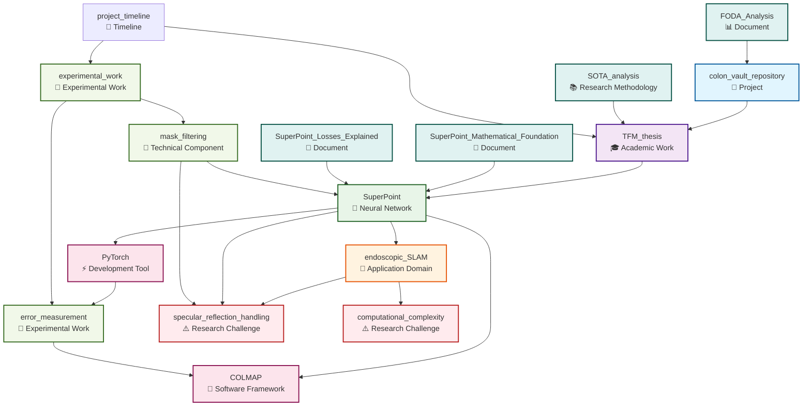
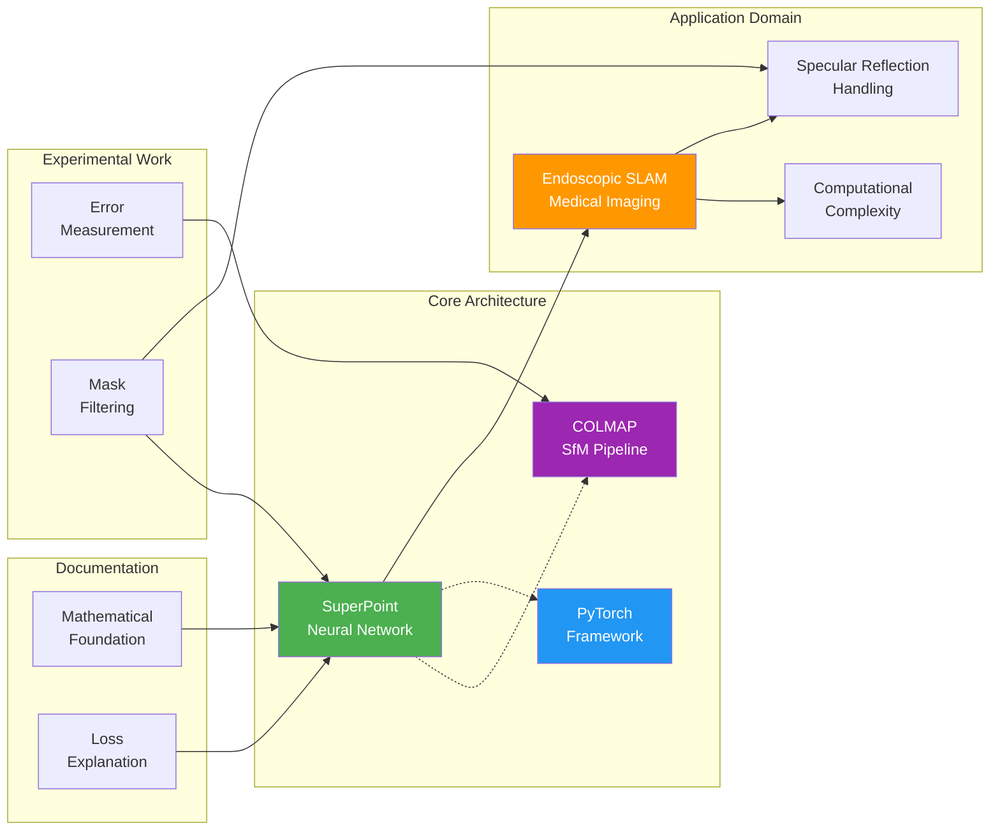
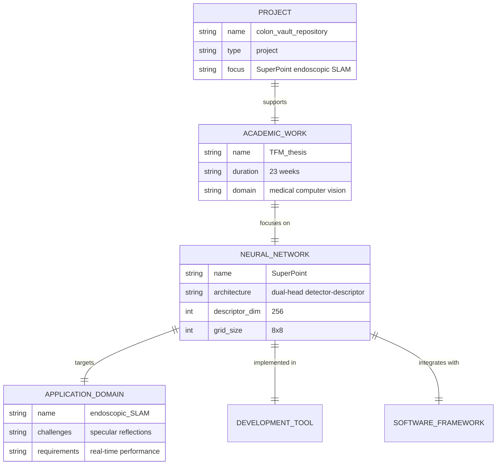
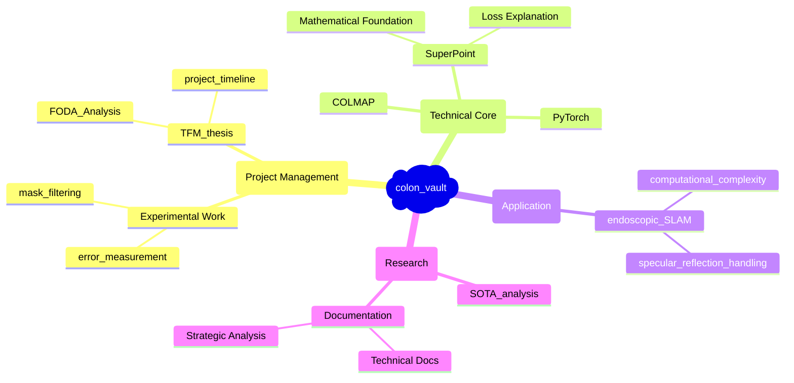

# Knowledge Graph Visualization: colon_vault

## 🌐 Interactive Mermaid Graph

```mermaid
graph TD
    %% Core Project Structure
    CVR[colon_vault_repository<br/>📁 Project] --> TFM[TFM_thesis<br/>🎓 Academic Work]
    TFM --> SP[SuperPoint<br/>🧠 Neural Network]
    SP --> ESLAM[endoscopic_SLAM<br/>🏥 Application Domain]
    
    %% Technical Framework
    SP --> PT[PyTorch<br/>⚡ Development Tool]
    SP --> CM[COLMAP<br/>🔧 Software Framework]
    PT --> EM[error_measurement<br/>🔬 Experimental Work]
    
    %% Documentation Layer
    FODA[FODA_Analysis<br/>📊 Document] --> CVR
    SPMF[SuperPoint_Mathematical_Foundation<br/>📐 Document] --> SP
    SPLE[SuperPoint_Losses_Explained<br/>📝 Document] --> SP
    SOTA[SOTA_analysis<br/>📚 Research Methodology] --> TFM
    
    %% Timeline and Management
    PT_TL[project_timeline<br/>📅 Timeline] --> TFM
    PT_TL --> EW[experimental_work<br/>🔬 Experimental Work]
    EW --> EM
    EW --> MF[mask_filtering<br/>🎯 Technical Component]
    
    %% Challenges and Solutions
    ESLAM --> SRH[specular_reflection_handling<br/>⚠️ Research Challenge]
    ESLAM --> CC[computational_complexity<br/>⚠️ Research Challenge]
    SP --> SRH
    MF --> SRH
    MF --> SP
    EM --> CM
    
    %% Styling
    classDef project fill:#e1f5fe,stroke:#01579b,stroke-width:2px
    classDef academic fill:#f3e5f5,stroke:#4a148c,stroke-width:2px
    classDef neural fill:#e8f5e8,stroke:#1b5e20,stroke-width:2px
    classDef domain fill:#fff3e0,stroke:#e65100,stroke-width:2px
    classDef tool fill:#fce4ec,stroke:#880e4f,stroke-width:2px
    classDef document fill:#e0f2f1,stroke:#004d40,stroke-width:2px
    classDef challenge fill:#ffebee,stroke:#b71c1c,stroke-width:2px
    classDef experimental fill:#f1f8e9,stroke:#33691e,stroke-width:2px
    
    class CVR project
    class TFM academic
    class SP neural
    class ESLAM domain
    class PT,CM tool
    class FODA,SPMF,SPLE,SOTA document
    class SRH,CC challenge
    class EM,EW,MF experimental
```

## 🎯 Focused Technical Architecture

```mermaid
flowchart LR
    subgraph "Core Architecture"
        SP[SuperPoint<br/>Neural Network]
        PT[PyTorch<br/>Framework]
        CM[COLMAP<br/>SfM Pipeline]
    end
    
    subgraph "Application Domain"
        ESLAM[Endoscopic SLAM<br/>Medical Imaging]
        SRH[Specular Reflection<br/>Handling]
        CC[Computational<br/>Complexity]
    end
    
    subgraph "Experimental Work"
        EM[Error<br/>Measurement]
        MF[Mask<br/>Filtering]
    end
    
    subgraph "Documentation"
        SPMF[Mathematical<br/>Foundation]
        SPLE[Loss<br/>Explanation]
    end
    
    SP --> ESLAM
    SP -.-> PT
    SP -.-> CM
    ESLAM --> SRH
    ESLAM --> CC
    EM --> CM
    MF --> SRH
    MF --> SP
    SPMF --> SP
    SPLE --> SP
    
    style SP fill:#4caf50,color:white
    style ESLAM fill:#ff9800,color:white
    style PT fill:#2196f3,color:white
    style CM fill:#9c27b0,color:white
```

## 📊 Entity Relationship Diagram

```mermaid
erDiagram
    PROJECT ||--|| ACADEMIC_WORK : supports
    ACADEMIC_WORK ||--|| NEURAL_NETWORK : "focuses on"
    NEURAL_NETWORK ||--|| APPLICATION_DOMAIN : targets
    NEURAL_NETWORK ||--|| DEVELOPMENT_TOOL : "implemented in"
    NEURAL_NETWORK ||--|| SOFTWARE_FRAMEWORK : "integrates with"
    
    PROJECT {
        string name "colon_vault_repository"
        string type "project"
        string focus "SuperPoint endoscopic SLAM"
    }
    
    ACADEMIC_WORK {
        string name "TFM_thesis"
        string duration "23 weeks"
        string domain "medical computer vision"
    }
    
    NEURAL_NETWORK {
        string name "SuperPoint"
        string architecture "dual-head detector-descriptor"
        int descriptor_dim "256"
        int grid_size "8x8"
    }
    
    APPLICATION_DOMAIN {
        string name "endoscopic_SLAM"
        string challenges "specular reflections"
        string requirements "real-time performance"
    }
```

## 🌳 Hierarchical Mind Map

```mermaid
mindmap
  root)colon_vault(
    (Project Management)
      TFM_thesis
        project_timeline
        FODA_Analysis
      Experimental Work
        error_measurement
        mask_filtering
    (Technical Core)
      SuperPoint
        Mathematical Foundation
        Loss Explanation
      PyTorch
      COLMAP
    (Application)
      endoscopic_SLAM
        specular_reflection_handling
        computational_complexity
    (Research)
      SOTA_analysis
      Documentation
        Strategic Analysis
        Technical Docs
```